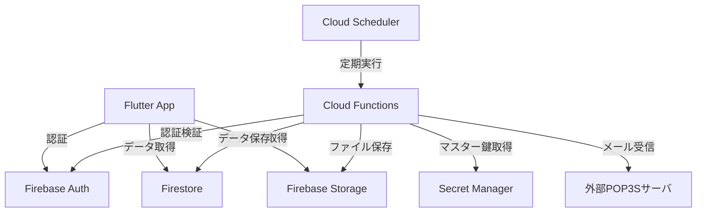
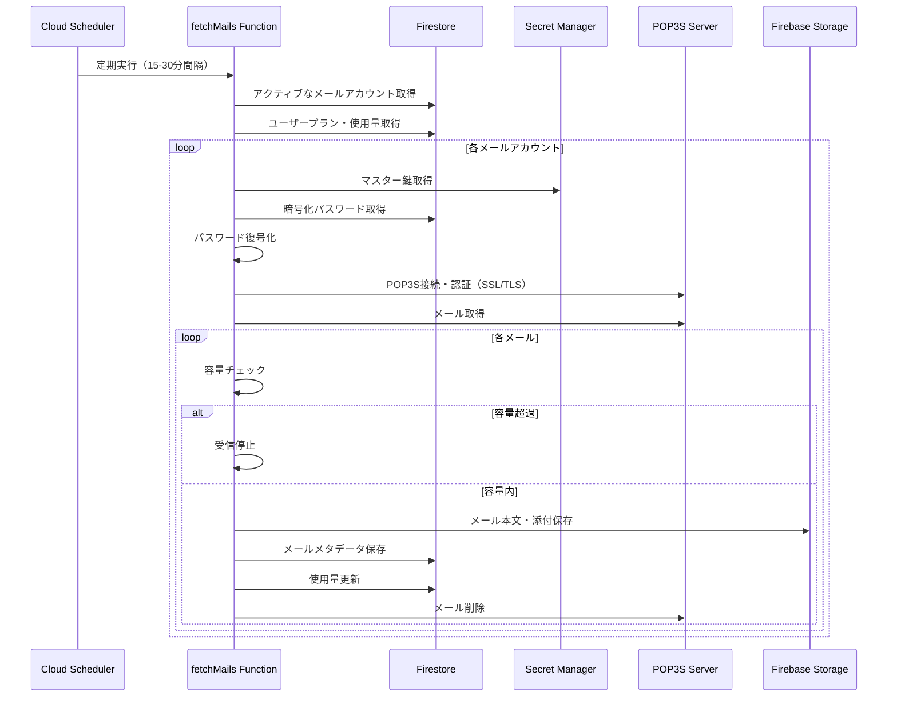
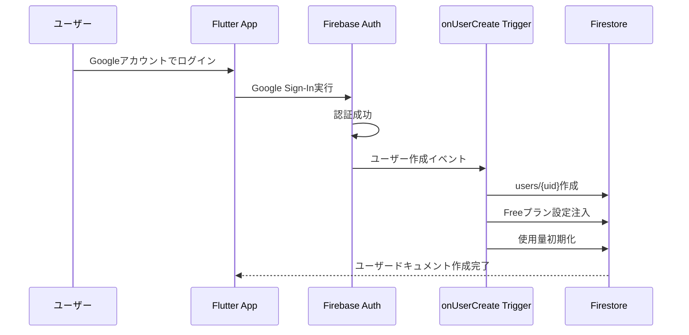

# Design Document

---
**Purpose**: Provide sufficient detail to ensure implementation consistency across different implementers, preventing interpretation drift.

**Approach**:
- Include essential sections that directly inform implementation decisions
- Omit optional sections unless critical to preventing implementation errors
- Match detail level to feature complexity
- Use diagrams and tables over lengthy prose
---

## Overview

CloudInbox MVPは、外部メールサーバ（POP3S）から受信したメールをクラウド上へ保存し、Flutterアプリからどの端末でも同じ受信箱を閲覧できる「クラウド受信箱サービス」です。本設計書は、Freeプラン（2GBストレージ、1アカウント）のMVP実装に関する技術設計を定義します。

**Users**: 新規ユーザーはFirebase AuthでGoogleアカウント認証を行い、自動的にFreeプランが設定されます。ユーザーはPOP3S（POP3 over SSL/TLS）メールアカウントを追加・設定し、自動受信されたメールをFlutterアプリで閲覧・管理できます。

**Impact**: サーバーレスアーキテクチャ（Firebase Functions、Firestore、Storage）とFlutterクライアントアプリを新規構築し、POP3Sメール受信からクラウド保存、閲覧までの完全なフローを実現します。

### Goals
- Firebase AuthによるGoogleアカウント認証とユーザー初期化の実装
- POP3S（SSL/TLS必須）メールアカウント設定とパスワード暗号化管理
- 15-30分間隔の自動メール受信とクラウド保存
- Flutterアプリによる統一受信トレイの実現
- Freeプラン（2GB、1アカウント）の容量管理と制限適用

### Non-Goals
- IMAPプロトコルのサポート（MVPはPOP3Sのみ）
- 非暗号化POP3接続のサポート（セキュリティ要件によりPOP3Sのみ）
- メール送信機能（SMTP設定は保存のみ）
- メール検索・フィルタリング機能（基本閲覧のみ）
- 複数プラン対応（Freeプランのみ）
- メール転送・自動応答機能
- 手動での言語切り替え機能（デバイスの言語設定に基づく自動選択のみ）

## Architecture

### Architecture Pattern & Boundary Map



**Architecture Integration**:
- Selected pattern: Serverless Functions（イベント駆動アーキテクチャ）
- Domain/feature boundaries: 
  - `mail/`: メール受信・保存・削除機能
  - `users/`: ユーザー初期化・プラン管理
  - `shared/`: 共通ユーティリティ（暗号化、バリデーション）
  - `config/`: 設定管理
- Existing patterns preserved: Monorepo構成、ドメイン別ディレクトリ分離
- New components rationale: 
  - `fetchMails`: 定期メール受信
  - `deleteMail`: メール削除と使用量更新
  - `accountTest`: POP3接続テスト
  - `onUserCreate`: ユーザー初期化トリガー
- Steering compliance: TypeScript strict mode、単一責任原則、エラーハンドリング明示化

### Technology Stack

| Layer | Choice / Version | Role in Feature | Notes |
|-------|------------------|-----------------|-------|
| Frontend | Flutter (Dart) | 認証UI、受信トレイ、メール詳細表示 | Material Design使用 |
| i18n | intl, flutter_localizations | 国際化リソース管理 | 日本語・英語対応 |
| Backend | Firebase Functions v2 (TypeScript) | メール受信、保存、削除、ユーザー初期化 | Node.js 18+ runtime |
| Authentication | Firebase Auth | Google Sign-In、将来Apple Sign-In対応 | Flutter SDK統合 |
| Database | Firestore (NoSQL) | ユーザー、メールアカウント、メールメタデータ | collectionGroupクエリ使用 |
| Storage | Firebase Storage | メール本文、添付ファイル | ユーザーベースのセキュリティルール |
| Secrets | Google Cloud Secret Manager | DEK（Data Encryption Key）の保存 | @google-cloud/secret-manager |
| KMS | Google Cloud KMS | KEK（Key Encryption Key）管理、DEKのwrap/unwrap | @google-cloud/kms |
| POP3S Client | mailparser + pop3-client | POP3S接続（SSL/TLS必須）とメールパース | TypeScript型定義必須、SSL/TLS必須 |
| Scheduler | Cloud Scheduler | 定期メール受信実行 | onSchedule関数と統合 |

## System Flows

### メール自動受信フロー



**Key Decisions**:
- 容量チェックは各メール受信前に実行し、上限超過時は即座に停止
- 使用量更新はバッチ処理で効率化（トランザクション使用）
- エラー発生時はアカウント状態を`error`に設定し、次回実行を継続

### ユーザー初期化フロー



## Requirements Traceability

| Requirement | Summary | Components | Interfaces | Flows |
|-------------|---------|------------|------------|-------|
| 1.1-1.13 | Googleアカウント認証 | FlutterApp (AuthScreen), FirebaseAuth | Firebase Auth API | 認証フロー |
| 1.14-1.17 | ユーザー初期化 | onUserCreate Function | Firestore API | ユーザー初期化フロー |
| 2.1-2.18 | メールアカウント設定 | FlutterApp (AccountScreen), accountTest Function | Firestore API, POP3S Client, EncryptionService | アカウント追加・テスト（POP3S必須） |
| 3.1-3.8 | メール自動受信 | fetchMails Function | Firestore API, Storage API, POP3S Client, EncryptionService | メール自動受信フロー（POP3S必須） |
| 4.1-4.13 | メール保存 | fetchMails Function | Firestore API, EncryptionService | メール保存処理（暗号化含む） |
| 5.1-5.12 | メール閲覧 | FlutterApp (InboxScreen, DetailScreen), getMailThreads, getMailMessage, decryptMail Function | Firestore API, Storage API, EncryptionService | メール閲覧フロー（復号含む） |
| 9.1-9.14 | データ暗号化基盤 | EncryptionService, KMS, Secret Manager | Google Cloud KMS, Secret Manager | 暗号化基盤 |
| 6.1-6.11 | メールゴミ箱 | FlutterApp (DetailScreen, TrashScreen), purgeTrash Function | Firestore API, Storage API | ゴミ箱フロー（移動・復元はFlutter側、完全削除のみFunctions側） |
| 7.1-7.8 | 容量管理 | fetchMails Function, purgeTrash Function | Firestore API | 容量チェック・更新 |
| 8.1-8.10 | 国際化 | FlutterApp (全画面) | intl, flutter_localizations | 国際化リソース管理 |
| 10.1-10.7 | メールアーカイブ | FlutterApp (DetailScreen, AllMailScreen) | Firestore API | アーカイブフロー（Flutter側で実装、すべてのメール一覧表示）

## Components and Interfaces

| Component | Domain/Layer | Intent | Req Coverage | Key Dependencies (P0/P1) | Contracts |
|-----------|-------------|--------|--------------|--------------------------|-----------|
| onUserCreate | users/ | ユーザー作成時のFreeプラン初期化とDEK生成 | 1.14-1.17, 9.3 | Firestore (P0), EncryptionService (P0) | Event |
| fetchMails | mail/ | 定期メール受信と保存 | 3.1-3.8, 4.1-4.15, 7.1-7.8 | Firestore (P0), Storage (P0), EncryptionService (P0), POP3S Client (P0) | Batch |
| purgeTrash | mail/ | ゴミ箱から30日経過メールを完全削除 | 6.7-6.11, 7.7 | Firestore (P0), Storage (P0) | Batch |
| accountTest | mail/ | POP3S接続テスト | 2.6-2.8, 2.14 | Secret Manager (P0), POP3S Client (P0) | Service |
| EncryptionService | encryption/ | データ暗号化・復号化（パスワード、メール本文） | 2.7-2.9, 2.11-2.12, 4.2-4.4, 5.5-5.6, 9.1-9.14 | KMS (P0), Secret Manager (P0) | Service |
| decryptMail | mail/ | メール本文の復号 | 5.7-5.9, 9.12 | Firestore (P0), Storage (P0), EncryptionService (P0) | Service |
| getMailMessage | mail/ | メール詳細取得 | 5.6, 5.10 | Firestore (P0) | Service |
| PlanValidator | shared/ | プラン制限チェック | 2.3, 3.4, 7.3-7.4 | Firestore (P0) | Service |
| I18nService | Flutter UI | 国際化リソース管理 | 8.1-8.10 | intl, flutter_localizations (P0) | Service |
| AuthScreen | Flutter UI | 認証画面 | 1.1-1.13, 8.1-8.10 | Firebase Auth (P0), I18nService (P0) | State |
| InboxScreen | Flutter UI | 受信トレイ一覧 | 5.1-5.4, 8.1-8.10, 12.1-12.9 | Firestore (P0), I18nService (P0), AdService (P1) | State |
| getMailThreads | mail/ | メールスレッド一覧取得 | 5.1-5.4 | Firestore (P0) | Service |
| DetailScreen | Flutter UI | メール詳細表示 | 5.4-5.8, 8.1-8.10, 12.1-12.9 | Firestore (P0), Storage (P0), I18nService (P0), AdService (P1) | State |
| AccountScreen | Flutter UI | メールアカウント設定 | 2.1-2.3, 8.1-8.10, 12.1-12.9 | Firestore (P0), accountTest Function (P1), I18nService (P0), AdService (P1) | State |
| SettingsScreen | Flutter UI | 設定画面 | 7.8, 8.1-8.10, 12.1-12.9 | Firestore (P0), I18nService (P0), AdService (P1) | State |

### Backend / Cloud Functions

#### onUserCreate

| Field | Detail |
|-------|--------|
| Intent | Firebase Authでユーザーが作成された際に、Firestoreにユーザードキュメントを作成し、Freeプラン設定を自動注入する |
| Requirements | 1.14-1.17 |
| Owner / Reviewers | (optional) |

**Responsibilities & Constraints**
- Firebase Authのユーザー作成イベントをトリガーとして実行
- `users/{uid}`ドキュメントを作成し、Freeプラン設定と使用量を初期化
- ユーザー専用のDEK（Data Encryption Key）を生成し、KMSでwrapしてSecret Managerに保存
- トランザクションで一貫性を保証

**Dependencies**
- Inbound: Firebase Auth — ユーザー作成イベント (P0)
- Outbound: 
  - Firestore — ユーザードキュメント作成 (P0)
  - EncryptionService — DEK生成 (P0)

**Contracts**: Event [✓]

##### Event Contract
- Triggered events: `auth.user().onCreate()`
- Event payload: `{ uid: string, email?: string, displayName?: string }`
- Ordering / delivery guarantees: At-least-once delivery

**Implementation Notes**
- Integration: Firebase Authトリガーを使用
- Validation: uidの存在を確認
- Risks: 重複実行の可能性（冪等性を保証）

#### fetchMails

| Field | Detail |
|-------|--------|
| Intent | 定期実行により、すべてのアクティブなメールアカウントからPOP3Sサーバへ接続し、メールを受信・保存する |
| Requirements | 3.1-3.8, 4.1-4.11, 7.1-7.8 |
| Owner / Reviewers | (optional) |

**Responsibilities & Constraints**
- Cloud Schedulerから15-30分間隔で実行
- アクティブなメールアカウントを走査し、容量チェック後にメール受信
- MIMEパース、bodyPreview生成、本文サイズ判定
- 小さい本文はFirestoreに、大きい本文・MIME原本・添付はStorageに暗号化保存
- mailThreadsとmailMessagesの両方を更新
- メールスレッドの`hasUnread: true`を設定し、`sentAt`フィールドに最新メッセージの送信日時を設定
- 使用量を正確に追跡し、上限超過時は受信停止

**Dependencies**
- Inbound: Cloud Scheduler — 定期実行トリガー (P0)
- Outbound: 
  - Firestore — アカウント・プラン・使用量取得・更新、mailThreads/mailMessages保存 (P0)
  - Storage — MIME原本、大きい本文、添付ファイル保存（暗号化済み） (P0)
  - EncryptionService — パスワード復号、メール本文暗号化 (P0)
  - POP3S Server — メール受信（SSL/TLS必須） (P0)
- External: POP3S Client Library、mailparser — POP3S接続（SSL/TLS必須）・MIMEパース (P0)

**Contracts**: Batch [✓]

##### Batch / Job Contract
- Trigger: Cloud Scheduler（cron形式、15-30分間隔）
- Input / validation: なし（全アクティブアカウントを走査）
- Output / destination: 
  - Firestore: mailThreads, mailMessages（メタデータ、小さい本文）
  - Storage: raw.eml.enc, body.html.enc, attachments/*.enc（暗号化済み）
- Idempotency & recovery: メッセージIDで重複チェック、エラー時はアカウント状態を`error`に設定

**Implementation Notes**
- Integration: `onSchedule`関数として実装、Cloud Schedulerと統合
- Validation: 容量チェック、プラン制限チェック
- MIME Processing: mailparserを使用してMIMEをパース、bodyPreviewを生成
- Size Decision: 本文サイズがFirestoreの1MiB制限を超える場合はStorageに保存
- Encryption: すべてのデータ（Firestore/Storage）はEncryptionServiceを使用して暗号化
- Thread Management: スレッドIDを生成し、mailThreadsとmailMessagesを更新
- Risks: 実行時間制限（最大540秒）、大量メール受信時のタイムアウト、暗号化処理のレイテンシ

**注**: メールのメタ情報管理（ゴミ箱移動・復元、アーカイブ・復元、未読状態更新）はFlutter側でFirestoreを直接更新して実装する。メール本文の復号化のみCloud Functions（decryptMail）経由で実行する。

#### purgeTrash

| Field | Detail |
|-------|--------|
| Intent | ゴミ箱に入ってから30日が経過したメールを完全削除する |
| Requirements | 6.7-6.11 |
| Owner / Reviewers | (optional) |

**Responsibilities & Constraints**
- Cloud Schedulerから定期実行（1日1回等）
- `deletedAt`が30日以上前のメールを検索
- StorageファイルとFirestoreドキュメントを完全削除
- 使用量から削除されたサイズを減算
- スレッド内のすべてのメールが削除された場合、スレッドも削除

**Dependencies**
- Inbound: Cloud Scheduler — 定期実行トリガー (P0)
- Outbound: 
  - Firestore — メール・スレッド削除・使用量更新 (P0)
  - Storage — ファイル削除 (P0)

**Contracts**: Batch [✓]

##### Batch / Job Contract
- Trigger: Cloud Scheduler（cron形式、1日1回推奨）
- Input / validation: なし（全ユーザーのゴミ箱を走査）
- Output / destination: Firestore（削除）、Storage（削除）、使用量更新
- Idempotency & recovery: メッセージIDで重複チェック

**Implementation Notes**
- Integration: `onSchedule`関数として実装、Cloud Schedulerと統合
- Validation: `deletedAt`が30日以上前であることを確認
- Risks: 大量メール削除時のタイムアウト、部分削除時の不整合

#### accountTest

| Field | Detail |
|-------|--------|
| Intent | ユーザーが入力したPOP3S設定（SSL/TLS必須）の接続テストを実行し、認証情報を検証する |
| Requirements | 2.6-2.11, 2.14-2.15 |
| Owner / Reviewers | (optional) |

**Responsibilities & Constraints**
- アカウント作成前の接続テスト: 平文パスワードを受け取り、POP3Sサーバへ接続テストを実行
- 既存アカウントの接続テスト: Secret ManagerからDEKを取得し、KMSでunwrapして暗号化パスワードを復号化
- POP3SサーバへSSL/TLS接続し、認証情報を検証
- `useSsl: true`が必須であることを検証し、非暗号化接続を拒否
- 結果を返却（成功/失敗、エラーメッセージ）
- 平文パスワードは接続テスト後すぐに破棄し、永続化しない

**Dependencies**
- Inbound: Flutter App — 接続テストリクエスト (P0)
- Outbound: 
  - Secret Manager — DEK取得（既存アカウントの場合） (P0)
  - Google Cloud KMS — DEK unwrap（既存アカウントの場合） (P0)
  - POP3S Server — 接続テスト（SSL/TLS必須） (P0)
- External: POP3S Client Library — POP3S接続（SSL/TLS必須） (P0)

**Contracts**: Service [✓]

##### Service Interface
```typescript
interface AccountTestService {
  // アカウント作成前の接続テスト（平文パスワード）
  testConnectionBeforeCreate(
    host: string,
    port: number,
    useSsl: boolean,
    userName: string,
    password: string  // 平文パスワード（HTTPSで保護）
  ): Promise<{ success: boolean; errorMessage?: string }>;
  
  // 既存アカウントの接続テスト（暗号化パスワード）
  testConnection(
    accountId: string,
    host: string,
    port: number,
    useSsl: boolean,
    userName: string,
    passwordEnc: string
  ): Promise<{ success: boolean; errorMessage?: string }>;
}
```
- Preconditions: すべてのパラメータが提供され、`useSsl: true`が必須
- Postconditions: POP3S接続テスト結果が返却される（非暗号化接続は拒否）
- Invariants: 平文パスワードは保存されない、非暗号化POP3接続は拒否される、接続テスト後は平文パスワードを破棄

**Implementation Notes**
- Integration: HTTP Callable Functionとして実装
- Validation: パラメータ検証、`useSsl: true`の強制チェック、タイムアウト設定
- Security: 平文パスワードはHTTPSで保護された通信でのみ受け取る、接続テスト後は即座に破棄
- Risks: POP3Sサーバの応答遅延、ネットワークエラー、SSL/TLS証明書エラー

#### EncryptionService

| Field | Detail |
|-------|--------|
| Intent | Google Cloud KMSとDEKを使用して、パスワードとメール本文の暗号化・復号化を実行する |
| Requirements | 2.7-2.9, 2.11-2.12, 4.2-4.4, 5.5-5.6, 9.1-9.14 |
| Owner / Reviewers | (optional) |

**Responsibilities & Constraints**
- ユーザーごとのDEK（Data Encryption Key）を生成・管理
- Google Cloud KMSを使用してDEKをwrap/unwrap
- Secret ManagerにDEKを保存（KMSでwrap済み）
- AES-256-GCMアルゴリズムでデータを暗号化・復号化
- 暗号鍵はメモリにのみ保持し、ログに出力しない
- 平文データをログに出力しない

**Dependencies**
- Outbound: 
  - Google Cloud KMS — DEKのwrap/unwrap (P0)
  - Secret Manager — DEKの保存・取得 (P0)
- External: 
  - @google-cloud/kms — KMSクライアント (P0)
  - @google-cloud/secret-manager — Secret Managerクライアント (P0)

**Contracts**: Service [✓]

##### Service Interface
```typescript
interface EncryptionService {
  // ユーザー専用DEKの生成と保存
  createDataKeyForUser(uid: string): Promise<void>;
  
  // パスワードの暗号化・復号化
  encryptPassword(uid: string, plainPassword: string): Promise<EncryptedData>;
  decryptPassword(uid: string, encrypted: EncryptedData): Promise<string>;
  
  // メール本文の暗号化・復号化
  encryptForUser(uid: string, data: string | Buffer): Promise<EncryptedData>;
  decryptForUser(uid: string, encrypted: EncryptedData): Promise<string | Buffer>;
  
  // 内部: DEKの取得と復号
  private getDataKey(uid: string): Promise<Buffer>;
}

interface EncryptedData {
  ciphertext: string; // base64
  nonce: string;      // base64 (12 bytes)
  tag: string;        // base64
}
```
- Preconditions: ユーザーのDEKが存在する（初回は自動生成）
- Postconditions: 暗号化/復号化されたデータが返却される
- Invariants: 平文データは永続化されない、暗号鍵はクライアントに送信されない

**Implementation Notes**
- Integration: `functions/src/encryption/`ディレクトリに実装
- Directory structure:
  - `kms.ts`: KMS操作（wrap/unwrap）
  - `keys.ts`: DEK生成・管理
  - `encrypt.ts`: 暗号化処理
  - `decrypt.ts`: 復号処理
- Validation: 暗号化/復号化の成功確認、nonce/tagの検証
- Risks: 
  - KMS API呼び出しのレイテンシ（DEKはキャッシュ可能）
  - 大容量データの暗号化時のメモリ使用量
- Security: 平文データは処理後即座に破棄、ログに出力しない

#### decryptMail

| Field | Detail |
|-------|--------|
| Intent | ユーザーがメール詳細を表示する際に、暗号化されたメール本文を復号して返す |
| Requirements | 5.5-5.6, 9.12 |
| Owner / Reviewers | (optional) |

**Responsibilities & Constraints**
- HTTP Callable Functionとして実装
- FirestoreからmailMessageを取得
- `hasLargeBody`に応じてFirestoreまたはStorageから暗号化データを取得
- EncryptionServiceを使用して復号
- 復号済みデータのみクライアントに送信
- 認証済みユーザーのみアクセス可能

**Dependencies**
- Inbound: Flutter App — メール本文取得リクエスト (P0)
- Outbound: 
  - Firestore — mailMessage取得、小さい本文取得 (P0)
  - Storage — 大きい本文取得 (P0)
  - EncryptionService — 復号処理 (P0)

**Contracts**: Service [✓]

##### Service Interface
```typescript
interface DecryptMailService {
  decryptMail(uid: string, messageId: string): Promise<{
    bodyText?: string;
    bodyHtml?: string;
  }>;
}
```
- Preconditions: ユーザーが認証済み、メッセージが存在する
- Postconditions: 復号済みメール本文が返却される（hasLargeBodyに応じてFirestoreまたはStorageから取得）
- Invariants: 暗号鍵はクライアントに送信されない、復号済みデータはキャッシュしない

**Implementation Notes**
- Integration: HTTP Callable Functionとして実装
- Validation: uid検証、メッセージ所有権確認
- Size Decision: `hasLargeBody`が`false`の場合はFirestoreの`bodyTextEncrypted`から、`true`の場合はStorageの`body.html.enc`から取得
- Risks: 復号処理のレイテンシ、Storageからの読み込み時間（キャッシュはしない）

#### PlanValidator

| Field | Detail |
|-------|--------|
| Intent | ユーザーのプラン制限（アカウント数、ストレージ容量）をチェックする |
| Requirements | 2.3, 3.4, 7.3-7.4 |
| Owner / Reviewers | (optional) |

**Responsibilities & Constraints**
- アカウント追加時のアカウント数上限チェック
- メール受信前のストレージ容量上限チェック
- プラン情報と使用量をFirestoreから取得

**Dependencies**
- Outbound: Firestore — プラン・使用量取得 (P0)

**Contracts**: Service [✓]

##### Service Interface
```typescript
interface PlanValidator {
  canAddAccount(uid: string): Promise<boolean>;
  canStoreMail(uid: string, mailSize: number): Promise<boolean>;
}
```
- Preconditions: ユーザーが存在する
- Postconditions: 制限チェック結果が返却される
- Invariants: プラン制限は常に遵守される

**Implementation Notes**
- Integration: 共有サービスとして実装、fetchMailsとaccountTestから利用
- Validation: プラン情報の存在確認
- Risks: Firestore読み取りのレイテンシ（キャッシュ検討）

### Frontend / Flutter

#### AuthScreen

| Field | Detail |
|-------|--------|
| Intent | Firebase Authを使用したGoogleアカウント認証画面を表示し、認証状態を管理する |
| Requirements | 1.1-1.13 |
| Owner / Reviewers | (optional) |

**Responsibilities & Constraints**
- Google Sign-Inボタンを表示
- 認証状態を監視し、成功時にホーム画面へ遷移
- エラーハンドリングとユーザーフィードバック

**Dependencies**
- Outbound: Firebase Auth — 認証実行 (P0)
- External: firebase_auth, google_sign_in — Flutterパッケージ (P0)

**Contracts**: State [✓]

##### State Management
- State model: `AuthState { isAuthenticated: boolean, isLoading: boolean, error: string? }`
- Persistence & consistency: Firebase Authがセッションを管理
- Concurrency strategy: 単一認証フローのみ許可

**Implementation Notes**
- Integration: Flutter Material Design、Firebase Auth SDK
- Validation: 認証トークンの検証
- Risks: ネットワークエラー、認証キャンセル

#### InboxScreen

| Field | Detail |
|-------|--------|
| Intent | FirestoreのmailThreadsコレクションを使用してメールスレッド一覧を表示する |
| Requirements | 5.1-5.4, 8.1-8.10, 12.1-12.9 |
| Owner / Reviewers | (optional) |

**Responsibilities & Constraints**
- `users/{uid}/mailThreads`コレクションをクエリしてメールスレッド一覧を取得
- `labels`に`inbox`を含み、`trash`を含まないスレッドのみを表示
- `lastMessageAt`降順でソート
- 件名、送信者、プレビュー、日時、未読状態、ラベルを表示
- Storageアクセスは発生させない（Firestoreのみで一覧表示）
- ページネーション対応: 初期表示で画面サイズに応じた件数を取得、スクロール時に追加読み込み（次のN件を取得）
- Freeプランの場合、画面下部に広告を表示

**Dependencies**
- Outbound: 
  - Firestore — メールスレッド一覧取得 (P0)
  - AdService — 広告表示（Freeプランの場合） (P1)
- External: cloud_firestore — Flutterパッケージ (P0)

**Contracts**: State [✓]

##### State Management
- State model: `InboxState { threads: List<MailThread>, lastDocument: DocumentSnapshot?, isLoading: boolean, isLoadingMore: boolean, hasMore: boolean, error: string? }`
- Persistence & consistency: Firestoreのリアルタイム更新を監視（既存アイテムのみ、追加読み込みは手動）
- Concurrency strategy: ストリームベースのリアルタイム更新、ページネーションは手動読み込み

**Implementation Notes**
- Integration: Flutter Material Design、Firestore StreamBuilder、ScrollController（追加読み込み）
- Validation: uid検証、インデックス確認
- Performance: 
  - Storageアクセスを避けることで一覧表示のパフォーマンスを最適化
  - ページネーションにより初期表示を高速化（画面に収まる件数のみ取得）
  - Firestoreの`limit()`と`startAfter()`を使用して追加読み込みを実装
- Pagination:
  - 初期表示: 画面サイズと1アイテムの高さから表示可能件数を計算（画面高さ ÷ アイテム高さ + 余裕分3-5件）
  - 最小値・最大値の制約: 最小10件、最大50件程度（パフォーマンスとUXのバランス）
  - 追加読み込み: 前回取得した最後のドキュメント（`lastDocument`）を`startAfter()`の基準として使用、初期表示と同じ件数を読み込む
  - スクロール位置が末尾に近づいたら（例: 末尾から5件手前）追加読み込みをトリガー
  - 取得件数が`limit`未満の場合、すべてのデータを読み込み終えたと判定（`hasMore: false`）
  - 画面サイズ変更時（端末回転等）は再計算して適切な件数に調整
- Risks: リアルタイム更新とページネーションの整合性（既存アイテムの更新は監視、新規アイテムは手動読み込み）、画面サイズ変更時の件数再計算

#### DetailScreen

| Field | Detail |
|-------|--------|
| Intent | 選択されたメールスレッドの詳細を表示し、メール本文と添付ファイルを読み込む |
| Requirements | 5.5-5.12, 8.1-8.10, 12.1-12.9 |
| Owner / Reviewers | (optional) |

**Responsibilities & Constraints**
- FirestoreからmailMessageを直接取得
- Cloud Functions経由で暗号化されたメール本文を復号して表示（decryptMail Function、hasLargeBodyに応じてFirestoreまたはStorageから取得）
- 添付ファイル一覧を表示（Storageパス情報から）
- メールを開いた際に未読状態をFlutter側でFirestoreを直接更新（mailMessageの`isRead: true`、mailThreadの`hasUnread`をスレッド内のすべてのメッセージを確認して再計算）
- Freeプランの場合、画面下部に広告を表示

**Dependencies**
- Outbound: 
  - Firestore — mailMessage取得、mailMessage/mailThread直接更新（未読状態、ラベル管理） (P0)
  - decryptMail Function — メール本文復号（メタ情報は含まない） (P0)
  - Storage — 添付ファイル取得 (P0)
  - AdService — 広告表示（Freeプランの場合） (P1)
- External: cloud_firestore, cloud_functions, firebase_storage — Flutterパッケージ (P0)

**Contracts**: State [✓]

##### State Management
- State model: `DetailState { message: MailMessage?, body: string?, attachments: List<Attachment>, isLoading: boolean }`
- Persistence & consistency: FirestoreとStorageのデータを同期
- Concurrency strategy: 単一メールの読み込み

**Implementation Notes**
- Integration: Flutter Material Design、Firestore/Cloud Functions/Storage SDK
- Validation: メッセージ所有権確認
- Encryption: メール本文はdecryptMail Function経由で復号済みデータを取得（hasLargeBodyに応じてFirestoreまたはStorageから）
- Thread Update: メールを開いた際にFlutter側でFirestoreのmailMessageとmailThreadを直接更新（バッチ更新またはトランザクションで一貫性保証）
- Metadata Management: ゴミ箱移動・復元、アーカイブ・復元もFlutter側でFirestoreを直接更新
- Risks: 大きな添付ファイルの読み込み時間、復号処理のレイテンシ、Storageからの読み込み時間

#### AccountScreen

| Field | Detail |
|-------|--------|
| Intent | メールアカウント情報を入力し、接続テストで確認してからFirestoreに保存する |
| Requirements | 2.1-2.3, 2.6-2.11, 12.1-12.9 |
| Owner / Reviewers | (optional) |

**Responsibilities & Constraints**
- メールアカウント情報（ラベル、メールアドレス、POP3S/SMTP設定）を入力
- 「接続テスト」または「確認」ボタンを提供し、入力情報の正しさを確認
- 接続テスト結果（成功/失敗、エラーメッセージ）を表示
- 接続テスト成功後にアカウント作成ボタンを有効化（または、接続テスト成功後にアカウント作成を実行可能にする）
- プラン制限チェック（Freeプランは1アカウントのみ）
- アカウント作成前に接続テストを実行

**Dependencies**
- Outbound: 
  - Firestore — アカウント保存 (P0)
  - accountTest Function — 接続テスト（アカウント作成前の平文パスワード対応） (P0)
  - AdService — 広告表示（Freeプランの場合） (P1)
- External: cloud_firestore — Flutterパッケージ (P0)

**Contracts**: State [✓]

##### State Management
- State model: `AccountState { account: MailAccount?, isTesting: boolean, testResult: TestResult?, canCreate: boolean }`
- Persistence & consistency: Firestoreへの保存を確認
- Concurrency strategy: 単一アカウント作成フロー、接続テスト中はアカウント作成ボタンを無効化

**Implementation Notes**
- Integration: Flutter Material Design、Firestore SDK、Cloud Functions
- Validation: 入力検証、プラン制限チェック、接続テスト成功確認
- UI Flow: 入力 → 接続テスト実行 → 結果表示 → 成功時のみアカウント作成可能
- Risks: 接続テストのタイムアウト、ネットワークエラー

#### AdService

| Field | Detail |
|-------|--------|
| Intent | Freeプランユーザーの画面下部に広告を表示する |
| Requirements | 12.1-12.9 |
| Owner / Reviewers | (optional) |

**Responsibilities & Constraints**
- ユーザーのプラン情報（`plan.id`）を確認し、Freeプランの場合のみ広告を表示
- Google AdMob（または同等の広告プラットフォーム）を使用してバナー広告を表示
- 画面下部に固定表示し、コンテンツを隠さないようにレイアウトを調整
- 広告読み込み失敗時は広告エリアを非表示にする
- 認証画面には広告を表示しない

**Dependencies**
- Inbound: Flutter App — 広告表示リクエスト (P1)
- Outbound: 
  - Firestore — プラン情報取得 (P0)
  - Google AdMob SDK — 広告表示 (P1)
- External: google_mobile_ads — Flutterパッケージ (P1)

**Contracts**: Service [✓]

##### Service Interface
```dart
class AdService {
  // Freeプランの場合のみ広告ウィジェットを返す
  Widget? getBannerAd(String? planId);
  
  // 広告の初期化
  Future<void> initialize();
  
  // 広告の破棄
  void dispose();
}
```
- Preconditions: プラン情報が取得できる
- Postconditions: Freeプランの場合のみ広告ウィジェットが返却される
- Invariants: Proプランでは広告を表示しない、認証画面では広告を表示しない

**Implementation Notes**
- Integration: Flutter Material Design、Google AdMob SDK
- Validation: プラン情報の確認、広告読み込み状態の管理
- Risks: 広告読み込みの遅延、広告プラットフォームのAPI変更

#### NavigationDrawer

| Field | Detail |
|-------|--------|
| Intent | ハンバーガーメニューによる画面遷移とプラン情報表示を提供する |
| Requirements | 5.1-5.12, 7.8, 8.1-8.10, 12.1-12.9 |

**Responsibilities & Constraints**
- アプリ共通の`Scaffold`に`Drawer`（または`NavigationDrawer`）を統合し、受信トレイ／すべてのメール／ゴミ箱／設定へのメニュー項目を表示
- 各メニュー項目にアイコンとラベル（I18nService経由）を表示
- 受信トレイ選択時は MailListScreen に受信トレイ用フィルタ（`labels`に`inbox`を含み、`trash`を含まない）を渡して表示
- すべてのメール選択時は MailListScreen にフィルタなしで表示
- ゴミ箱選択時は MailListScreen に`labels`に`trash`を含むフィルタを渡して表示
- 設定選択時は SettingsScreen へ遷移
- Drawer 最下部に現在のプラン情報（`plan.label`）と使用量（`usage.storageBytes`）、残り使用可能量を表示（フォーマットは I18nService を利用）
- Free プランの場合でも広告と競合しないようにレイアウトを調整

**Dependencies**
- Outbound: Firestore — ユーザープランおよび使用量取得 (P0)
- Outbound: MailListScreen — ラベルフィルタ付きメール一覧表示 (P0)
- Outbound: SettingsScreen — 設定画面遷移 (P0)
- Outbound: I18nService — メニューラベルと数値フォーマット (P0)
- External: Flutter Material Design — Drawer UIコンポーネント (P0)

**Contracts**: State [✓]

##### State Management
- State model: `NavigationState { selectedItem: NavigationItem, isDrawerOpen: boolean }`
- Persistence & consistency: 画面回転時も選択中メニューを維持
- Concurrency strategy: 単一ナビゲーションフロー（タップ毎に1回のみ遷移）

#### I18nService

| Field | Detail |
|-------|--------|
| Intent | Flutterアプリの国際化リソースを管理し、画面文字列を多言語対応する |
| Requirements | 8.1-8.10 |
| Owner / Reviewers | (optional) |

**Responsibilities & Constraints**
- 国際化リソース（.arbファイル）の管理
- デバイスの言語設定に基づく言語選択
- 画面文字列の取得と表示
- 日付・時刻・数値のロケール対応フォーマット

**Dependencies**
- External: intl, flutter_localizations — Flutterパッケージ (P0)

**Contracts**: Service [✓]

##### Service Interface
```dart
class I18nService {
  static String translate(String key, {Map<String, dynamic>? args});
  static String formatDate(DateTime date);
  static String formatBytes(int bytes);
  static Locale getCurrentLocale();
}
```
- Preconditions: 国際化リソースファイルが存在する
- Postconditions: 適切な言語の文字列が返却される
- Invariants: すべての画面文字列は国際化リソースから取得される

**Implementation Notes**
- Integration: Flutter Material Design、intlパッケージ
- Validation: リソースキーの存在確認、フォールバック処理
- Risks: リソースファイルの管理、翻訳の一貫性

**国際化リソース構造**
- `lib/l10n/app_ja.arb`: 日本語リソース
- `lib/l10n/app_en.arb`: 英語リソース
- `lib/l10n/app.dart`: 生成された国際化クラス

**対象画面と文字列**
- AuthScreen: ログインボタン、エラーメッセージ
- AccountScreen: フォームラベル、バリデーションメッセージ、成功/エラーメッセージ
- InboxScreen: 画面タイトル、空状態メッセージ、ローディングメッセージ
- DetailScreen: 添付ファイルラベル、削除ボタン、エラーメッセージ
- SettingsScreen: プラン情報、使用量表示、単位（GB、MB等）

**非対象**
- バックエンド（Cloud Functions）のコメント、ログ、エラーメッセージは日本語のまま
- メール本文は元の言語のまま表示（国際化対象外）

#### getMailThreads

| Field | Detail |
|-------|--------|
| Intent | メールスレッド一覧を取得する（オプション: HTTP Callable Function、またはFlutterから直接Firestoreクエリ） |
| Requirements | 5.1-5.4 |
| Owner / Reviewers | (optional) |

**Responsibilities & Constraints**
- Firestoreの`users/{uid}/mailThreads`コレクションをクエリ
- ページング、ラベルフィルタ、未読フィルタをサポート
- Storageアクセスは発生させない

**Dependencies**
- Outbound: Firestore — メールスレッド一覧取得 (P0)

**Contracts**: Service [✓]

##### Service Interface
```typescript
interface GetMailThreadsService {
  getMailThreads(
    uid: string,
    options?: {
      limit?: number;  // 画面サイズに応じて計算された件数（最小10件、最大50件程度）
      startAfter?: DocumentSnapshot;  // ページネーション用（前回取得した最後のドキュメント）
      labels?: string[];
      hasUnread?: boolean;
    }
  ): Promise<{
    threads: MailThread[];
    lastDocument: DocumentSnapshot | null;  // 次のページネーション用
    hasMore: boolean;  // 次のページが存在するか
  }>;
}
```
- Preconditions: ユーザーが認証済み、`limit`は適切な範囲内（最小10件、最大50件程度）
- Postconditions: メールスレッド一覧とページネーション情報が返却される
- Invariants: Storageアクセスは発生しない、取得件数が`limit`未満の場合は`hasMore: false`

**Implementation Notes**
- Integration: HTTP Callable Functionとして実装、またはFlutterから直接Firestoreクエリ（推奨: 直接クエリ）
- Validation: uid検証
- Performance: 
  - Storageアクセスを避けることで高速化
  - ページネーションにより大量データ時のパフォーマンスを最適化
- Pagination:
  - Firestoreの`limit()`と`startAfter()`を使用
  - limit値: 画面サイズに応じて動的に計算（最小10件、最大50件程度）
  - 取得結果が`limit`未満の場合、次のページは存在しない（`hasMore: false`）
- Risks: リアルタイム更新とページネーションの整合性、画面サイズに応じた動的な件数計算の実装

#### getMailMessage

| Field | Detail |
|-------|--------|
| Intent | メールメッセージの詳細情報を取得する（オプション: HTTP Callable Function、またはFlutterから直接Firestoreクエリ） |
| Requirements | 5.6, 5.10 |
| Owner / Reviewers | (optional) |

**Responsibilities & Constraints**
- Firestoreの`users/{uid}/mailMessages/{messageId}`からメール情報を取得
- メタデータ、bodyPreview、storageパス情報を返却
- 本文は含めない（decryptMailで別途取得）

**Dependencies**
- Outbound: Firestore — メールメッセージ取得 (P0)

**Contracts**: Service [✓]

##### Service Interface
```typescript
interface GetMailMessageService {
  getMailMessage(uid: string, messageId: string): Promise<MailMessage>;
}
```
- Preconditions: ユーザーが認証済み、メッセージが存在する
- Postconditions: メールメッセージ情報が返却される（本文は含まない）
- Invariants: 本文は含めない（decryptMailで別途取得）

**Implementation Notes**
- Integration: HTTP Callable Functionとして実装、またはFlutterから直接Firestoreクエリ
- Validation: uid検証、メッセージ所有権確認
- Risks: なし（Firestoreクエリのみ）

## Data Models

### Domain Model

**Aggregates**:
- `User`: ユーザー集約（プラン、使用量）
- `MailAccount`: メールアカウント集約（POP3/SMTP設定、状態）
- `MailThread`: メールスレッド集約（スレッド情報、最新メッセージ）
- `MailMessage`: メッセージ集約（メタデータ、本文、添付情報）

**Entities**:
- `User` (root): `uid`, `plan`, `usage`, `createdAt`, `updatedAt`
- `MailAccount`: `accountId`, `label`, `emailAddress`, `pop3`, `smtp`, `status`, `lastFetchedAt`
- `MailThread`: `threadId`, `latestMessageId`, `subject`, `from`, `to`, `preview`, `hasUnread`, `labels`, `lastMessageAt`, `createdAt`, `updatedAt`
- `MailMessage`: `messageId`, `threadId`, `from`, `to`, `cc`, `bcc`, `subject`, `sentAt`, `receivedAt`, `bodyPreview`, `bodyTextEncrypted`, `hasLargeBody`, `hasAttachments`, `storage`, `isRead`, `labels`, `deletedAt`, `createdAt`, `updatedAt`

**Value Objects**:
- `Plan`: `id`, `label`, `maxStorageBytes`, `maxAccounts`
- `Usage`: `storageBytes`, `updatedAt`
- `POP3Config`: `host`, `port`, `useSsl: true`（必須、POP3Sのみ許可）, `userName`, `passwordEnc`
- `StoragePaths`: `rawMimePath`, `largeBodyPath`, `attachmentsBasePath`
- `EncryptedData`: `ciphertext: string`, `nonce: string`, `tag: string`

**Business Rules & Invariants**:
- ユーザーはFreeプランで最大1アカウントまで追加可能
- ストレージ使用量はプラン上限を超えない
- メール受信前に容量チェックを実行
- メールがゴミ箱に移動されても使用量は変更しない（30日後に完全削除時に減算）
- メールがアーカイブされても使用量は変更しない
- ゴミ箱に入ってから30日が経過したメールは自動的に完全削除される
- ラベルは`inbox`、`archive`、`trash`のいずれかを含む（複数可）
- 「すべてのメール」一覧画面では**すべてのメール**を表示する（ラベルの条件によるフィルタリングは行わない）。アーカイブ化の操作（inboxラベルを外す）は「アーカイブ」という表現を使用する。

### Logical Data Model

**Structure Definition**:
- `users/{uid}`: ユーザードキュメント（プラン、使用量）
- `users/{uid}/mailAccounts/{accountId}`: メールアカウントサブコレクション
- `users/{uid}/mailThreads/{threadId}`: メールスレッドコレクション
- `users/{uid}/mailMessages/{messageId}`: メッセージコレクション

**Entity Relationships**:
- User 1:N MailAccount（ユーザーは複数のメールアカウントを持つ、Freeプランは1のみ）
- User 1:N MailThread（ユーザーは複数のメールスレッドを持つ）
- MailThread 1:N MailMessage（スレッドは複数のメッセージを持つ）

**Attributes & Types**:
- `users/{uid}`:
  - `plan.id`: string ("free")
  - `plan.maxStorageBytes`: number (2147483648)
  - `plan.maxAccounts`: number (1)
  - `usage.storageBytes`: number
  - `usage.updatedAt`: Timestamp
- `mailAccounts/{accountId}`:
  - `label`: string
  - `emailAddress`: string
  - `pop3.passwordEnc`: string (暗号化済み)
  - `status`: "active" | "error" | "disabled"
- `mailThreads/{threadId}`:
  - `threadId`: string
  - `latestMessageId`: string
  - `subject`: string
  - `from`: string
  - `to`: string[]
  - `preview`: string
  - `hasUnread`: boolean
  - `labels`: string[]
  - `lastMessageAt`: Timestamp
  - `sentAt`: Timestamp（最新メッセージの送信日時）
  - `createdAt`: Timestamp
  - `updatedAt`: Timestamp
- `mailMessages/{messageId}`:
  - `messageId`: string
  - `threadId`: string
  - `from`: string
  - `to`: string[]
  - `cc`: string[] | undefined
  - `bcc`: string[] | undefined
  - `subject`: string
  - `sentAt`: Timestamp
  - `receivedAt`: Timestamp
  - `bodyPreview`: string
  - `bodyTextEncrypted`: { ciphertext: string, nonce: string, tag: string } | undefined
  - `hasLargeBody`: boolean
  - `hasAttachments`: boolean
  - `storage.rawMimePath`: string
  - `storage.largeBodyPath`: string | undefined
  - `storage.attachmentsBasePath`: string | undefined
  - `isRead`: boolean
  - `labels`: string[] (例: ["inbox"], ["archive"], ["trash"])
  - `deletedAt`: Timestamp | null (ゴミ箱に移動した日時、復元時はnull)
  - `createdAt`: Timestamp
  - `updatedAt`: Timestamp

**Consistency & Integrity**:
- Transaction boundaries: ユーザー初期化、メール保存時の使用量更新
- Cascading rules: メール削除時はStorageファイルも削除
- Temporal aspects: `createdAt`, `updatedAt`で監査

### Physical Data Model

**For Document Stores (Firestore)**:
- Collection structures: 
  - `users/{uid}/mailThreads/{threadId}`: メールスレッド
  - `users/{uid}/mailMessages/{messageId}`: メールメッセージ
- Embedding vs referencing: 
  - メール一覧表示に必要な情報（件名、送信者、プレビュー等）は`mailThreads`に保存
  - 小さい本文（1MiB制限内）は`mailMessages.bodyTextEncrypted`に保存
  - 大きい本文、MIME原本、添付ファイルはStorageに保存（パス参照）
- Sharding key design: `uid`でユーザー単位に分散
- Index definitions:
  - `mailThreads`: `uid` (ascending), `lastMessageAt` (descending) — 複合インデックス
  - `mailThreads`: `uid` (ascending), `labels` (array-contains), `lastMessageAt` (descending) — ラベルフィルタ用複合インデックス
  - `mailMessages`: `uid` (ascending), `threadId` (ascending), `receivedAt` (descending) — 複合インデックス
  - `mailMessages`: `uid` (ascending), `labels` (array-contains), `deletedAt` (ascending) — ゴミ箱完全削除用複合インデックス
- Encryption: 小さい本文は`{ciphertext, nonce, tag}`形式でFirestoreに保存
- Size limit: Firestoreの1MiB制限を考慮し、大きい本文はStorageに保存

**For File Storage (Firebase Storage)**:
- Path structure: 
  - `mail-data/{uid}/{messageId}/raw.eml.enc`: MIME原本（暗号化済み）
  - `mail-data/{uid}/{messageId}/body.html.enc`: 大きいHTML本文（暗号化済み）
  - `mail-data/{uid}/{messageId}/attachments/{filename}.enc`: 添付ファイル（暗号化済み）
- Metadata: `contentType`, `size`, `customMetadata`（メッセージID等）
- Encryption: すべてのファイルは保存前にAES-256-GCMで暗号化
- TTL and compaction: なし（ユーザー削除まで保持）

### Data Contracts & Integration

**API Data Transfer**:
- Request/response schemas: TypeScript型定義を使用
- Validation rules: 入力検証、型チェック
- Serialization format: JSON

**Cross-Service Data Management**:
- Distributed transaction patterns: Firestoreトランザクションで使用量更新
- Data synchronization strategies: リアルタイム更新（Firestore Stream）
- Eventual consistency handling: 使用量更新は最終的に一貫性を保証

## Error Handling

### Error Strategy
- **Fail Fast**: 入力検証と容量チェックを早期実行
- **Graceful Degradation**: メール受信エラー時はアカウント状態を`error`に設定し、次回実行を継続
- **User Context**: エラーメッセージをユーザーに分かりやすく表示
- **Observability**: Cloud FunctionsのログとFirebase Consoleで監視

### Error Categories and Responses
**User Errors** (4xx):
- 無効な認証情報 → 認証エラーメッセージ表示
- プラン制限超過 → アカウント追加拒否、容量超過メッセージ
- 無効なPOP3S設定 → 接続テストエラーメッセージ
- 非暗号化POP3接続試行 → SSL/TLS必須エラーメッセージ

**System Errors** (5xx):
- Secret Manager APIエラー → リトライ、フォールバック
- POP3S接続タイムアウト → タイムアウトエラー、アカウント状態を`error`に設定
- SSL/TLS証明書エラー → 証明書検証エラーメッセージ
- Firestore/Storage APIエラー → リトライ、エラーログ記録

**Business Logic Errors** (422):
- 容量上限超過 → メール受信停止、ユーザーに通知
- アカウント数上限超過 → アカウント追加拒否

### Monitoring
- Cloud Functions: 実行ログ、エラーログ、実行時間
- Firestore: 読み書き操作の監視
- Storage: アップロード/ダウンロードエラー
- Secret Manager: API呼び出しエラー

## Testing Strategy

### Unit Tests
- `EncryptionService`: 暗号化・復号化の正確性
- `PlanValidator`: プラン制限チェックロジック
- `fetchMails`: 容量チェック、メール受信ロジック
- `deleteMail`: 使用量減算ロジック
- `onUserCreate`: Freeプラン初期化ロジック

### Integration Tests
- `fetchMails` → Firestore/Storage保存フロー
- `accountTest` → POP3S接続テストフロー（SSL/TLS必須）
- `deleteMail` → Storage/Firestore削除と使用量更新フロー
- 認証フロー（Firebase Auth統合）

### E2E/UI Tests
- Google Sign-In → ユーザー初期化 → ホーム画面遷移
- メールアカウント追加 → POP3S接続テスト（SSL/TLS必須） → アカウント作成
- 受信トレイ表示 → メール詳細表示 → 未読状態更新
- メール削除 → 使用量更新確認

### Performance/Load
- collectionGroupクエリのパフォーマンス（大量メール時）
- メール受信処理の並列実行（複数アカウント）
- Storageアップロードのスループット

## Security Considerations

### Authentication and Authorization
- Firebase Authでユーザー認証、すべてのFirestore/Storageアクセスで`request.auth.uid`を検証
- Firestoreセキュリティルール: `request.auth.uid == resource.data.uid`
- Storageセキュリティルール: `request.auth.uid == request.resource.name.split('/')[1]`

### Data Protection
- パスワードはSecret Managerのマスター鍵で暗号化（AES-256-GCM）
- 平文パスワードはFirestoreに保存しない
- マスター鍵はSecret Managerにのみ保存、アプリケーションコードには含めない

### Secret Management
- Secret Manager APIのアクセス制御（IAMロール: Secret Manager Secret Accessor）
- マスター鍵のバージョン管理とローテーション戦略
- 監査ログでシークレットアクセスを記録

## Performance & Scalability

### Target Metrics
- メール受信処理: 1アカウントあたり最大100メール/実行（実行時間制限内）
- collectionGroupクエリ: 1000メール以下で1秒以内
- Storageアップロード: 10MB/秒以上

### Scaling Approaches
- 水平スケーリング: Firebase Functionsの自動スケーリング
- 並列処理: 複数アカウントの並列受信（Promise.all使用）
- キャッシュ: Secret Managerマスター鍵のメモリキャッシュ

### Optimization Techniques
- メール受信のバッチ処理
- Firestoreインデックスの最適化
- Storageパスの階層構造で分散

