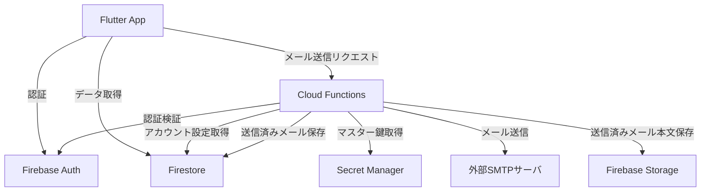
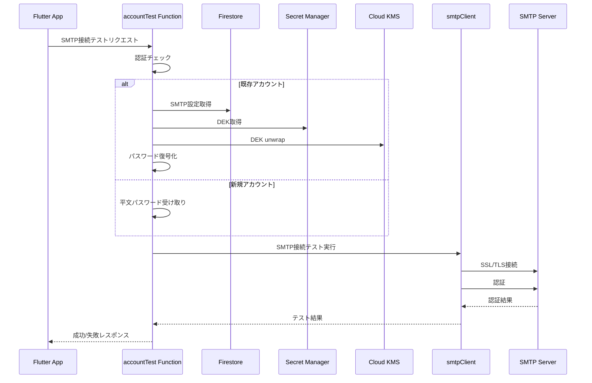
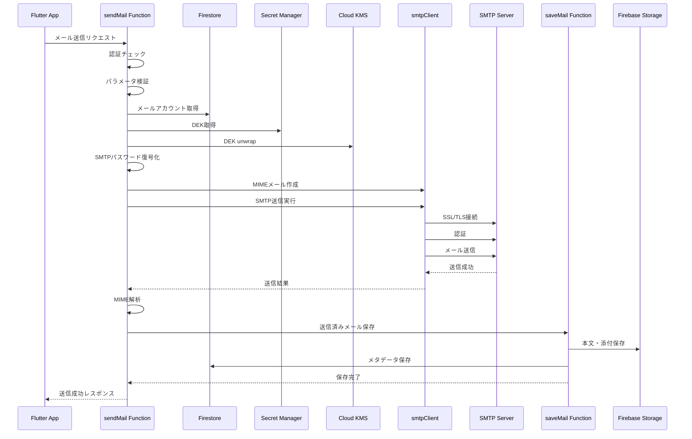

# Design Document

---
**Purpose**: Provide sufficient detail to ensure implementation consistency across different implementers, preventing interpretation drift.

**Approach**:
- Include essential sections that directly inform implementation decisions
- Omit optional sections unless critical to preventing implementation errors
- Match detail level to feature complexity
- Use diagrams and tables over lengthy prose
---

## Overview

CloudInboxは、既存のPOP3メール受信機能に加えて、SMTP（SMTP over SSL/TLS必須）によるメール送信機能を追加します。本設計書は、SMTPアカウント設定、メール送信、送信済みメール管理、メール作成UI機能の技術設計を定義します。

**Users**: ユーザーは既存のメールアカウント設定画面でSMTP設定を追加・設定し、Flutterアプリからメールを送信できます。送信済みメールは「送信済み」フォルダで確認・管理できます。

**Impact**: 既存のPOP3受信機能に加えて、メール送信機能を追加します。既存のアーキテクチャパターン（Serverless Functions、Firestore/Storage、暗号化基盤）を継承し、SMTPクライアント統合と送信済みメール保存機能を実装します。

### Goals
- SMTPアカウント設定と接続テスト機能の実装
- Cloud Functions経由のSMTPメール送信機能
- 送信済みメールのFirestore/Storage保存と管理
- Flutterアプリによるメール作成・送信UIの実装
- ナビゲーションメニューへの「送信済み」フォルダ追加

### Non-Goals
- IMAPプロトコルのサポート（SMTPのみ）
- 非暗号化SMTP接続のサポート（SSL/TLS必須）
- メール下書き機能（将来実装）
- メールテンプレート機能
- 一括メール送信機能

## Architecture

### Existing Architecture Analysis

既存のPOP3受信機能のアーキテクチャパターンを継承：

- **Serverless Functions**: Cloud Functions（TypeScript）によるバックエンド処理
- **ドメイン分離**: `functions/src/mail/`ディレクトリ内の機能分離
- **暗号化基盤**: 既存のencryptionモジュール（KMS + DEK）を再利用
- **データ保存**: Firestore（メタデータ）+ Storage（本文・添付）のパターンを継承
- **認証**: Firebase Authによる認証・認可チェック

### Architecture Pattern & Boundary Map



**Architecture Integration**:
- Selected pattern: Serverless Functions（既存パターンを継承）
- Domain/feature boundaries: 
  - `mail/`: メール送信・接続テスト機能を追加
  - 既存の`mail/`ドメイン内にSMTP関連機能を統合
- Existing patterns preserved: Monorepo構成、ドメイン別ディレクトリ分離、暗号化パターン
- New components rationale: 
  - `smtpClient.ts`: SMTP接続と認証ロジック
  - `sendMail.ts`: メール送信Cloud Function
  - `smtpAccountTest.ts`: SMTP接続テスト機能（既存accountTest.tsを拡張）
- Steering compliance: TypeScript strict mode、単一責任原則、エラーハンドリング明示化

### Technology Stack & Alignment

| Layer | Choice / Version | Role in Feature | Notes |
|-------|------------------|-----------------|-------|
| Frontend | Flutter (Dart) | メール作成UI、送信済みメール一覧 | Material Design、FloatingActionButton使用 |
| Backend | Firebase Functions v2 (TypeScript) | SMTP接続テスト、メール送信 | Node.js 20 runtime |
| SMTP Client | nodemailer 7.0.11 | SMTP接続とメール送信 | TypeScript型定義あり、SSL/TLS対応 |
| Database | Firestore (NoSQL) | SMTP設定、送信済みメールメタデータ | 既存スキーマを拡張 |
| Storage | Firebase Storage | 送信済みメール本文・添付 | 既存パターンを継承 |
| Secrets | Google Cloud Secret Manager | DEK取得 | 既存パターンを再利用 |
| KMS | Google Cloud KMS | DEK unwrap | 既存パターンを再利用 |

## System Flows

### SMTP接続テストフロー



### メール送信フロー



**Key Decisions**:
- SMTP送信成功後に送信済みメールを保存（送信失敗時は保存しない）
- 既存のsaveMail関数を再利用して送信済みメールを保存
- SMTP接続テストは既存のaccountTest.tsを拡張してPOP3/SMTP両方に対応

## Requirements Traceability

| Requirement | Summary | Components | Interfaces | Flows |
|-------------|---------|------------|------------|-------|
| 1.1-1.5 | SMTP設定入力・保存 | AccountScreen, AccountRepository | AccountFormData | - |
| 1.6-1.11 | SMTP接続テスト | smtpClient, accountTest | SmtpTestResult | SMTP接続テストフロー |
| 1.12-1.14 | SMTP認証（パスワード復号化） | smtpClient, encryption | - | SMTP接続テストフロー、メール送信フロー |
| 1.15 | SMTP設定必須チェック | AccountScreen | - | - |
| 1.16-1.18 | POP3設定からSMTP設定コピー | AccountScreen | - | - |
| 2.1-2.4 | メール作成画面表示 | ComposeScreen | ComposeFormData | - |
| 2.5-2.17 | メール送信実行 | sendMail, smtpClient | SendMailRequest | メール送信フロー |
| 3.1-3.8 | 送信済みメール保存 | sendMail, saveMail | - | メール送信フロー |
| 3.9-3.10 | 送信済みメール一覧表示 | MailListScreen | - | - |
| 3.11-3.15 | 送信済みメール管理 | saveMail, DetailScreen | - | - |
| 4.1-4.23 | メール作成UI | ComposeScreen, NavigationDrawer | - | - |
| 5.1-5.18 | メール送信バックエンド | sendMail, smtpClient | - | メール送信フロー |

## Components and Interfaces

### Backend / Services

#### smtpClient

| Field | Detail |
|-------|--------|
| Intent | SMTP接続と認証、メール送信の実行 |
| Requirements | 1.7, 1.11, 2.8, 5.6, 5.7 |
| Owner / Reviewers | - |

**Responsibilities & Constraints**
- SMTPサーバへのSSL/TLS接続確立
- SMTP認証（ユーザー名・パスワード）
- MIME形式メールの送信
- 接続エラー・認証エラーのハンドリング
- SSL/TLS必須（非暗号化接続を拒否）

**Dependencies**
- Inbound: sendMail Function — メール送信リクエスト (P0)
- Inbound: accountTest Function — 接続テストリクエスト (P0)
- External: nodemailer — SMTPクライアントライブラリ (P0)
- External: Node.js tls — SSL/TLS接続 (P0)

**Contracts**: Service [✓] / API [ ] / Event [ ] / Batch [ ] / State [ ]

##### Service Interface
```typescript
interface SmtpClient {
  testConnection(
    host: string,
    port: number,
    useSsl: boolean,
    userName: string,
    password: string
  ): Promise<SmtpTestResult>;
  
  sendMail(
    config: SmtpConfig,
    from: string,
    to: string[],
    cc?: string[],
    bcc?: string[],
    subject: string,
    body: string,
    attachments?: Attachment[]
  ): Promise<void>;
}

interface SmtpTestResult {
  success: boolean;
  errorMessage?: string;
}

interface SmtpConfig {
  host: string;
  port: number;
  useSsl: boolean;
  userName: string;
  password: string;
}

interface Attachment {
  filename: string;
  content: Buffer;
  contentType?: string;
}
```
- Preconditions: useSsl must be true
- Postconditions: Connection closed after operation
- Invariants: SSL/TLS connection required for all operations

**Implementation Notes**
- Integration: nodemailerを使用してSMTP接続を実装
- Validation: useSsl=falseの場合はエラーを返す
- Risks: 接続タイムアウト、認証エラーの適切なハンドリング

#### sendMail Function

| Field | Detail |
|-------|--------|
| Intent | Cloud Functions経由でメールを送信し、送信済みメールを保存 |
| Requirements | 2.5, 2.6, 2.7, 3.1, 5.1-5.18 |
| Owner / Reviewers | - |

**Responsibilities & Constraints**
- Firebase Authによる認証チェック
- リクエストパラメータ検証
- メールアカウント情報取得（SMTP設定含む）
- SMTPパスワード復号化
- SMTP経由でメール送信
- 送信済みメールの保存（saveMail関数を再利用）

**Dependencies**
- Inbound: Flutter App — メール送信リクエスト (P0)
- Outbound: smtpClient — SMTP送信実行 (P0)
- Outbound: saveMail — 送信済みメール保存 (P0)
- Outbound: Firestore — アカウント情報取得 (P0)
- Outbound: Secret Manager — DEK取得 (P0)
- Outbound: KMS — DEK unwrap (P0)
- External: Firebase Functions — HTTP Callable Function (P0)

**Contracts**: Service [ ] / API [✓] / Event [ ] / Batch [ ] / State [ ]

##### API Contract
| Method | Endpoint | Request | Response | Errors |
|--------|----------|---------|----------|--------|
| POST | sendMail (Callable) | SendMailRequest | SendMailResponse | 400, 401, 403, 500 |

```typescript
interface SendMailRequest {
  accountId: string;
  to: string[];
  cc?: string[];
  bcc?: string[];
  subject: string;
  body: string;
  attachments?: Array<{
    filename: string;
    content: string; // Base64 encoded
    contentType?: string;
  }>;
  threadId?: string; // 返信・転送の場合
}

interface SendMailResponse {
  success: boolean;
  messageId?: string;
  errorMessage?: string;
}
```

**Implementation Notes**
- Integration: 既存のsaveMail関数を再利用（送信元アカウント情報を追加）
- Validation: 宛先、件名の必須チェック、メールアドレス形式検証
- Risks: 送信成功後の保存失敗時のエラーハンドリング

#### accountTest Function (拡張)

| Field | Detail |
|-------|--------|
| Intent | POP3/SMTP接続テストを実行（既存機能を拡張） |
| Requirements | 1.6-1.13 |
| Owner / Reviewers | - |

**Responsibilities & Constraints**
- POP3接続テスト（既存機能）
- SMTP接続テスト（新規追加）
- 認証チェック
- パスワード復号化（既存アカウントの場合）
- テスト結果の返却

**Dependencies**
- Inbound: Flutter App — 接続テストリクエスト (P0)
- Outbound: smtpClient — SMTP接続テスト (P0)
- Outbound: pop3Client — POP3接続テスト (P0, 既存)
- Outbound: Firestore — アカウント情報取得 (P0)
- Outbound: Secret Manager — DEK取得 (P0)
- Outbound: KMS — DEK unwrap (P0)

**Contracts**: Service [ ] / API [✓] / Event [ ] / Batch [ ] / State [ ]

##### API Contract
| Method | Endpoint | Request | Response | Errors |
|--------|----------|---------|----------|--------|
| POST | accountTest (Callable) | AccountTestRequest | AccountTestResponse | 400, 401, 500 |

```typescript
interface AccountTestRequest {
  // POP3/SMTP共通
  protocol: 'pop3' | 'smtp';
  host: string;
  port: number;
  useSsl: boolean;
  userName: string;
  password?: string; // 新規アカウントの場合
  accountId?: string; // 既存アカウントの場合
}

interface AccountTestResponse {
  success: boolean;
  errorMessage?: string;
}
```

**Implementation Notes**
- Integration: 既存のaccountTest.tsを拡張してprotocolパラメータを追加
- Validation: useSsl必須チェック、protocol値の検証
- Risks: POP3/SMTP両方のテストロジックを統合することによる複雑性

### Frontend / UI

#### ComposeScreen

| Field | Detail |
|-------|--------|
| Intent | メール作成・送信UI画面 |
| Requirements | 4.1-4.21 |
| Owner / Reviewers | - |

**Responsibilities & Constraints**
- メール作成フォーム表示（宛先、件名、本文、添付）
- 返信・転送時の自動入力
- 送信元アカウント選択
- 入力検証
- メール送信実行
- エラーハンドリングとユーザーフィードバック

**Dependencies**
- Inbound: MailListScreen — 新規作成ボタンタップ (P0)
- Inbound: DetailScreen — 返信・転送ボタンタップ (P0)
- Outbound: sendMail Function — メール送信 (P0)
- Outbound: AccountRepository — アカウント一覧取得 (P0)
- External: Flutter Material Design — UIコンポーネント (P0)

**Contracts**: Service [✓] / API [ ] / Event [ ] / Batch [ ] / State [✓]

##### Service Interface
```dart
abstract class MailComposeRepository {
  Future<List<MailAccount>> listAccounts();
  Future<SendMailResponse> sendMail(SendMailRequest request);
}
```

##### State Management
- State model: `ComposeState { formData, selectedAccountId, isSending, errorMessage }`
- Persistence & consistency: 一時的なフォーム状態のみ（送信成功後にクリア）
- Concurrency strategy: 送信中は送信ボタンを無効化

**Implementation Notes**
- Integration: FloatingActionButtonをMailListScreenに追加
- Validation: 宛先、件名の必須チェック、メールアドレス形式検証
- Risks: 添付ファイルサイズ制限、送信タイムアウト時のユーザーフィードバック

#### NavigationDrawer (拡張)

| Field | Detail |
|-------|--------|
| Intent | ナビゲーションメニューに「送信済み」項目を追加 |
| Requirements | 4.22, 4.23 |
| Owner / Reviewers | - |

**Responsibilities & Constraints**
- 既存メニュー項目（受信トレイ、すべてのメール、ゴミ箱、設定）に加えて「送信済み」を追加
- メニュー項目のルーティング処理

**Dependencies**
- Inbound: Flutter App — メニュー表示 (P0)
- Outbound: MailListScreen — 「送信済み」一覧表示 (P0)
- External: Flutter Material Design — Drawer UI (P0)

**Implementation Notes**
- Integration: 既存のNavigationDrawerにListTileを1つ追加
- Validation: なし
- Risks: なし（既存パターンの拡張のみ）

#### MailListScreen (拡張)

| Field | Detail |
|-------|--------|
| Intent | 「送信済み」ラベルのメール一覧表示、FloatingActionButton追加 |
| Requirements | 3.9, 3.10, 4.1 |
| Owner / Reviewers | - |

**Responsibilities & Constraints**
- `labels`に`sent`を含むメールスレッド一覧を表示
- ページネーション対応（既存機能を継承）
- FloatingActionButtonによる新規作成画面への遷移

**Dependencies**
- Inbound: NavigationDrawer — 「送信済み」メニュータップ (P0)
- Outbound: ComposeScreen — 新規作成画面遷移 (P0)
- Outbound: Firestore — メールスレッド取得 (P0)
- External: Flutter Material Design — ListView、FloatingActionButton (P0)

**Implementation Notes**
- Integration: 既存のMailListScreenを再利用し、フィルタ条件を追加
- Validation: なし
- Risks: なし（既存パターンの拡張のみ）

#### AccountScreen (拡張)

| Field | Detail |
|-------|--------|
| Intent | SMTP設定入力、POP3設定からのコピー機能追加 |
| Requirements | 1.1-1.5, 1.16-1.18 |
| Owner / Reviewers | - |

**Responsibilities & Constraints**
- POP3設定に加えてSMTP設定入力フィールドを表示
- 「POP3設定からコピー」ボタンの表示と処理
- SMTP接続テストの実行
- SMTP設定の保存

**Dependencies**
- Inbound: SettingsScreen — アカウント設定画面遷移 (P0)
- Outbound: accountTest Function — SMTP接続テスト (P0)
- Outbound: AccountRepository — アカウント保存 (P0)
- External: Flutter Material Design — フォームUI (P0)

**Implementation Notes**
- Integration: 既存のAccountScreenにSMTP設定フィールドを追加
- Validation: SMTP設定の必須チェック、ポート番号の範囲チェック
- Risks: POP3/SMTP設定の整合性チェック

#### DetailScreen (拡張)

| Field | Detail |
|-------|--------|
| Intent | 返信・転送ボタンの追加 |
| Requirements | 4.2-4.4 |
| Owner / Reviewers | - |

**Responsibilities & Constraints**
- 「返信」「全員に返信」「転送」ボタンの表示
- 返信・転送時の自動入力データ準備
- ComposeScreenへの遷移

**Dependencies**
- Inbound: MailListScreen — メール詳細表示 (P0)
- Outbound: ComposeScreen — 返信・転送画面遷移 (P0)
- External: Flutter Material Design — ボタンUI (P0)

**Implementation Notes**
- Integration: 既存のDetailScreenにアクションボタンを追加
- Validation: なし
- Risks: 返信・転送時の件名プレフィックス（Re:, Fw:）の追加ロジック

## Data Models

### Domain Model

**Entities**:
- `MailAccount`: POP3/SMTP設定を含むメールアカウント
- `MailMessage`: 送信済みメールメッセージ（既存のMailMessageを拡張）
- `MailThread`: メールスレッド（既存のMailThreadを継承）

**Value Objects**:
- `SmtpConfig`: `host`, `port`, `useSsl: true`（必須）, `userName`, `passwordEnc`
- `ComposeFormData`: `accountId`, `to`, `cc`, `bcc`, `subject`, `body`, `attachments`

**Business Rules & Invariants**:
- SMTP設定はSSL/TLS必須（useSsl: true）
- 送信済みメールには`sent`ラベルを付与
- 送信済みメールも既存の受信メールと同様に容量にカウント
- 返信・転送の場合は既存のthreadIdを使用

### Logical Data Model

**Structure Definition**:

- `users/{uid}/mailAccounts/{accountId}`:
  - `smtp.host`: string
  - `smtp.port`: number (587 or 465)
  - `smtp.useSsl`: boolean (必須: true)
  - `smtp.userName`: string
  - `smtp.passwordEnc`: { ciphertext: string, nonce: string, tag: string }

- `users/{uid}/mailMessages/{messageId}`:
  - `labels`: string[] (送信済みメールには`sent`を含む)
  - その他のフィールドは既存のMailMessageと同一

- `users/{uid}/mailThreads/{threadId}`:
  - `labels`: string[] (送信済みメールスレッドには`sent`を含む)
  - その他のフィールドは既存のMailThreadと同一

**Consistency & Integrity**:
- SMTP設定はPOP3設定と同様に暗号化して保存
- 送信済みメールの保存は既存のsaveMail関数を使用（一貫性を維持）
- 送信済みメールも容量にカウント（usage.storageBytesを更新）

## Error Handling

### Error Strategy

- **User Errors** (4xx): 入力検証エラー、認証エラー → フィールドレベルでのエラー表示
- **System Errors** (5xx): SMTP接続エラー、タイムアウト → エラーメッセージ表示とリトライ案内
- **Business Logic Errors** (422): 容量超過、SMTP設定不正 → 条件説明とガイダンス

### Error Categories and Responses

**SMTP接続テストエラー**:
- 認証エラー: "認証に失敗しました。ユーザー名とパスワードを確認してください"
- 接続エラー: "SMTPサーバーに接続できませんでした。ホスト名とポート番号を確認してください"
- SSL/TLSエラー: "SSL/TLS接続が必要です。useSslをtrueに設定してください"

**メール送信エラー**:
- 送信失敗: "メールの送信に失敗しました。ネットワーク接続を確認してください"
- タイムアウト: "メール送信がタイムアウトしました。しばらく待ってから再試行してください"
- 容量超過: "ストレージ容量が不足しています。不要なメールを削除してください"

### Monitoring

- SMTP接続テストの成功/失敗率をログ記録
- メール送信の成功/失敗率をログ記録
- 送信タイムアウトの発生率を監視
- エラーメッセージの分類と集計

## Testing Strategy

### Unit Tests
- smtpClient.test.ts: SMTP接続テスト、メール送信の各メソッド
- sendMail.test.ts: パラメータ検証、エラーハンドリング
- accountTest.test.ts: SMTP接続テストの統合（POP3テストと併せて）

### Integration Tests
- SMTP接続テストフロー: accountTest → smtpClient → SMTPサーバ
- メール送信フロー: sendMail → smtpClient → saveMail → Firestore/Storage
- パスワード復号化フロー: sendMail → Secret Manager → KMS

### E2E/UI Tests
- ComposeScreen: メール作成、送信、エラー表示
- AccountScreen: SMTP設定入力、POP3設定からのコピー、接続テスト
- MailListScreen: 「送信済み」一覧表示、FloatingActionButton
- NavigationDrawer: 「送信済み」メニュー項目

## Security Considerations

- **SSL/TLS必須**: 非暗号化SMTP接続を拒否（useSsl必須チェック）
- **パスワード暗号化**: SMTPパスワードはPOP3と同様にAES-256-GCMで暗号化
- **認証チェック**: すべてのCloud FunctionsでFirebase Authによる認証チェック
- **パスワード破棄**: 送信後は平文パスワードを即座にメモリから破棄
- **送信元検証**: 送信元アドレスは選択されたアカウントのemailフィールドから取得（改ざん防止）

## Performance & Scalability

- **タイムアウト設定**: メール送信関数のタイムアウトを9分以内に設定
- **接続プール**: nodemailerは接続を自動管理（明示的なプール管理は不要）
- **添付ファイルサイズ**: Cloud Functionsのメモリ制限を考慮（512MB）
- **送信済みメール保存**: 既存のsaveMail関数を再利用（パフォーマンス最適化済み）

