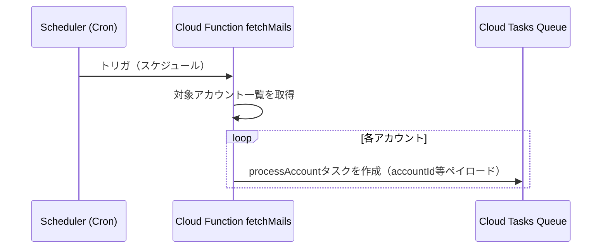
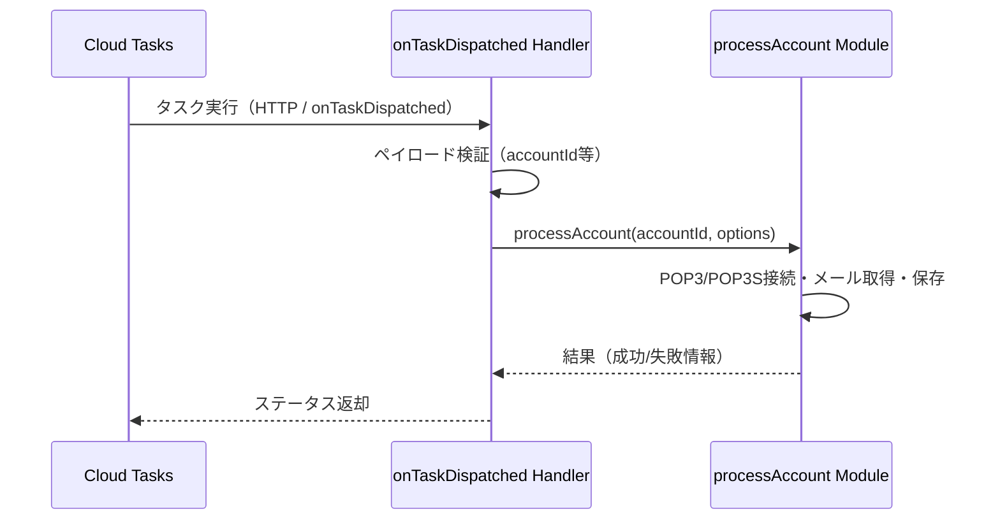

# Design Document: 20251223_fetch-mails-process-account

## Overview 

**Purpose**: この機能は、Cloud Functionsの`fetchMails`に内包されているアカウント単位処理`processAccount`を独立したモジュールとして切り出し、Cloud Tasks＋`onTaskDispatched`トリガから非同期に実行できるジョブとして再構成することで、メール取得処理のスケーラビリティ・テスト容易性・責務分離を実現する。  
**Users**: 主にバックエンド／インフラエンジニアが、本機能を通じてPOP3/POP3Sでのメール取得処理を安全かつスケーラブルに運用する。  
**Impact**: 既存の`fetchMails`関数は「アカウントごとの処理本体」を直接実行するのではなく、Cloud Tasksにアカウント別ジョブを投入する役割へと変更される。また、メール取得ロジックは新しい`processAccount`モジュール（および`onTaskDispatched`ハンドラ）に集約される。

### Goals
- `fetchMails`から`processAccount`ロジックを分離し、再利用可能かつテストしやすいモジュールとして定義すること
- Cloud Tasks＋`onTaskDispatched`を用いてアカウント単位のメール取得を非同期・並列に実行できるようにすること  
- 要件ドキュメントで定義した受け入れ基準（インターフェースの明確化、タスクペイロード仕様、再試行ポリシー、ログ確認性など）を設計レベルで具体化すること

### Non-Goals
- メール本文のパースロジック自体の再設計や暗号化方式の変更は行わない  
- Cloud Tasks以外のキューベース基盤（Pub/Sub等）への移行は対象外  
- 料金プランやユーザプランロジック（`planValidator`等）の新規設計は行わない（必要であれば既存ロジックを参照）

## Architecture

### Existing Architecture Analysis

- 既存のCloud Functionsコードは`functions/src/mail/fetchMails.ts`に`fetchMails`エントリポイントを持ち、アカウント一覧を走査しつつPOP3/POP3Sクライアントを介してメール取得を行っている。  
- メールの取得・保存・復号化等は、`pop3Client.ts`/`pop3sClient.ts`/`saveMail.ts`/`decryptMail.ts`などのモジュールに分かれているが、アカウント単位の処理フローは`fetchMails`内に近接している。  
- 現状は1つの関数実行内で複数アカウントを逐次処理する形になっており、アカウント数増加時に実行時間が線形に増大しうる。

### Architecture Pattern & Boundary Map

**Architecture Integration**:
- **Selected pattern**: 「ジョブキュー＋ワーカー」パターン（Cloud Tasks＋`onTaskDispatched`）。  
- **Domain/feature boundaries**:  
  - `fetchMails`関数: 「スケジュールされたトリガからアカウントごとタスクを投入するオーケストレータ」  
  - `processAccount`モジュール: 「単一アカウントのPOP3/POP3S接続〜メール取得〜保存までを担当するドメインロジック」  
  - `onTaskDispatched`ハンドラ: 「Cloud Tasksからのリクエストを受け取り、`processAccount`を実行するアダプタ」
- **Existing patterns preserved**: 既存の暗号化・保存ロジック・POP3クライアント構造は可能な限り踏襲し、モジュール分割と呼び出し元の変更に留める。  
- **New components rationale**:  
  - 新規`processAccount`モジュールにより、テスト対象が明確になり、`fetchMails`やタスクハンドラから独立して検証可能となる。  
  - `onTaskDispatched`ハンドラ導入により、アカウント単位での並列実行・リトライなどCloud Tasksの機能を活用できる。  
- **Steering compliance**: AI-DLC/Spec-Driven Developmentに従い、requirements→design→tasks→implementationの段階的アプローチを踏襲する。

### Technology Stack

| Layer | Choice / Version | Role in Feature | Notes |
|-------|------------------|-----------------|-------|
| Backend / Services | Firebase Cloud Functions (Node.js / TypeScript) | `fetchMails`エントリポイント、`onTaskDispatched`ハンドラの実装 | 既存functionsコードに追従 |
| Messaging / Events | Cloud Tasks | アカウント単位`processAccount`実行タスクのキューイング | HTTPターゲット＋`onTaskDispatched` |
| Data / Storage | Firestore / Cloud Storage（既存） | 取得メールのメタデータ保存・本文格納 | 既存ロジックを再利用 |
| Infrastructure / Runtime | GCP（Cloud Functions, Cloud Tasks） | ジョブ実行基盤 | 既存プロジェクト設定を利用 |

## System Flows

### Flow 1: fetchMailsによるタスク投入



### Flow 2: onTaskDispatchedによるprocessAccount実行



## Requirements Traceability

| Requirement | Summary | Components | Interfaces | Flows |
|-------------|---------|------------|------------|-------|
| 1 | processAccountの独立化 | `processAccount`モジュール、`fetchMails` | TypeScript関数インターフェース | Flow 1, Flow 2 |
| 2 | Cloud Tasks / onTaskDispatchedによる非同期実行 | `fetchMails`、`onTaskDispatched`ハンドラ | Cloud Tasks HTTPペイロード／レスポンス | Flow 1, Flow 2 |

## Components and Interfaces

### Mail Domain / Backend

#### Component: processAccount Module

| Field | Detail |
|-------|--------|
| Intent | 単一アカウントのメール取得〜保存までの処理を担当するコアドメインモジュール |
| Requirements | 1, 2 |

**Responsibilities & Constraints**
- 指定されたアカウントIDに紐づく接続情報を取得し、POP3/POP3Sクライアントを通じてメールを取得する。  
- メールの保存・復号・重複排除等は既存の`saveMail`や`decryptMail`モジュールを利用し、一貫した振る舞いとする。  
- 入力パラメータのバリデーション（必須項目・型）を行い、不正な入力は明示的なエラーとして扱う。  

**Dependencies**
- Inbound: `fetchMails`、`onTaskDispatched`ハンドラ — accountId等を渡して実行を依頼する（Critical）。  
- Outbound: `pop3Client` / `pop3sClient` — メール取得（Critical）。  
- Outbound: `saveMail` — Firestore/Storageへの保存（Critical）。  
- External: Cloud Logging — ログ出力（P1）。  

**Contracts**: Service [x] / API [ ] / Event [ ] / Batch [ ] / State [ ]

##### Service Interface（概略）

```typescript
export interface ProcessAccountParams {
  accountId: string;
  // 追加オプション（例: maxMessages, timeoutMs等）は将来拡張用にオプション扱い
}

export async function processAccount(params: ProcessAccountParams): Promise<void> {
  // 実装はimplementationフェーズで詳細化
}
```

- Preconditions: `accountId`が非空文字列であること。対象アカウント設定が有効であること。  
- Postconditions: 対象アカウントの新着メールが取得され、保存処理が実行されていること。  
- Invariants: メールIDの重複保存が起こらないこと。失敗時にはエラーが呼び出し元に伝播またはログされること。  

#### Component: fetchMails Orchestrator

| Field | Detail |
|-------|--------|
| Intent | スケジュール起動され、対象アカウントごとにCloud Tasksタスクを作成するオーケストレータ |
| Requirements | 1, 2 |

**Responsibilities & Constraints**
- 対象アカウント一覧を取得し、各アカウントについて`accountId`等を含むタスクをCloud Tasksへ投入する。  
- 既存の同期的な`processAccount`呼び出しを廃止し、新しい`processAccount`モジュールは直接は呼ばずにタスク経由の実行を基本とする（ただしテスト用などの同期実行フックはあってもよい）。  

**Contracts**: Service [ ] / API [ ] / Event [ ] / Batch [x] / State [ ]

##### Batch / Job Contract（タスク投入）
- Trigger: Cron もしくはHTTPトリガによる`fetchMails`実行。  
- Input / validation: タスク生成時に`accountId`が必須。その他オプションは検証ルールを定義。  
- Output / destination: Cloud Tasksキューへタスクを投入。  
- Idempotency & recovery: 同一アカウントに対して重複タスクを投入しない／もしくは重複しても`processAccount`側で冪等に処理できるようにする。  

#### Component: onTaskDispatched Handler

| Field | Detail |
|-------|--------|
| Intent | Cloud Tasksからの`onTaskDispatched`呼び出しを受け、`processAccount`を実行するアダプタ |
| Requirements | 2 |

**Responsibilities & Constraints**
- 受信ペイロードの検証（`accountId`必須、型チェック）を行い、問題があれば4xx系エラーとして応答する。  
- 検証を通過した場合に`processAccount`を呼び出し、その成功・失敗をHTTPステータスとしてCloud Tasksへ返す。  
- 再試行ポリシーに応じて、再試行時でも冪等に処理できるように`processAccount`の挙動を前提とする。  

**Contracts**: Service [ ] / API [x] / Event [ ] / Batch [x] / State [ ]

##### API Contract（概略）

| Method | Endpoint | Request | Response | Errors |
|--------|----------|---------|----------|--------|
| POST | `/tasks/processAccount`（例） | `{ accountId: string, ... }` | `{ status: "ok" }` | 400, 422, 500 |

## Data Models

### Domain Model

- エンティティ: メールアカウント（Account）、メール（Mail）  
- `processAccount`は1つのAccountに対する新着Mail取得というトランザクション境界を持つ。  
- 既存のMail保存ロジックを利用し、ビジネスルールや一意制約は既存実装に依存する。  

### Data Contracts & Integration

- Cloud Tasksペイロードスキーマ（設計レベル）:  
  - 必須: `accountId: string`  
  - 任意: `maxMessages?: number`, `retryCount?: number` 等（将来的な拡張を想定）  
- シリアライゼーション形式: JSON。  

## Error Handling

### Error Strategy

- POP3/POP3S接続エラー・認証エラーなど、インフラ／外部サービス起因のエラーは`processAccount`内で分類し、ログに明示する。  
- Cloud Tasksの再試行可能エラー（5xx相当）は、ハンドラから適切なステータスコードを返すことで自動リトライ対象とする。  
- 入力バリデーションエラー（`accountId`欠如など）は4xx系として扱い、再試行対象外とする。  
 - `fetchMails`関数のタイムアウトは15分とし、処理開始から10分を超過した時点で新規タスク投入を停止することで、タイムアウト直前の強制終了を避けつつ、残ったアカウントは次回スケジュール起動時に処理を継続できるようにする。  

### Monitoring

- `processAccount`開始／終了、失敗時のエラー種別・アカウントID（マスク／匿名化方針は既存ルールに従う）をログ出力する。  
- Cloud Tasksの失敗タスク数・再試行回数を監視指標としてダッシュボードに追加することを推奨する。  
 - `fetchMails`実行時間（開始〜終了）をメトリクスとして収集し、10分閾値付近での動作（新規タスク投入停止）が期待どおり行われているかを確認できるようにする。  

## Testing Strategy

- Unit Tests:  
  - `processAccount`の正常系（新着メールが存在する場合）。  
  - 認証エラー／接続エラー時のハンドリング。  
  - 不正な`accountId`入力時のバリデーション。  
- Integration Tests:  
  - `fetchMails`実行時に、対象アカウント数分のCloud Tasksタスクが正しく生成されること。  
  - `onTaskDispatched`ハンドラ経由で`processAccount`が呼び出されること（モックを用いた検証）。  
- Performance/Load（必要に応じて）:  
  - 多数アカウントに対するタスク投入時のレイテンシ・失敗率の確認。  


