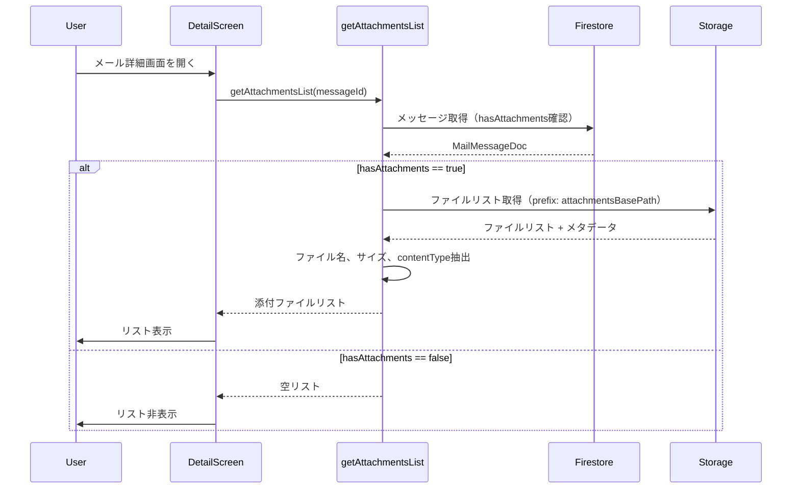
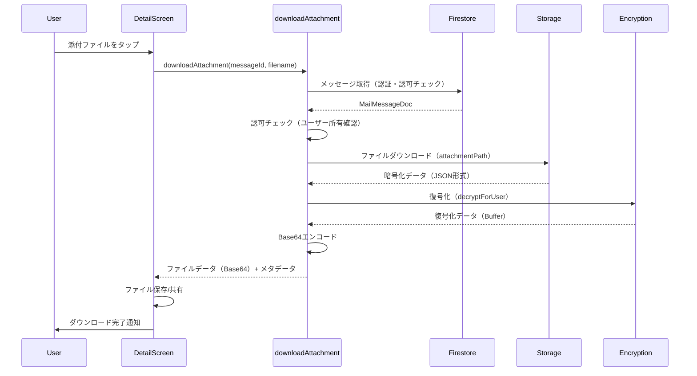

# Design Document

---
**Purpose**: Provide sufficient detail to ensure implementation consistency across different implementers, preventing interpretation drift.

**Approach**:
- Include essential sections that directly inform implementation decisions
- Omit optional sections unless critical to preventing implementation errors
- Match detail level to feature complexity
- Use diagrams and tables over lengthy prose

**Warning**: Approaching 1000 lines indicates excessive feature complexity that may require design simplification.
---

## Overview

この機能は、CloudInboxサービスにおいて受信メールに含まれる添付ファイルをユーザーが閲覧・ダウンロードできるようにする拡張機能です。既存のバックエンドでは添付ファイルの保存機能（暗号化してFirebase Storageに保存）が実装済みですが、クライアントアプリ側での表示・ダウンロード機能が未実装です。

**ユーザー**: CloudInboxサービスを利用するユーザーが、メール詳細画面で添付ファイルを確認し、必要に応じてダウンロードできるようになります。

**影響**: メール詳細画面に添付ファイルリスト表示機能が追加され、バックエンドに2つの新しいCloud Functions（添付ファイルリスト取得、添付ファイルダウンロード）が追加されます。

### Goals
- メール詳細画面で添付ファイルのリストを表示する
- ユーザーが添付ファイルをダウンロードできるようにする
- 既存のアーキテクチャパターン（decryptMail）に従って実装する
- セキュリティとエラーハンドリングを適切に実装する

### Non-Goals
- 添付ファイルのプレビュー機能（画像のインライン表示など）
- 添付ファイルの編集機能
- 複数ファイルの一括ダウンロード機能
- 添付ファイルの検索機能
- Firestoreへの添付ファイルメタデータ保存（既存のStorage保存方式を維持）

## Architecture

### Existing Architecture Analysis

既存システムは以下のアーキテクチャパターンに従っています：

- **サーバーレスアーキテクチャ**: Firebase Functions + Firestore/Storage
- **暗号化パターン**: AES-256-GCMアルゴリズムでユーザーごとのDEKを使用
- **Functionパターン**: HTTP Callable Function（`functions.region('asia-northeast1').https.onCall`）
- **認証・認可**: Firebase Authを使用し、各Functionで認証チェックを実装
- **エラーハンドリング**: `functions.https.HttpsError`を使用してエラーを返す
- **テストパターン**: `executeXXX`形式でコアロジックを分離してテスト可能にしている

既存の`decryptMail`関数が本文復号化のパターンを確立しているため、添付ファイル機能も同様のパターンに従います。

### Architecture Pattern & Boundary Map

```
┌─────────────────┐
│ Flutter App     │
│ DetailScreen    │
└────────┬────────┘
         │
         │ 1. getAttachmentsList(messageId)
         │ 2. downloadAttachment(messageId, filename)
         ▼
┌─────────────────────────────────────────┐
│ Firebase Functions                      │
│ ┌─────────────────────────────────────┐ │
│ │ getAttachmentsList                  │ │
│ │ - Firestore: メッセージ取得         │ │
│ │ - Storage: ファイルリスト取得       │ │
│ └─────────────────────────────────────┘ │
│ ┌─────────────────────────────────────┐ │
│ │ downloadAttachment                  │ │
│ │ - Firestore: メッセージ取得         │ │
│ │ - Storage: ファイルダウンロード     │ │
│ │ - Encryption: 復号化                │ │
│ └─────────────────────────────────────┘ │
└────────┬────────────────────────────────┘
         │
         │
    ┌────┴────┐
    │         │
    ▼         ▼
┌────────┐ ┌──────────────┐
│Firestore│ │Firebase      │
│         │ │Storage       │
└────────┘ └──────────────┘
```

**Architecture Integration**:
- **選択パターン**: 既存のdecryptMailパターンを踏襲
- **ドメイン境界**: バックエンド（Functions）とフロントエンド（Flutter）を明確に分離
- **既存パターンの維持**: decryptMailと同じパターンで認証・認可・エラーハンドリングを実装
- **新規コンポーネント**: getAttachmentsList、downloadAttachmentの2つのCloud Functions
- **Steering準拠**: 既存のTypeScript strict mode、単一責任原則、エラーハンドリングを維持

### Technology Stack

| Layer | Choice / Version | Role in Feature | Notes |
|-------|------------------|-----------------|-------|
| Frontend | Flutter / Dart | メール詳細画面に添付ファイルリスト表示、ダウンロード機能 | 既存のDetailScreenを拡張 |
| Backend | Firebase Functions / TypeScript | 添付ファイルリスト取得、ダウンロード・復号化 | 既存のdecryptMailパターンに従う |
| Data / Storage | Firebase Storage | 添付ファイルの保存先（暗号化済み） | 既存の保存方式を維持 |
| Database | Firestore | メッセージメタデータ（hasAttachments、storage.attachmentsBasePath） | 既存のスキーマを使用 |
| Encryption | AES-256-GCM | 添付ファイルの復号化 | 既存のdecryptForUserを使用 |

## System Flows

### 添付ファイルリスト取得フロー



**Key Decisions**: 
- リスト取得時はFirestoreでメッセージ存在確認後、Storageから直接リスト取得
- ファイル名はStorageパスから`.enc`拡張子を除去して取得

### 添付ファイルダウンロードフロー



**Key Decisions**: 
- ダウンロード時は認証・認可チェック後にStorageからダウンロード
- 復号化後はBase64エンコードして返す（既存のdecryptMailパターンと一貫性）
- エラー時は適切なエラーメッセージを返す

## Requirements Traceability

| Requirement | Summary | Components | Interfaces | Flows |
|-------------|---------|------------|------------|-------|
| 1.1 | メール詳細画面で添付ファイルリスト取得・表示 | DetailScreen, getAttachmentsList | getAttachmentsList API | リスト取得フロー |
| 1.2 | 添付ファイル情報（ファイル名、サイズ、contentType）表示 | DetailScreen, getAttachmentsList | AttachmentListItem interface | リスト取得フロー |
| 1.3 | 添付ファイルがない場合のリスト非表示 | DetailScreen, getAttachmentsList | getAttachmentsList API | リスト取得フロー |
| 1.4 | 認証されたユーザーのメッセージのみ取得 | getAttachmentsList | 認証・認可チェック | リスト取得フロー |
| 2.1 | Storageから暗号化ファイル取得 | downloadAttachment | Storage API | ダウンロードフロー |
| 2.2 | ユーザーDEKで復号化 | downloadAttachment | decryptForUser | ダウンロードフロー |
| 2.3 | ファイル不存在時のエラー処理 | downloadAttachment | エラーハンドリング | ダウンロードフロー |
| 2.4 | 復号化失敗時のエラー処理 | downloadAttachment | エラーハンドリング | ダウンロードフロー |
| 2.5 | 復号化データ + メタデータ返却 | downloadAttachment | downloadAttachment API | ダウンロードフロー |
| 2.6 | 認証されたユーザーの添付ファイルのみダウンロード許可 | downloadAttachment | 認証・認可チェック | ダウンロードフロー |
| 3.1 | 添付ファイルリストセクション表示 | DetailScreen | UI Component | リスト取得フロー |
| 3.2 | 添付ファイルタップでダウンロード開始 | DetailScreen | UI Event Handler | ダウンロードフロー |
| 3.3 | ダウンロード中の読み込みインジケーター表示 | DetailScreen | UI State Management | ダウンロードフロー |
| 3.4 | ダウンロード完了後のファイル保存/共有 | DetailScreen | File Save/Share | ダウンロードフロー |
| 3.5 | ダウンロード失敗時のエラーメッセージ表示 | DetailScreen | Error Handling | ダウンロードフロー |
| 3.6 | ファイルタイプに応じたアイコン表示 | DetailScreen | UI Component | リスト取得フロー |
| 4.1 | ダウンロードリクエスト前の認証チェック | downloadAttachment, getAttachmentsList | 認証チェック | 両フロー |
| 4.2 | メッセージ所有権の検証 | downloadAttachment, getAttachmentsList | 認可チェック | 両フロー |
| 4.3 | 認証失敗時のエラー返却 | downloadAttachment, getAttachmentsList | エラーハンドリング | 両フロー |
| 4.4 | 認可失敗時のエラー返却 | downloadAttachment, getAttachmentsList | エラーハンドリング | 両フロー |
| 4.5 | Storageエラーの処理 | downloadAttachment, getAttachmentsList | エラーハンドリング | 両フロー |
| 4.6 | エラーログ記録 | downloadAttachment, getAttachmentsList | Logging | 両フロー |
| 4.7 | ネットワークエラーの処理 | DetailScreen | Error Handling | ダウンロードフロー |

## Components and Interfaces

### Components Summary

| Component | Domain/Layer | Intent | Req Coverage | Key Dependencies (P0/P1) | Contracts |
|-----------|--------------|--------|--------------|--------------------------|-----------|
| getAttachmentsList | Backend (Functions) | 添付ファイルリスト取得 | 1.1, 1.2, 1.3, 1.4, 4.1, 4.2, 4.3, 4.4, 4.5, 4.6 | Firestore (P0), Storage (P0), Firebase Auth (P0) | Service, API |
| downloadAttachment | Backend (Functions) | 添付ファイルダウンロード・復号化 | 2.1, 2.2, 2.3, 2.4, 2.5, 2.6, 4.1, 4.2, 4.3, 4.4, 4.5, 4.6 | Firestore (P0), Storage (P0), Encryption (P0), Firebase Auth (P0) | Service, API |
| DetailScreen (拡張) | Frontend (Flutter) | 添付ファイル表示・ダウンロードUI | 3.1, 3.2, 3.3, 3.4, 3.5, 3.6, 4.7 | getAttachmentsList API (P0), downloadAttachment API (P0) | State, UI |

### Backend (Functions)

#### getAttachmentsList

| Field | Detail |
|-------|--------|
| Intent | メッセージに含まれる添付ファイルのリストを取得する |
| Requirements | 1.1, 1.2, 1.3, 1.4, 4.1, 4.2, 4.3, 4.4, 4.5, 4.6 |

**Responsibilities & Constraints**
- Firestoreからメッセージを取得し、hasAttachmentsを確認
- hasAttachmentsがtrueの場合、Storageからファイルリストを取得
- ファイル名、サイズ、contentTypeを抽出して返す
- 認証・認可チェックを実装（認証されたユーザーがメッセージを所有していることを確認）

**Dependencies**
- Inbound: Firebase Auth — 認証チェック (Criticality: P0)
- Outbound: Firestore — メッセージ取得 (Criticality: P0)
- Outbound: Firebase Storage — ファイルリスト取得 (Criticality: P0)

**Contracts**: Service [✓] / API [✓]

##### Service Interface
```typescript
interface GetAttachmentsListService {
  executeGetAttachmentsList(
    uid: string,
    messageId: string,
    db: admin.firestore.Firestore,
    storage: admin.storage.Storage
  ): Promise<AttachmentListItem[]>;
}
```
- Preconditions:
  - uidは認証されたユーザーのIDである
  - messageIdは有効なメッセージIDである
- Postconditions:
  - 返されるリストは、メッセージに属する添付ファイルのみを含む
  - 各アイテムにはfilename、size、contentTypeが含まれる
- Invariants:
  - メッセージが存在しない場合はエラーを返す
  - ユーザーがメッセージを所有していない場合はエラーを返す

##### API Contract
| Method | Endpoint | Request | Response | Errors |
|--------|----------|---------|----------|--------|
| HTTPS Callable | getAttachmentsList | { messageId: string } | { attachments: AttachmentListItem[] } | 401 (unauthenticated), 403 (permission-denied), 404 (not-found), 500 (internal) |

```typescript
interface GetAttachmentsListRequest {
  messageId: string;
}

interface GetAttachmentsListResponse {
  attachments: AttachmentListItem[];
}

interface AttachmentListItem {
  filename: string;
  size: number;  // bytes
  contentType: string;
}
```

**Implementation Notes**
- Integration: 既存のdecryptMailパターンに従う
- Validation: messageIdの存在確認、認証チェック、認可チェック
- Risks: Storage APIのレート制限に注意（ただし、既存のpurgeTrashでも同じパターンを使用）

#### downloadAttachment

| Field | Detail |
|-------|--------|
| Intent | 添付ファイルをダウンロードして復号化する |
| Requirements | 2.1, 2.2, 2.3, 2.4, 2.5, 2.6, 4.1, 4.2, 4.3, 4.4, 4.5, 4.6 |

**Responsibilities & Constraints**
- Firestoreからメッセージを取得し、認証・認可チェックを実行
- Storageから暗号化されたファイルをダウンロード
- ユーザーのDEKを使用して復号化
- Base64エンコードして返す（既存のdecryptMailパターンと一貫性）

**Dependencies**
- Inbound: Firebase Auth — 認証チェック (Criticality: P0)
- Outbound: Firestore — メッセージ取得 (Criticality: P0)
- Outbound: Firebase Storage — ファイルダウンロード (Criticality: P0)
- Outbound: Encryption Module (decryptForUser) — 復号化 (Criticality: P0)

**Contracts**: Service [✓] / API [✓]

##### Service Interface
```typescript
interface DownloadAttachmentService {
  executeDownloadAttachment(
    uid: string,
    messageId: string,
    filename: string,
    db: admin.firestore.Firestore,
    storage: admin.storage.Storage
  ): Promise<DownloadAttachmentResponse>;
}
```
- Preconditions:
  - uidは認証されたユーザーのIDである
  - messageIdは有効なメッセージIDである
  - filenameはメッセージに含まれる添付ファイルのファイル名である
- Postconditions:
  - 返されるデータは復号化されたファイル内容である
  - filename、contentType、sizeが含まれる
- Invariants:
  - メッセージが存在しない場合はエラーを返す
  - ユーザーがメッセージを所有していない場合はエラーを返す
  - ファイルが存在しない場合はエラーを返す

##### API Contract
| Method | Endpoint | Request | Response | Errors |
|--------|----------|---------|----------|--------|
| HTTPS Callable | downloadAttachment | { messageId: string, filename: string } | { content: string (base64), filename: string, contentType: string, size: number } | 401 (unauthenticated), 403 (permission-denied), 404 (not-found), 500 (internal) |

```typescript
interface DownloadAttachmentRequest {
  messageId: string;
  filename: string;
}

interface DownloadAttachmentResponse {
  content: string;  // Base64エンコードされたファイル内容
  filename: string;
  contentType: string;
  size: number;  // bytes
}
```

**Implementation Notes**
- Integration: 既存のdecryptMailパターンに従う。executeDownloadAttachment関数を実装してテスト可能にする
- Validation: messageId、filenameの存在確認、認証チェック、認可チェック
- Risks: 大きなファイルの場合、メモリ使用量が増える可能性（Cloud Functionsのメモリ制限内であれば問題なし）

### Frontend (Flutter)

#### DetailScreen (拡張)

| Field | Detail |
|-------|--------|
| Intent | メール詳細画面に添付ファイルリスト表示・ダウンロード機能を追加 |
| Requirements | 3.1, 3.2, 3.3, 3.4, 3.5, 3.6, 4.7 |

**Responsibilities & Constraints**
- メール詳細画面に添付ファイルリストセクションを表示
- 添付ファイルをタップするとダウンロードを開始
- ダウンロード中は読み込みインジケーターを表示
- ダウンロード完了後、ファイルを保存または共有
- エラー時はユーザーフレンドリーなメッセージを表示

**Dependencies**
- Inbound: getAttachmentsList API — 添付ファイルリスト取得 (Criticality: P0)
- Inbound: downloadAttachment API — 添付ファイルダウンロード (Criticality: P0)
- Outbound: File System / Share API — ファイル保存・共有 (Criticality: P1)

**Contracts**: State [✓] / UI [✓]

##### State Management
- State model: 添付ファイルリスト、ダウンロード状態（ファイルごと）、エラーメッセージ
- Persistence & consistency: メッセージ読み込み時にリストを取得、状態は画面内でのみ保持
- Concurrency strategy: 複数のファイルを同時にダウンロード可能（ただし、UIは個別の読み込み状態を管理）

**Implementation Notes**
- Integration: 既存のDetailScreenに添付ファイルリストセクションを追加。MailMessageDetail型にattachmentsフィールドを追加するか、別途取得する
- Validation: ネットワークエラー、認証エラーなどのエラーハンドリング
- Risks: 大きなファイルのダウンロード時にメモリ使用量が増える可能性（Base64デコード時）

## Data Models

### Domain Model

添付ファイルはメッセージに属する値オブジェクトとして扱います。

- **Aggregate Root**: MailMessage
- **Value Object**: Attachment（filename、size、contentType）
- **Business Rules**: 
  - 添付ファイルはメッセージの所有権に従う（ユーザーがメッセージを所有していない場合、添付ファイルにアクセスできない）
  - 添付ファイルは暗号化されて保存される

### Logical Data Model

**Structure Definition**:
- 既存のFirestoreスキーマを維持（`MailMessageDoc`に`hasAttachments`と`storage.attachmentsBasePath`が既に存在）
- 添付ファイルのメタデータ（ファイル名、サイズ、contentType）はStorageのメタデータから取得
- Storageパス: `mail-data/{uid}/{messageId}/attachments/{filename}.enc`

**Consistency & Integrity**:
- メッセージと添付ファイルの整合性は、Storageパスの構造によって保証される
- メッセージが削除される場合、添付ファイルも一緒に削除される（purgeTrashで実装済み）

### Physical Data Model

**For File Storage (Firebase Storage)**:
- Path structure: 
  - `mail-data/{uid}/{messageId}/attachments/{filename}.enc`: 添付ファイル（暗号化済み）
- Metadata: `contentType`、`size`（Storageのメタデータに保存）
- Encryption: AES-256-GCMで暗号化（既存の保存方式を維持）
- File naming: ファイル名はStorageパスから`.enc`拡張子を除去して取得

### Data Contracts & Integration

**API Data Transfer**:
- Request/response schemas: TypeScript型定義を使用（上記のAPI Contractセクションを参照）
- Validation rules: 入力検証、型チェック、認証・認可チェック
- Serialization format: JSON（Firebase Functionsの標準）

**Cross-Service Data Management**:
- メッセージと添付ファイルの整合性は、Storageパスの構造によって保証される
- 分散トランザクションは不要（メッセージと添付ファイルは同じストレージ階層内に保存されるため）

## Error Handling

### Error Strategy

既存のdecryptMailパターンに従い、`functions.https.HttpsError`を使用してエラーを返します。

### Error Categories and Responses

**User Errors** (4xx):
- **401 (unauthenticated)**: 認証されていない — ユーザーにログインを促す
- **403 (permission-denied)**: メッセージを所有していない — 適切なエラーメッセージを表示
- **404 (not-found)**: メッセージまたはファイルが存在しない — 適切なエラーメッセージを表示

**System Errors** (5xx):
- **500 (internal)**: ストレージエラー、復号化エラーなど — ユーザーフレンドリーなエラーメッセージを表示、詳細はログに記録

**Business Logic Errors**:
- ファイルが存在しない場合 — 404エラーを返す
- 復号化が失敗した場合 — 500エラーを返す（内部エラーとして扱う）

### Monitoring

- エラーログ: `functions.logger.error`を使用してエラーをログに記録
- メトリクス: Cloud Functionsの組み込みメトリクスを使用（実行時間、エラー率など）
- アラート: Cloud Functionsのエラー率が閾値を超えた場合にアラート（既存の監視設定を利用）

## Testing Strategy

### Unit Tests
- `executeGetAttachmentsList`: メッセージ取得、Storageリスト取得、ファイル名抽出ロジック
- `executeDownloadAttachment`: メッセージ取得、Storageダウンロード、復号化ロジック
- エラーハンドリング: 認証エラー、認可エラー、ファイル不存在エラー

### Integration Tests
- `getAttachmentsList` Function: 認証、Firestore、Storageとの統合
- `downloadAttachment` Function: 認証、Firestore、Storage、復号化との統合
- エンドツーエンド: メッセージに添付ファイルがある場合のリスト取得、ダウンロード

### E2E/UI Tests
- DetailScreen: 添付ファイルリスト表示、ダウンロード、エラー表示
- 複数添付ファイルがある場合の表示
- 添付ファイルがない場合の非表示

### Performance/Load
- 大きなファイル（10MB以上）のダウンロード性能
- 複数添付ファイルがある場合のリスト取得性能
- Storage API呼び出しのレート制限

## Security Considerations

- **認証**: Firebase Authを使用し、各Functionで認証チェックを実装
- **認可**: メッセージの所有権を確認（ユーザーがメッセージを所有していることを確認）
- **データ保護**: 添付ファイルは既にAES-256-GCMで暗号化されて保存されているため、復号化時のみDEKを使用
- **入力検証**: messageId、filenameの存在確認とバリデーション
- **エラーメッセージ**: 内部エラーの詳細をクライアントに返さない（セキュリティ上の理由）

## Performance & Scalability

- **リスト取得**: Storage API呼び出しが発生するため、レイテンシが発生する可能性（ただし、既存のpurgeTrashでも同じパターンを使用）
- **ダウンロード**: 大きなファイルの場合、メモリ使用量が増える可能性（Cloud Functionsのメモリ制限内であれば問題なし）
- **スケーリング**: Firebase Functionsの自動スケーリングに依存

