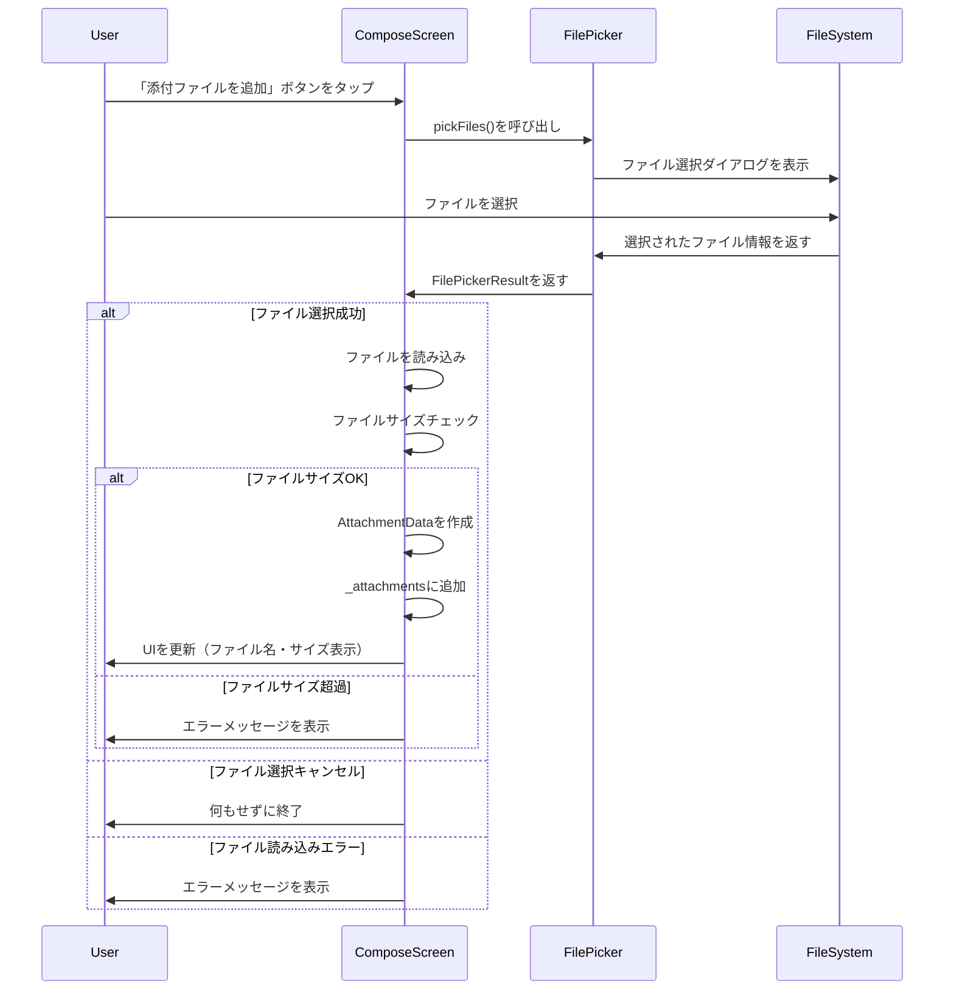
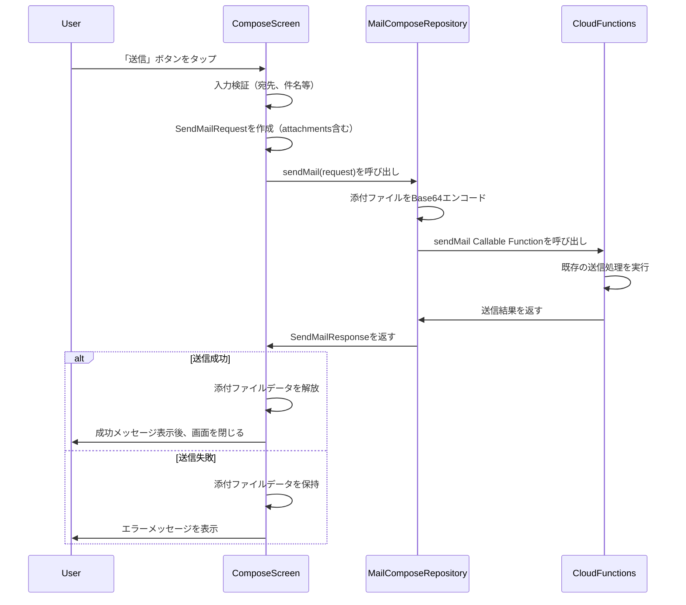

# Design Document

## Overview

本機能は、CloudInboxのメール作成画面にファイル選択機能を追加し、ユーザーが添付ファイル付きのメールを送信できるようにします。バックエンド側（Cloud Functions）では既に添付ファイル付きメール送信の処理が実装済みのため、本設計は主にフロントエンド側（Flutterアプリ）の実装に焦点を当てます。

**Purpose**: ユーザーがメール作成画面からファイルを選択し、添付ファイル付きのメールを送信できるようにする。

**Users**: CloudInboxのメール送信機能を利用するすべてのユーザーが、ファイルを添付してメールを送信できるようになります。

**Impact**: 既存の`ComposeScreen`にファイル選択機能を追加し、`file_picker`パッケージを導入することで、ユーザーはデバイスからファイルを選択してメールに添付できるようになります。

### Goals

- メール作成画面からファイルを選択して添付できる機能を実装する
- 既存のバックエンド実装を活用し、フロントエンド側のみを拡張する
- Android/iOS両プラットフォームで動作するファイル選択機能を提供する
- ユーザーフレンドリーなエラーハンドリングとフィードバックを実装する

### Non-Goals

- バックエンド側の変更は行わない（既存実装を活用）
- ファイルプレビュー機能は実装しない（ファイル名とサイズのみ表示）
- ファイル編集機能は実装しない
- クラウドストレージからのファイル選択は実装しない（デバイスローカルファイルのみ）

## Architecture

### Existing Architecture Analysis

既存のアーキテクチャを確認した結果、以下の状況が確認されました：

- **バックエンド（Cloud Functions）**: `sendMail.ts`で添付ファイル付きメール送信の処理が完全に実装済み
  - `SendMailRequest`インターフェースに`attachments`フィールドが定義されている
  - Base64エンコードされた添付ファイルデータを受け取り、MIMEメールに含めて送信する処理が実装されている

- **フロントエンド（Flutter）**: `ComposeScreen`に添付ファイル管理のUI要素が既に存在
  - `AttachmentData`クラスが定義されている（`filename`, `content: Uint8List`, `contentType`）
  - `_attachments`リストで添付ファイルを管理している
  - 添付ファイル表示UI（`ListTile`）が実装されている
  - `_onAddAttachmentPressed`メソッドが未実装（TODOコメントあり）

- **メール送信処理**: `main.dart`の`MailComposeRepository`実装で、既に添付ファイルをBase64エンコードして送信する処理が実装されている

### Architecture Pattern & Boundary Map

```
┌─────────────────────────────────────────────────────────┐
│                    ComposeScreen                         │
│  ┌───────────────────────────────────────────────────┐  │
│  │  UI Layer                                         │  │
│  │  - ファイル選択ボタン                              │  │
│  │  - 添付ファイルリスト表示                          │  │
│  │  - エラーメッセージ表示                            │  │
│  └───────────────────────────────────────────────────┘  │
│  ┌───────────────────────────────────────────────────┐  │
│  │  State Management                                 │  │
│  │  - _attachments: List<AttachmentData>             │  │
│  │  - _isLoading: bool                               │  │
│  │  - _errorMessage: String?                         │  │
│  └───────────────────────────────────────────────────┘  │
│  ┌───────────────────────────────────────────────────┐  │
│  │  File Picker Integration                          │  │
│  │  - file_picker パッケージ                         │  │
│  │  - ファイル選択処理                                │  │
│  │  - ファイル読み込み処理                            │  │
│  └───────────────────────────────────────────────────┘  │
└─────────────────────────────────────────────────────────┘
                          │
                          ▼
┌─────────────────────────────────────────────────────────┐
│              MailComposeRepository                       │
│  - sendMail(SendMailRequest)                            │
│  - 添付ファイルをBase64エンコード                       │
└─────────────────────────────────────────────────────────┘
                          │
                          ▼
┌─────────────────────────────────────────────────────────┐
│            Cloud Functions (sendMail)                    │
│  - 既存実装を活用                                        │
│  - 添付ファイル付きメール送信                           │
└─────────────────────────────────────────────────────────┘
```

**Architecture Integration**:
- Selected pattern: 既存の`ComposeScreen`を拡張する形で実装
- Domain/feature boundaries: UI層とファイル選択処理を分離し、既存のメール送信フローを維持
- Existing patterns preserved: 既存の`AttachmentData`クラス、`SendMailRequest`クラス、エラーハンドリングパターンを活用
- New components rationale: `file_picker`パッケージを導入してファイル選択機能を実現
- Steering compliance: Flutter Material Design、国際化対応、エラーハンドリングの原則に準拠

### Technology Stack

| Layer | Choice / Version | Role in Feature | Notes |
|-------|------------------|-----------------|-------|
| Frontend | Flutter (Dart) | メール作成画面の拡張 | 既存の`ComposeScreen`を拡張 |
| File Picker | file_picker ^8.0.0 | ファイル選択機能 | Android/iOS対応、スコープドストレージ対応 |
| State Management | Flutter StatefulWidget | 添付ファイルリスト管理 | 既存の`_ComposeScreenState`を拡張 |
| Error Handling | SnackBar / AlertDialog | エラーメッセージ表示 | 既存パターンを活用 |
| Internationalization | I18nService | エラーメッセージの国際化 | 既存の`I18nService`を活用 |

## System Flows

### ファイル選択フロー



### メール送信フロー（既存実装を活用）



## Requirements Traceability

| Requirement | Summary | Components | Interfaces | Flows |
|-------------|---------|------------|------------|-------|
| 1.1-1.12 | ファイル選択機能の実装 | ComposeScreen, FilePicker | _onAddAttachmentPressed | ファイル選択フロー |
| 2.1-2.9 | 添付ファイルの管理と表示 | ComposeScreen | _attachments, build() | UI更新 |
| 3.1-3.9 | 添付ファイルの送信処理 | ComposeScreen, MailComposeRepository | sendMail() | メール送信フロー |
| 4.1-4.8 | プラットフォーム対応と権限管理 | file_picker, AndroidManifest.xml, Info.plist | - | ファイル選択フロー |
| 5.1-5.7 | エラーハンドリングとユーザー体験 | ComposeScreen, I18nService | _onAddAttachmentPressed | ファイル選択フロー |
| 6.1-6.5 | 依存関係とパッケージ管理 | pubspec.yaml | - | - |

## Components and Interfaces

### UI Layer

#### ComposeScreen

| Field | Detail |
|-------|--------|
| Intent | メール作成画面にファイル選択機能を追加する |
| Requirements | 1.1-1.12, 2.1-2.9, 3.1-3.9, 5.1-5.7 |

**Responsibilities & Constraints**
- ファイル選択ボタンの表示とイベントハンドリング
- 選択されたファイルの表示と管理
- ファイルサイズの検証とエラーハンドリング
- 既存のメール送信フローとの統合

**Dependencies**
- Inbound: `file_picker`パッケージ — ファイル選択機能（Criticality: P0）
- Inbound: `I18nService` — 国際化対応（Criticality: P1）
- Outbound: `MailComposeRepository` — メール送信（Criticality: P0）

**Contracts**: Service [ ] / API [ ] / Event [ ] / Batch [ ] / State [X]

##### State Management
- State model: `_attachments: List<AttachmentData>`で添付ファイルリストを管理
- Persistence & consistency: メール送信成功時までメモリに保持、送信成功後に解放
- Concurrency strategy: 単一スレッド（Flutterのメインスレッド）で処理

**Implementation Notes**
- Integration: 既存の`_onAddAttachmentPressed`メソッドを実装
- Validation: ファイルサイズ制限（10MBを推奨、実装側で決定）をチェック
- Risks: 大きなファイルを選択した場合のメモリ使用量に注意

### File Picker Integration

#### FilePickerService（仮想的なサービス層）

| Field | Detail |
|-------|--------|
| Intent | `file_picker`パッケージを使用してファイル選択機能を提供する |
| Requirements | 1.1-1.12, 4.1-4.8 |

**Responsibilities & Constraints**
- プラットフォーム（Android/iOS）に応じたファイル選択ダイアログの表示
- 選択されたファイルの読み込み
- ファイル情報（ファイル名、サイズ、コンテンツタイプ）の取得

**Dependencies**
- External: `file_picker`パッケージ — ファイル選択機能（Criticality: P0）

**Implementation Notes**
- Integration: `ComposeScreen`の`_onAddAttachmentPressed`メソッド内で直接使用
- Validation: ファイルサイズ、ファイルタイプの検証を実装
- Risks: プラットフォーム固有の権限設定が必要な場合がある

## Data Models

### Domain Model

**AttachmentData**（既存クラスを活用）

```dart
class AttachmentData {
  const AttachmentData({
    required this.filename,
    required this.content,
    this.contentType,
  });

  final String filename;
  final Uint8List content;
  final String? contentType;
}
```

- **Aggregates and transactional boundaries**: `ComposeScreen`の状態として管理
- **Entities, value objects, domain events**: 値オブジェクトとして扱う
- **Business rules & invariants**: 
  - ファイル名は必須
  - ファイル内容（`Uint8List`）は必須
  - コンテンツタイプはオプション（自動検出可能な場合）

### Logical Data Model

**添付ファイル管理の状態**

- `_attachments: List<AttachmentData>`: 選択された添付ファイルのリスト
- 各`AttachmentData`は以下の情報を含む:
  - `filename: String`: ファイル名
  - `content: Uint8List`: ファイル内容（メモリ上）
  - `contentType: String?`: MIMEタイプ（オプション）

**Consistency & Integrity**
- メール送信成功時までメモリに保持
- メール送信成功後、または画面を閉じる際にメモリから解放
- ファイルサイズ制限を超えるファイルは追加しない

### Data Contracts & Integration

**API Data Transfer**

`SendMailRequest`（既存クラス）:
```dart
class SendMailRequest {
  final String accountId;
  final List<String> to;
  final List<String> cc;
  final List<String> bcc;
  final String subject;
  final String body;
  final List<AttachmentData> attachments;  // 既存フィールド
  final String? threadId;
}
```

- Request/response schemas: 既存の`SendMailRequest`と`SendMailResponse`を活用
- Validation rules: ファイルサイズ制限、ファイル名の検証
- Serialization format: JSON（Cloud Functions経由）

## Error Handling

### Error Strategy

ファイル選択時のエラーは、ユーザーフレンドリーなメッセージとして表示し、操作を継続可能にします。エラーの種類に応じて適切な処理を行います。

### Error Categories and Responses

**User Errors**:
- **ファイル選択キャンセル**: エラーメッセージを表示せず、正常終了
- **ファイルサイズ超過**: ファイルサイズ制限を超えていることを示すエラーメッセージを表示（例: "ファイルサイズが10MBを超えています"）
- **ファイル読み込みエラー**: ファイル読み込みに失敗したことを示すエラーメッセージを表示（例: "ファイルの読み込みに失敗しました"）

**System Errors**:
- **ファイルアクセス権限エラー**: ファイルアクセス権限が不足していることを示すエラーメッセージを表示（例: "ファイルへのアクセス権限がありません"）
- **プラットフォーム固有のエラー**: プラットフォーム（Android/iOS）固有のエラーメッセージを表示

**Business Logic Errors**:
- **サポートされていないファイルタイプ**: 警告メッセージを表示するか、選択を許可するかは実装側で決定（デフォルトではすべてのファイルタイプを許可）

### Monitoring

- エラーログを`debugPrint`で記録（開発環境用）
- 本番環境ではFirebase Crashlytics等のエラートラッキングツールを使用することを推奨

## Testing Strategy

### Unit Tests

1. **ファイル選択処理のテスト**
   - `_onAddAttachmentPressed`メソッドのテスト
   - ファイル選択成功時の`_attachments`リストへの追加を検証
   - ファイル選択キャンセル時の処理を検証

2. **ファイルサイズ検証のテスト**
   - ファイルサイズ制限を超えるファイルが拒否されることを検証
   - ファイルサイズ制限内のファイルが許可されることを検証

3. **添付ファイル削除処理のテスト**
   - `_onRemoveAttachment`メソッドのテスト
   - 添付ファイルリストから正しく削除されることを検証

### Integration Tests

1. **ファイル選択からメール送信までの統合テスト**
   - ファイル選択 → 添付ファイル表示 → メール送信の一連の流れを検証
   - バックエンドへの送信リクエストに添付ファイルが含まれることを検証

2. **エラーハンドリングの統合テスト**
   - ファイル選択エラー時のエラーメッセージ表示を検証
   - メール送信失敗時の添付ファイルデータ保持を検証

### E2E/UI Tests

1. **ファイル選択UIのテスト**
   - 「添付ファイルを追加」ボタンをタップしてファイル選択ダイアログが表示されることを検証
   - 選択されたファイルがリストに表示されることを検証
   - ファイル削除ボタンでファイルが削除されることを検証

2. **メール送信フローのテスト**
   - 添付ファイル付きメールの送信が成功することを検証
   - 送信成功後に画面が閉じられることを検証

## Security Considerations

- **ファイルアクセス権限**: Android/iOSのスコープドストレージ制約に準拠
- **メモリ管理**: 大きなファイルを選択した場合のメモリ使用量に注意し、必要に応じてストリーミング処理を検討
- **データ保護**: 添付ファイルデータはメモリ上にのみ保持し、送信成功後は即座に解放

## Performance & Scalability

- **ファイルサイズ制限**: 10MBを推奨（実装側で決定可能）
- **メモリ使用量**: 複数の大きなファイルを選択した場合のメモリ使用量に注意
- **ファイル読み込み**: 大きなファイルの読み込み時にUIがブロックされないよう、非同期処理を適切に実装

## Supporting References

- `file_picker`パッケージの公式ドキュメント: https://pub.dev/packages/file_picker
- 既存の`ComposeScreen`実装: `apps/mobile_app/lib/screens/compose_screen.dart`
- 既存のメール送信処理: `apps/mobile_app/lib/main.dart`（`MailComposeRepository`実装）
- 既存のバックエンド実装: `functions/src/mail/sendMail.ts`

