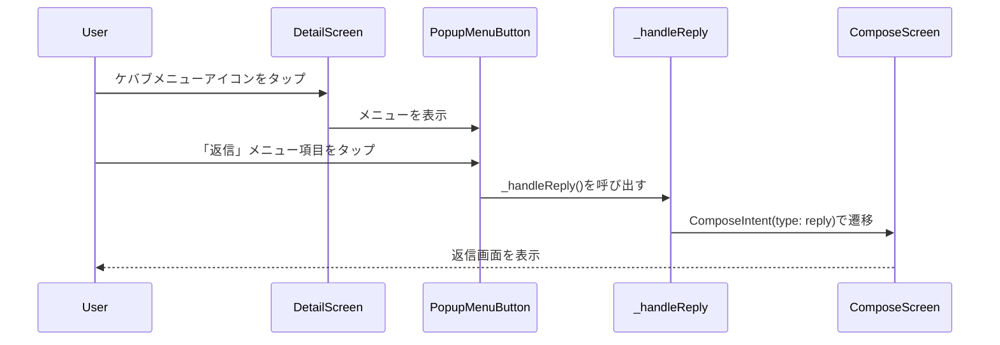
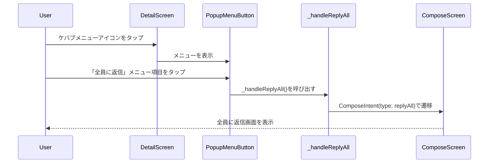
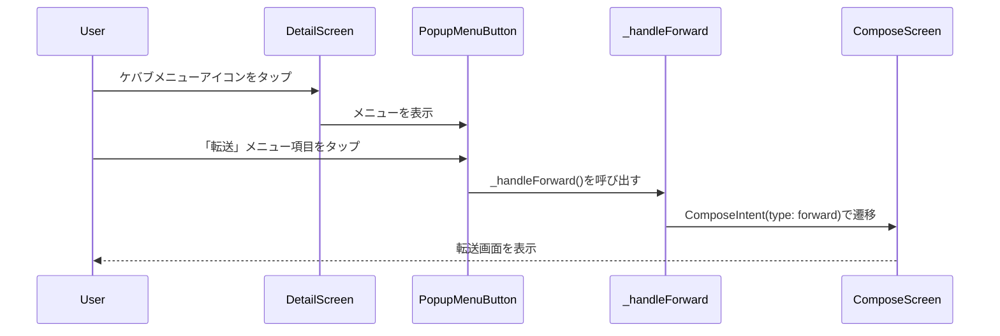

# Design Document

## Overview

本機能は、CloudInboxサービスのメール詳細画面（`DetailScreen`）の`AppBar`にケバブメニュー（`PopupMenuButton`）を追加し、「返信」「全員に返信」「転送」の各アクションを実行できるようにします。現在、これらの機能は`bottomNavigationBar`のアイコンボタンとして実装されていますが、よりアクセスしやすくするため、`AppBar`にも追加します。

**Purpose**: メール詳細画面の`AppBar`にケバブメニューを追加し、ユーザーが返信・転送機能にアクセスしやすくする。

**Users**: CloudInboxのメール詳細画面を利用するすべてのユーザーが、`AppBar`のケバブメニューから返信・転送機能を利用できるようになります。

**Impact**: `DetailScreen`の`AppBar`に`PopupMenuButton`を追加し、既存の処理ロジック（`_handleReply()`, `_handleReplyAll()`, `_handleForward()`）を再利用してケバブメニューから実行できるようにします。

### Goals

- `DetailScreen`の`AppBar`に`PopupMenuButton`を追加する
- ケバブメニューに「返信」「全員に返信」「転送」の3つのメニュー項目を実装する
- 既存の処理ロジック（`_handleReply()`, `_handleReplyAll()`, `_handleForward()`）を再利用する
- 既存のUI（`bottomNavigationBar`）に影響を与えない
- Material Designガイドラインに準拠したUI実装を行う

### Non-Goals

- `bottomNavigationBar`の既存のアイコンボタンを削除・変更しない（要件に従い、両方の場所からアクセス可能にする）
- 新しい処理ロジックの実装は行わない（既存のハンドラーメソッドを再利用）
- 国際化対応は既存の`I18nService`を使用する（新しい翻訳キーの追加は不要）

## Architecture

### Existing Architecture Analysis

既存のアーキテクチャを確認した結果、以下の状況が確認されました：

- **UI層（Flutter）**: `DetailScreen`に`AppBar`と`bottomNavigationBar`が実装済み
  - `AppBar`には現在、`title`のみが設定されている（363-365行目）
  - `bottomNavigationBar`には「返信」「全員に返信」「転送」のアイコンボタンが実装されている（386-409行目）
  - `_handleReply()`, `_handleReplyAll()`, `_handleForward()`メソッドが既に実装されている（166-267行目）
  - `ComposeScreen`への遷移処理も実装済み

- **国際化**: `I18nService.translateReply()`, `translateReplyAll()`, `translateForward()`が既に実装されている

- **状態管理**: `_message`が`null`の場合のハンドリングが既に実装されている

### Architecture Pattern & Boundary Map

```
┌─────────────────────────────────────────────────────────┐
│                    DetailScreen                          │
│  ┌───────────────────────────────────────────────────┐  │
│  │  AppBar                                           │  │
│  │  - Title (既存)                                    │  │
│  │  - PopupMenuButton (新規追加)                      │  │
│  │    └─ 返信メニュー項目                            │  │
│  │    └─ 全員に返信メニュー項目                      │  │
│  │    └─ 転送メニュー項目                            │  │
│  └───────────────────────────────────────────────────┘  │
│  ┌───────────────────────────────────────────────────┐  │
│  │  Body (既存)                                       │  │
│  └───────────────────────────────────────────────────┘  │
│  ┌───────────────────────────────────────────────────┐  │
│  │  bottomNavigationBar (既存、変更なし)              │  │
│  │  - 返信アイコンボタン                              │  │
│  │  - 全員に返信アイコンボタン                        │  │
│  │  - 転送アイコンボタン                              │  │
│  └───────────────────────────────────────────────────┘  │
└─────────────────────────────────────────────────────────┘
                          │
                          ▼
          ┌─────────────────────────────────┐
          │  既存のハンドラーメソッド        │
          │  - _handleReply()               │
          │  - _handleReplyAll()            │
          │  - _handleForward()             │
          └─────────────────────────────────┘
                          │
                          ▼
          ┌─────────────────────────────────┐
          │        ComposeScreen             │
          │  (既存、変更なし)                │
          └─────────────────────────────────┘
```

**Architecture Integration**:
- **Selected pattern**: 既存の`DetailScreen`クラスを拡張する形で実装
- **Domain/feature boundaries**: UI層（`DetailScreen`）の責務を維持し、既存のハンドラーメソッドを再利用
- **Existing patterns preserved**: 既存の`AppBar`の実装パターン（`ComposeScreen`の`AppBar`の`actions`プロパティの使用例）を踏襲
- **New components rationale**: `AppBar`の`actions`プロパティに`PopupMenuButton`を追加するのみ
- **Steering compliance**: Material Designガイドラインに準拠したUI実装

### Technology Stack

| Layer | Choice / Version | Role in Feature | Notes |
|-------|------------------|-----------------|-------|
| Frontend | Flutter (Dart) | メール詳細画面のUI実装 | 既存の`DetailScreen`を拡張 |
| UI Component | PopupMenuButton | ケバブメニューの表示 | Flutter標準ウィジェット |
| State Management | Flutter StatefulWidget | メール詳細画面の状態管理 | 既存の`DetailScreen`を活用 |
| Internationalization | I18nService | メニュー項目の国際化 | 既存のメソッドを再利用 |

## System Flows

### Flow 1: ケバブメニューから返信フロー



### Flow 2: ケバブメニューから全員に返信フロー



### Flow 3: ケバブメニューから転送フロー



## Requirements Traceability

| Requirement | Summary | Components | Interfaces | Flows |
|-------------|---------|------------|------------|-------|
| 1.1-1.7 | ケバブメニューの追加 | DetailScreen (AppBar) | PopupMenuButton | - |
| 2.1-2.6 | 返信メニュー項目の実装 | DetailScreen (PopupMenuButton) | _handleReply() | Flow 1 |
| 3.1-3.6 | 全員に返信メニュー項目の実装 | DetailScreen (PopupMenuButton) | _handleReplyAll() | Flow 2 |
| 4.1-4.6 | 転送メニュー項目の実装 | DetailScreen (PopupMenuButton) | _handleForward() | Flow 3 |
| 5.1-5.5 | UIの一貫性とユーザー体験 | DetailScreen (PopupMenuButton) | - | - |
| 6.1-6.4 | エラーハンドリングと状態管理 | DetailScreen (PopupMenuButton) | 既存のハンドラー | 全フロー |
| 7.1-7.7 | 実装の一貫性とコード品質 | DetailScreen | 既存のパターン | 全フロー |

## Components and Interfaces

### UI Layer

#### Component: DetailScreen (AppBar)

| Field | Detail |
|-------|--------|
| Intent | メール詳細画面の`AppBar`にケバブメニューを追加し、返信・転送機能へのアクセスを提供する |
| Requirements | 1.1-1.7, 2.1-2.6, 3.1-3.6, 4.1-4.6, 5.1-5.5, 6.1-6.4, 7.1-7.7 |

**Responsibilities & Constraints**
- `AppBar`の`actions`プロパティに`PopupMenuButton`を追加する
- `composeRepository`と`accountRepository`が`null`の場合はメニューを表示しない
- `_message == null`の場合はメニュー項目を無効化する
- 既存の`title`表示に影響を与えない

**Dependencies**
- Inbound: `widget.composeRepository` — 返信・転送機能のリポジトリ（Criticality: P0）
- Inbound: `widget.accountRepository` — アカウント情報のリポジトリ（Criticality: P0）
- Inbound: `_message` — メールメッセージの状態（Criticality: P0）
- Outbound: `_handleReply()`, `_handleReplyAll()`, `_handleForward()` — 既存のハンドラーメソッド（Criticality: P0）
- External: `I18nService` — 国際化サービス（Criticality: P0）

**Contracts**: Service [ ] / API [ ] / Event [ ] / Batch [ ] / State [ ]

##### Implementation Interface

```dart
// AppBarのactionsプロパティに追加するPopupMenuButtonの実装例

AppBar(
  title: Text(_message?.subject ?? 'Mail Detail'),
  actions: [
    // composeRepositoryとaccountRepositoryが存在する場合のみ表示
    if (widget.composeRepository != null && 
        widget.accountRepository != null)
      PopupMenuButton<String>(
        icon: const Icon(Icons.more_vert),
        onSelected: (value) {
          switch (value) {
            case 'reply':
              _handleReply();
              break;
            case 'reply_all':
              _handleReplyAll();
              break;
            case 'forward':
              _handleForward();
              break;
          }
        },
        itemBuilder: (BuildContext context) {
          final locale = Localizations.localeOf(context);
          final isEnabled = _message != null;
          
          return [
            PopupMenuItem<String>(
              value: 'reply',
              enabled: isEnabled,
              child: Row(
                children: [
                  const Icon(Icons.reply),
                  const SizedBox(width: 8),
                  Text(I18nService.translateReply(locale)),
                ],
              ),
            ),
            PopupMenuItem<String>(
              value: 'reply_all',
              enabled: isEnabled,
              child: Row(
                children: [
                  const Icon(Icons.reply_all),
                  const SizedBox(width: 8),
                  Text(I18nService.translateReplyAll(locale)),
                ],
              ),
            ),
            PopupMenuItem<String>(
              value: 'forward',
              enabled: isEnabled,
              child: Row(
                children: [
                  const Icon(Icons.forward),
                  const SizedBox(width: 8),
                  Text(I18nService.translateForward(locale)),
                ],
              ),
            ),
          ];
        },
      ),
  ],
)
```

- Preconditions: `widget.composeRepository`と`widget.accountRepository`が`null`でない場合のみ表示
- Postconditions: メニュー項目がタップされると、対応するハンドラーメソッドが呼び出される
- Invariants: `_message == null`の場合、メニュー項目は無効化される（`enabled: false`）

**Implementation Notes**
- Integration: 既存の`DetailScreen`クラスの`build`メソッド内の`AppBar`に`actions`プロパティを追加
- Validation: `composeRepository`と`accountRepository`の`null`チェック、`_message`の`null`チェック
- Risks: 既存の`AppBar`の実装を変更するため、既存の動作に影響を与えないよう注意が必要

## Data Models

本機能では、新しいデータモデルは追加しません。既存の`MailMessageDetail`モデルと`ComposeIntent`モデルを再利用します。

### Domain Model

既存のモデルを再利用：

- **MailMessageDetail**: メールメッセージの詳細情報（`id`, `subject`, `from`, `to`, `cc`, `bcc`, `bodyText`, `threadId`など）
- **ComposeIntent**: 返信・転送用のデータ（`type`, `threadId`, `replyTo`, `replyToAll`, `subject`, `body`）

## Error Handling

### Error Strategy

ケバブメニューからの操作時のエラーは、既存のハンドラーメソッド（`_handleReply()`, `_handleReplyAll()`, `_handleForward()`）のエラーハンドリングロジックを使用します。これらのメソッドは既に適切なエラーハンドリングを実装しているため、追加のエラー処理は不要です。

### Error Categories and Responses

**User Errors**:
- **メッセージが読み込まれていない**: メニュー項目が無効化される（`enabled: false`）
- **composeRepositoryまたはaccountRepositoryがnull**: メニューが表示されない

**System Errors**:
- **ComposeScreenへの遷移エラー**: 既存のハンドラーメソッドで処理される（既に実装済み）

### Monitoring

- エラーログは既存のハンドラーメソッドで`debugPrint`により記録される（既に実装済み）
- 新しいエラー処理は追加しない

## Testing Strategy

### Unit Tests

1. **ケバブメニューの表示テスト**
   - `composeRepository`と`accountRepository`が`null`でない場合、メニューが表示されることを検証
   - `composeRepository`または`accountRepository`が`null`の場合、メニューが表示されないことを検証

2. **メニュー項目の有効化/無効化テスト**
   - `_message`が`null`の場合、メニュー項目が無効化されることを検証
   - `_message`が`null`でない場合、メニュー項目が有効化されることを検証

3. **メニュー項目のタップ処理テスト**
   - 「返信」メニュー項目がタップされた場合、`_handleReply()`が呼び出されることを検証
   - 「全員に返信」メニュー項目がタップされた場合、`_handleReplyAll()`が呼び出されることを検証
   - 「転送」メニュー項目がタップされた場合、`_handleForward()`が呼び出されることを検証

### Integration Tests

1. **ケバブメニューからComposeScreenへの遷移テスト**
   - 「返信」メニュー項目から`ComposeScreen`に遷移することを検証
   - 「全員に返信」メニュー項目から`ComposeScreen`に遷移することを検証
   - 「転送」メニュー項目から`ComposeScreen`に遷移することを検証

2. **既存テストコードの動作確認**
   - `detail_screen_test.dart`の既存テストが動作することを確認

### E2E/UI Tests

1. **ケバブメニューUIのテスト**
   - ケバブメニューアイコンが表示されることを検証
   - ケバブメニューをタップしてメニューが表示されることを検証
   - メニュー項目が正しい順序で表示されることを検証（「返信」「全員に返信」「転送」）
   - メニュー項目にアイコンとテキストが表示されることを検証

2. **国際化のテスト**
   - メニュー項目のテキストが国際化されていることを検証（英語・日本語）

## Security Considerations

- **認証チェック**: 既存のハンドラーメソッドで適切に処理される（既に実装済み）
- **データアクセス制御**: 既存のリポジトリ層で適切に処理される（既に実装済み）
- **UIの状態管理**: `composeRepository`と`accountRepository`が`null`の場合はメニューを表示しない

## Performance & Scalability

- **UIパフォーマンス**: `PopupMenuButton`はFlutter標準ウィジェットであり、軽量な実装
- **状態管理**: 既存の`StatefulWidget`の状態管理を活用し、追加の状態管理は不要
- **メモリ使用量**: 新しい状態変数は追加しない

## Supporting References

- 既存の`DetailScreen`実装: `apps/mobile_app/lib/screens/detail_screen.dart`
- 既存の`ComposeScreen`実装: `apps/mobile_app/lib/screens/compose_screen.dart`
- 既存の国際化サービス: `apps/mobile_app/lib/services/i18n_service.dart`
- Flutter PopupMenuButtonドキュメント: https://api.flutter.dev/flutter/material/PopupMenuButton-class.html
- 既存のテストコード: `apps/mobile_app/test/detail_screen_test.dart`

