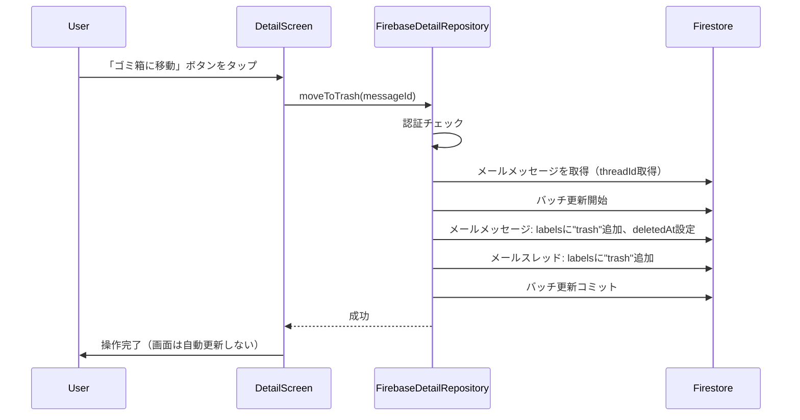
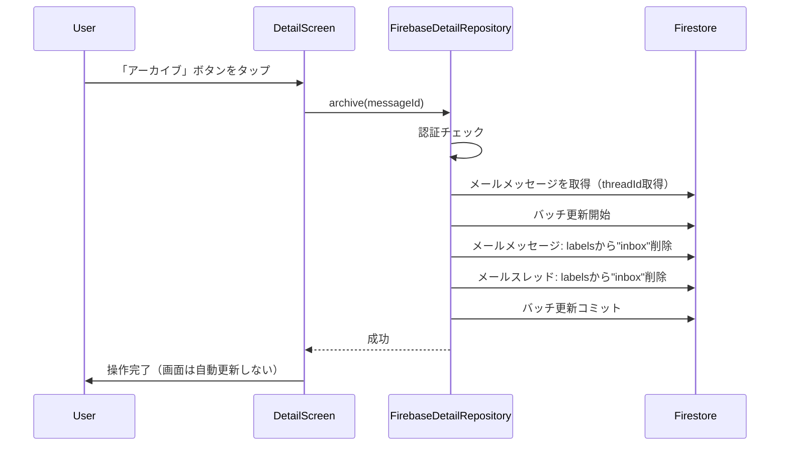
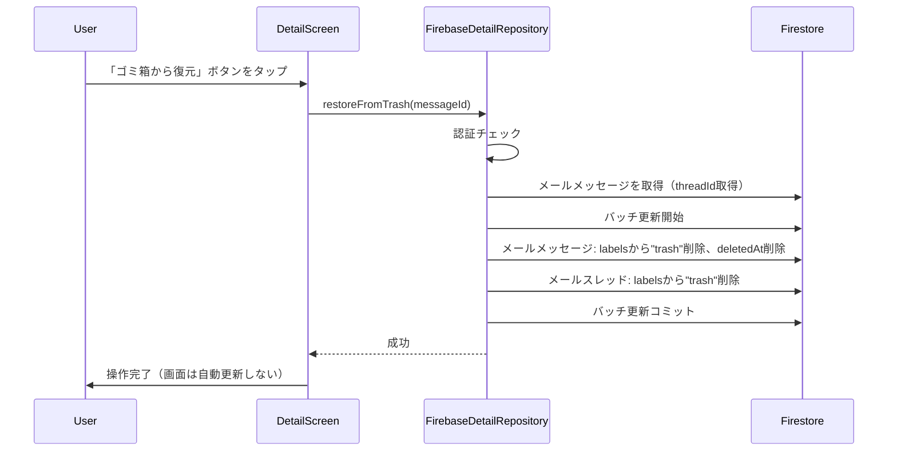
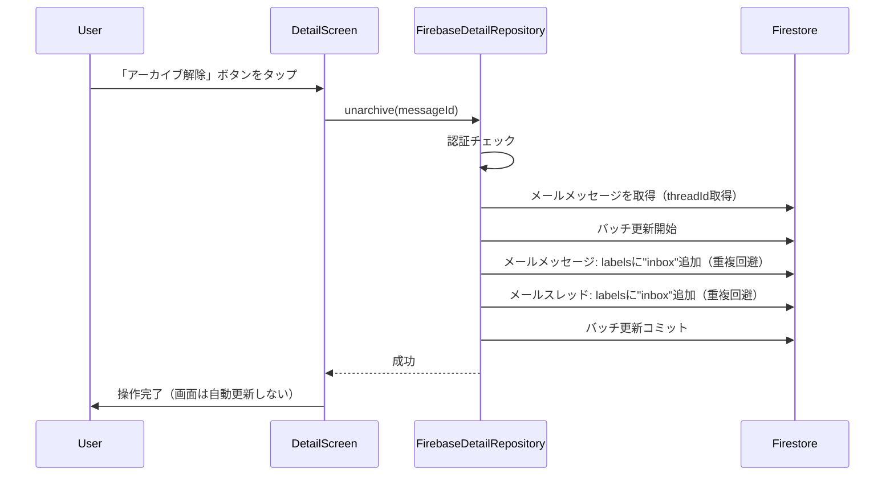

# Design Document

## Overview

本機能は、CloudInboxサービスのメール詳細画面（`DetailScreen`）に配置されている未実装のアイコンボタン4つ（ゴミ箱に移動、アーカイブ、ゴミ箱から復元、アーカイブ解除）の実装を行います。現在、`FirebaseDetailRepository`クラスのこれらのメソッドは`UnimplementedError()`を投げているため、実際の機能が動作していません。

**Purpose**: メール詳細画面のアイコンボタンを実装し、ユーザーがメールの状態（ゴミ箱、アーカイブ）を変更できるようにする。

**Users**: CloudInboxのメール詳細画面を利用するすべてのユーザーが、メールをゴミ箱に移動、アーカイブ、復元できるようになります。

**Impact**: 既存の`FirebaseDetailRepository`クラスに4つのメソッドを実装し、Firestoreのメールメッセージとメールスレッドドキュメントを更新することで、メールの状態管理機能を提供します。

### Goals

- `FirebaseDetailRepository`の4つの未実装メソッド（`moveToTrash`, `archive`, `restoreFromTrash`, `unarchive`）を実装する
- Firestoreのバッチ更新を使用して、メールメッセージとメールスレッドの更新を一貫性保証する
- 既存のコードパターンとエラーハンドリングに準拠した実装を行う
- 既存の要件仕様（`20251209_cloudinbox-mvp-pop3`）に記載されているラベル管理ロジックに従う

### Non-Goals

- バックエンド側（Cloud Functions）の変更は行わない（Flutter側でFirestoreを直接更新）
- メール一覧画面の自動更新機能は実装しない（画面遷移や手動リロードで更新）
- 使用量（`usage.storageBytes`）の更新は行わない（要件に従い変更しない）
- メールの完全削除機能は実装しない（既存の`purgeTrash`機能を活用）

## Architecture

### Existing Architecture Analysis

既存のアーキテクチャを確認した結果、以下の状況が確認されました：

- **フロントエンド（Flutter）**: `DetailScreen`にアイコンボタンとハンドラーが実装済み
  - `_handleMoveToTrash()`, `_handleArchive()`, `_handleRestoreFromTrash()`, `_handleUnarchive()`メソッドが存在
  - 各ハンドラーは`FirebaseDetailRepository`の対応するメソッドを呼び出す
  - UIは既に実装されており、リポジトリ層の実装のみが未完了

- **リポジトリ層**: `FirebaseDetailRepository`クラスが`MailDetailRepository`インターフェースを実装
  - `loadMessage()`, `getAttachmentsList()`, `downloadAttachment()`は実装済み
  - `_markAsRead()`メソッドでFirestoreの更新処理のパターンが確認できる
  - 4つのメソッド（`moveToTrash`, `archive`, `restoreFromTrash`, `unarchive`）が`UnimplementedError()`を投げている

- **データ層**: Firestoreのスキーマ構造
  - `mailMessages/{messageId}`: `labels`（配列）、`deletedAt`（Timestamp | null）、`threadId`（文字列）
  - `mailThreads/{threadId}`: `labels`（配列）
  - 既存の要件仕様（`20251209_cloudinbox-mvp-pop3`）にラベル管理ロジックが定義されている

### Architecture Pattern & Boundary Map

```
┌─────────────────────────────────────────────────────────┐
│                    DetailScreen                          │
│  ┌───────────────────────────────────────────────────┐  │
│  │  UI Layer                                         │  │
│  │  - アイコンボタン（ゴミ箱、アーカイブ等）          │  │
│  │  - イベントハンドラー                              │  │
│  └───────────────────────────────────────────────────┘  │
└─────────────────────────────────────────────────────────┘
                          │
                          ▼
┌─────────────────────────────────────────────────────────┐
│          FirebaseDetailRepository                       │
│  ┌───────────────────────────────────────────────────┐  │
│  │  moveToTrash()                                     │  │
│  │  archive()                                        │  │
│  │  restoreFromTrash()                               │  │
│  │  unarchive()                                      │  │
│  └───────────────────────────────────────────────────┘  │
│  ┌───────────────────────────────────────────────────┐  │
│  │  Firestore Batch Update                           │  │
│  │  - メールメッセージ更新                          │  │
│  │  - メールスレッド更新                             │  │
│  └───────────────────────────────────────────────────┘  │
└─────────────────────────────────────────────────────────┘
                          │
                          ▼
┌─────────────────────────────────────────────────────────┐
│                    Firestore                            │
│  - mailMessages/{messageId}                            │
│  - mailThreads/{threadId}                              │
└─────────────────────────────────────────────────────────┘
```

**Architecture Integration**:
- **Selected pattern**: 既存の`FirebaseDetailRepository`クラスを拡張する形で実装
- **Domain/feature boundaries**: UI層（`DetailScreen`）とリポジトリ層（`FirebaseDetailRepository`）の責務分離を維持
- **Existing patterns preserved**: 既存の`_markAsRead()`メソッドのパターン（認証チェック、エラーハンドリング、`debugPrint`）を踏襲
- **New components rationale**: Firestoreのバッチ更新を使用して、メールメッセージとメールスレッドの更新を一貫性保証
- **Steering compliance**: 既存の要件仕様（`20251209_cloudinbox-mvp-pop3`）に記載されているラベル管理ロジックに準拠

### Technology Stack

| Layer | Choice / Version | Role in Feature | Notes |
|-------|------------------|-----------------|-------|
| Frontend | Flutter (Dart) | メール詳細画面のリポジトリ層実装 | 既存の`FirebaseDetailRepository`を拡張 |
| Database | Firebase Firestore | メールメッセージとスレッドの状態管理 | バッチ更新を使用 |
| State Management | Flutter StatefulWidget | メール詳細画面の状態管理 | 既存の`DetailScreen`を活用 |
| Error Handling | Exception / debugPrint | エラーログ出力 | 既存パターンを活用 |

## System Flows

### Flow 1: ゴミ箱に移動フロー



### Flow 2: アーカイブフロー



### Flow 3: ゴミ箱から復元フロー



### Flow 4: アーカイブ解除フロー



## Requirements Traceability

| Requirement | Summary | Components | Interfaces | Flows |
|-------------|---------|------------|------------|-------|
| 1.1-1.10 | ゴミ箱に移動機能の実装 | FirebaseDetailRepository | moveToTrash() | Flow 1 |
| 2.1-2.9 | アーカイブ機能の実装 | FirebaseDetailRepository | archive() | Flow 2 |
| 3.1-3.10 | ゴミ箱から復元機能の実装 | FirebaseDetailRepository | restoreFromTrash() | Flow 3 |
| 4.1-4.9 | アーカイブ解除機能の実装 | FirebaseDetailRepository | unarchive() | Flow 4 |
| 5.1-5.5 | エラーハンドリングとユーザー体験 | FirebaseDetailRepository | 全メソッド | 全フロー |
| 6.1-6.7 | 実装の一貫性とコード品質 | FirebaseDetailRepository | 全メソッド | 全フロー |

## Components and Interfaces

### Repository Layer

#### Component: FirebaseDetailRepository

| Field | Detail |
|-------|--------|
| Intent | メール詳細画面のリポジトリ層として、Firestoreへのアクセスを提供する |
| Requirements | 1.1-1.10, 2.1-2.9, 3.1-3.10, 4.1-4.9, 5.1-5.5, 6.1-6.7 |

**Responsibilities & Constraints**
- メールメッセージとメールスレッドの状態（ラベル、`deletedAt`）を更新する
- Firestoreのバッチ更新を使用して、メールメッセージとメールスレッドの更新を一貫性保証する
- 認証チェック、エラーハンドリング、ログ出力を行う
- 既存のコードパターン（`_markAsRead()`メソッドなど）に準拠する

**Dependencies**
- Inbound: `FirebaseAuth` — 認証チェック（Criticality: P0）
- Inbound: `FirebaseFirestore` — データベースアクセス（Criticality: P0）
- Outbound: `mailMessages`コレクション — メールメッセージの更新（Criticality: P0）
- Outbound: `mailThreads`コレクション — メールスレッドの更新（Criticality: P0）

**Contracts**: Service [ ] / API [ ] / Event [ ] / Batch [X] / State [ ]

##### Service Interface（概略）

```dart
@override
Future<void> moveToTrash(String messageId) async {
  // 1. 認証チェック
  // 2. メールメッセージを取得（threadId取得）
  // 3. バッチ更新: メールメッセージとスレッドのlabelsに"trash"追加、deletedAt設定
  // 4. エラーハンドリング
}

@override
Future<void> archive(String messageId) async {
  // 1. 認証チェック
  // 2. メールメッセージを取得（threadId取得）
  // 3. バッチ更新: メールメッセージとスレッドのlabelsから"inbox"削除
  // 4. エラーハンドリング
}

@override
Future<void> restoreFromTrash(String messageId) async {
  // 1. 認証チェック
  // 2. メールメッセージを取得（threadId取得）
  // 3. バッチ更新: メールメッセージとスレッドのlabelsから"trash"削除、deletedAt削除
  // 4. エラーハンドリング
}

@override
Future<void> unarchive(String messageId) async {
  // 1. 認証チェック
  // 2. メールメッセージを取得（threadId取得）
  // 3. バッチ更新: メールメッセージとスレッドのlabelsに"inbox"追加（重複回避）
  // 4. エラーハンドリング
}
```

- Preconditions: `messageId`が非空文字列であること。認証されたユーザーが存在すること。
- Postconditions: メールメッセージとメールスレッドの`labels`フィールドが更新されていること。`deletedAt`フィールドが適切に設定・削除されていること。
- Invariants: バッチ更新が成功するか、すべて失敗するかのいずれかであること（一貫性保証）。エラー時には例外が呼び出し元に伝播されること。

**Implementation Notes**
- Integration: 既存の`FirebaseDetailRepository`クラス内に実装
- Validation: 認証チェック、メッセージIDの存在確認
- Risks: バッチ更新の失敗時には適切にエラーを処理する必要がある

## Data Models

### Domain Model

**MailMessage**（既存のFirestoreスキーマを活用）

- `labels: string[]`: メールのラベル（`["inbox"]`, `["trash"]`, `["sent"]`など）
- `deletedAt: Timestamp | null`: ゴミ箱に移動した日時（復元時は`null`）
- `threadId: string`: メールスレッドID

**MailThread**（既存のFirestoreスキーマを活用）

- `labels: string[]`: スレッドのラベル（メールメッセージと同期）

**Business Rules & Invariants**:
- `moveToTrash`: `labels`に`trash`を追加（`inbox`は削除しない）、`deletedAt`を設定
- `archive`: `labels`から`inbox`を削除（`archive`ラベルは追加しない）
- `restoreFromTrash`: `labels`から`trash`を削除、`deletedAt`を削除（`inbox`は追加・削除しない）
- `unarchive`: `labels`に`inbox`を追加（重複を避ける）

### Logical Data Model

**Firestore更新操作**

- メールメッセージドキュメント（`users/{uid}/mailMessages/{messageId}`）:
  - `labels`: 配列フィールドの追加・削除（`FieldValue.arrayUnion()`, `FieldValue.arrayRemove()`）
  - `deletedAt`: タイムスタンプの設定・削除（`FieldValue.serverTimestamp()`, `FieldValue.delete()`）
  - `updatedAt`: タイムスタンプの更新（`FieldValue.serverTimestamp()`）

- メールスレッドドキュメント（`users/{uid}/mailThreads/{threadId}`）:
  - `labels`: 配列フィールドの追加・削除（`FieldValue.arrayUnion()`, `FieldValue.arrayRemove()`）
  - `updatedAt`: タイムスタンプの更新（`FieldValue.serverTimestamp()`）

**Consistency & Integrity**
- バッチ更新を使用して、メールメッセージとメールスレッドの更新を一貫性保証
- バッチ更新はすべて成功するか、すべて失敗するかのいずれか（トランザクション的保証）

### Data Contracts & Integration

**Firestore更新スキーマ**

- `moveToTrash`:
  - メールメッセージ: `labels`に`"trash"`追加、`deletedAt`設定、`updatedAt`更新
  - メールスレッド: `labels`に`"trash"`追加、`updatedAt`更新

- `archive`:
  - メールメッセージ: `labels`から`"inbox"`削除、`updatedAt`更新
  - メールスレッド: `labels`から`"inbox"`削除、`updatedAt`更新

- `restoreFromTrash`:
  - メールメッセージ: `labels`から`"trash"`削除、`deletedAt`削除、`updatedAt`更新
  - メールスレッド: `labels`から`"trash"`削除、`updatedAt`更新

- `unarchive`:
  - メールメッセージ: `labels`に`"inbox"`追加（重複回避）、`updatedAt`更新
  - メールスレッド: `labels`に`"inbox"`追加（重複回避）、`updatedAt`更新

## Error Handling

### Error Strategy

メール操作時のエラーは、既存のエラーハンドリングパターンに従い、`debugPrint`でログ出力し、例外を再スローします。呼び出し元（`DetailScreen`）でエラーを処理できるようにします。

### Error Categories and Responses

**User Errors**:
- **認証エラー**: `Exception('User not authenticated')`を投げる
- **メッセージIDが存在しない**: `Exception('Message not found')`を投げる

**System Errors**:
- **Firestore接続エラー**: Firestoreの例外をキャッチし、`debugPrint`でログ出力後、再スロー
- **バッチ更新エラー**: バッチ更新の失敗時には例外をキャッチし、`debugPrint`でログ出力後、再スロー

**Business Logic Errors**:
- **スレッドIDが存在しない**: メールメッセージの`threadId`が存在しない場合、エラーを投げる（通常は発生しない）

### Monitoring

- エラーログを`debugPrint`で記録（開発環境用）
- 本番環境ではFirebase Crashlytics等のエラートラッキングツールを使用することを推奨
- バッチ更新の成功・失敗をログに記録

## Testing Strategy

### Unit Tests

1. **各メソッドの正常系テスト**
   - `moveToTrash()`: メールメッセージとスレッドの`labels`に`trash`が追加され、`deletedAt`が設定されることを検証
   - `archive()`: メールメッセージとスレッドの`labels`から`inbox`が削除されることを検証
   - `restoreFromTrash()`: メールメッセージとスレッドの`labels`から`trash`が削除され、`deletedAt`が削除されることを検証
   - `unarchive()`: メールメッセージとスレッドの`labels`に`inbox`が追加されることを検証

2. **エラーハンドリングのテスト**
   - 認証されていないユーザーが操作を試みた場合のエラー処理を検証
   - メッセージIDが存在しない場合のエラー処理を検証
   - Firestore接続エラー時のエラー処理を検証

3. **バッチ更新のテスト**
   - バッチ更新が成功することを検証
   - バッチ更新が失敗した場合のエラー処理を検証

### Integration Tests

1. **メール操作からFirestore更新までの統合テスト**
   - `DetailScreen`から`FirebaseDetailRepository`を経由してFirestoreが更新されることを検証
   - メールメッセージとメールスレッドの両方が更新されることを検証

2. **既存テストコードの動作確認**
   - `detail_screen_test.dart`の既存テストが動作することを確認

### E2E/UI Tests

1. **メール操作UIのテスト**
   - 「ゴミ箱に移動」ボタンをタップしてメールがゴミ箱に移動することを検証
   - 「アーカイブ」ボタンをタップしてメールがアーカイブされることを検証
   - 「ゴミ箱から復元」ボタンをタップしてメールが復元されることを検証
   - 「アーカイブ解除」ボタンをタップしてメールが受信トレイに戻ることを検証

## Security Considerations

- **認証チェック**: すべてのメソッドで認証チェックを実施し、認証されていないユーザーからの操作を拒否
- **データアクセス制御**: Firestoreのセキュリティルールに従い、ユーザーは自分のメールのみを操作できる
- **一貫性保証**: バッチ更新を使用して、メールメッセージとメールスレッドの更新を一貫性保証

## Performance & Scalability

- **バッチ更新**: Firestoreのバッチ更新を使用して、メールメッセージとメールスレッドの更新を1回の操作で実行
- **ネットワーク効率**: バッチ更新により、ネットワークリクエスト数を最小化
- **スケーラビリティ**: Firestoreのスケーラビリティに依存（既存のインフラを活用）

## Supporting References

- 既存の`FirebaseDetailRepository`実装: `apps/mobile_app/lib/main.dart`
- 既存の`DetailScreen`実装: `apps/mobile_app/lib/screens/detail_screen.dart`
- 既存の要件仕様: `.kiro/specs/20251209_cloudinbox-mvp-pop3/requirements.md`
- Firestoreバッチ更新のドキュメント: https://firebase.google.com/docs/firestore/manage-data/transactions#batched-writes
- 既存のテストコード: `apps/mobile_app/test/detail_screen_test.dart`

