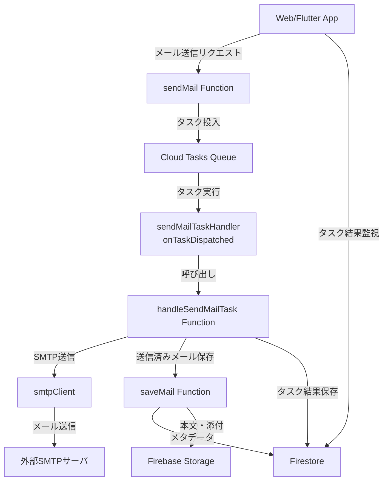
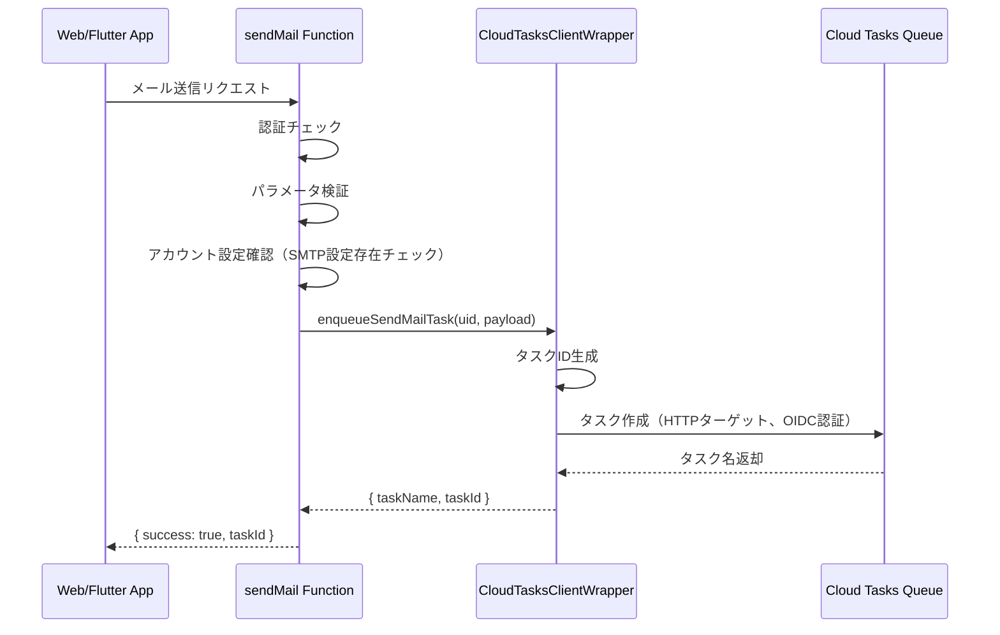
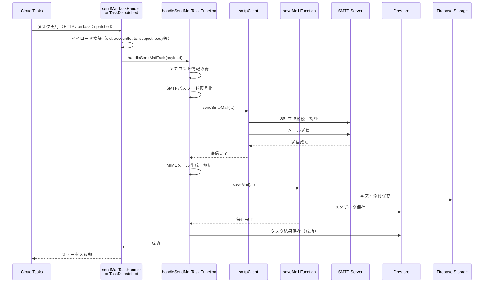
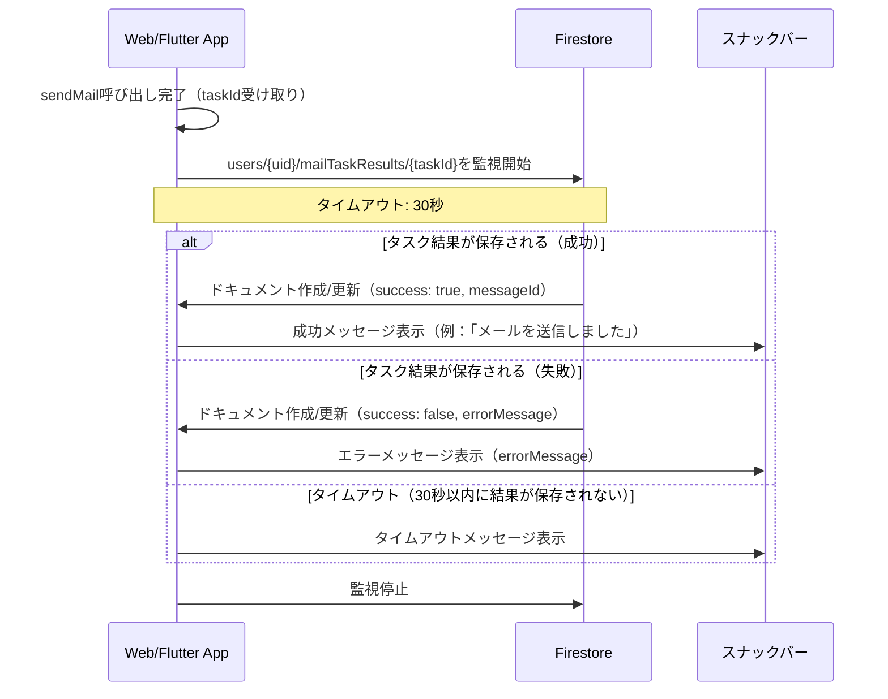

# Design Document

---
**Purpose**: Provide sufficient detail to ensure implementation consistency across different implementers, preventing interpretation drift.

**Approach**:
- Include essential sections that directly inform implementation decisions
- Omit optional sections unless critical to preventing implementation errors
- Match detail level to feature complexity
- Use diagrams and tables over lengthy prose
---

## Overview

メール送信処理を非同期化するため、`sendMail`関数でメール送信リクエストを受け付け、実際の送信処理を`sendMailTaskHandler`と`onTaskDispatched`として独立させます。また、`sendMailTaskHandler`の結果をFirestoreに保存し、Web/Flutterアプリでスナックバーで確認できるようにします。

**Users**: ユーザーは既存のメール送信機能を使用し、メール送信リクエストを送信すると、タスクとして非同期に処理されます。タスク結果はWeb/Flutterアプリのスナックバーで確認できます。

**Impact**: 既存の`sendMail`関数は同期処理から非同期処理に変更され、実際のメール送信処理は`handleSendMailTask`関数と`sendMailTaskHandler`（`onTaskDispatched`）として独立します。既存の`processAccountTaskHandler`パターンを踏襲し、メール送信処理のスケーラビリティと責務分離を実現します。

### Goals
- `sendMail`関数をタスク投入のみを行うようにリファクタリング
- `handleSendMailTask`関数の作成（実際のメール送信処理を独立）
- `sendMailTaskHandler`（`onTaskDispatched`）の作成
- `CloudTasksClientWrapper`の拡張（メール送信タスク投入用）
- タスク結果のFirestore保存
- Web/Flutterアプリでのタスク結果確認（スナックバー表示）

### Non-Goals
- メール送信処理自体の再設計（既存の`sendMail.ts`ロジックを移植）
- Cloud Tasks以外のキューベース基盤への移行
- タスク結果の永続的な履歴管理（30秒以内の結果確認のみ）

## Architecture

### Existing Architecture Analysis

既存のメール送信機能のアーキテクチャパターンを継承：

- **Serverless Functions**: Cloud Functions（TypeScript）によるバックエンド処理
- **同期処理**: `sendMail`関数内でSMTP接続、メール送信、送信済みメール保存を同期的に実行
- **暗号化基盤**: 既存のencryptionモジュール（KMS + DEK）を再利用
- **データ保存**: Firestore（メタデータ）+ Storage（本文・添付）のパターンを継承
- **非同期処理パターン**: 既存の`processAccountTaskHandler`パターン（Cloud Tasks + `onTaskDispatched`）を踏襲

### Architecture Pattern & Boundary Map



**Architecture Integration**:
- Selected pattern: 「ジョブキュー＋ワーカー」パターン（Cloud Tasks + `onTaskDispatched`）。既存の`processAccountTaskHandler`パターンを踏襲。
- Domain/feature boundaries:
  - `sendMail`関数: 「メール送信リクエストを受け付け、Cloud Tasksにタスクを投入するオーケストレータ」
  - `handleSendMailTask`モジュール: 「単一メール送信のSMTP接続〜メール送信〜保存までを担当するドメインロジック」
  - `sendMailTaskHandler`（`onTaskDispatched`）: 「Cloud Tasksからのリクエストを受け取り、`handleSendMailTask`を実行するアダプタ」
- Existing patterns preserved: 既存のSMTP送信ロジック・保存ロジック・暗号化構造は可能な限り踏襲し、モジュール分割と呼び出し元の変更に留める。
- New components rationale:
  - 新規`handleSendMailTask`モジュールにより、テスト対象が明確になり、`sendMail`やタスクハンドラから独立して検証可能となる。
  - `sendMailTaskHandler`（`onTaskDispatched`）導入により、メール送信処理の並列実行・リトライなどCloud Tasksの機能を活用できる。
  - タスク結果のFirestore保存により、Web/Flutterアプリで結果を確認できるようになる。
- Steering compliance: TypeScript strict mode、単一責任原則、エラーハンドリング明示化、AI-DLC/Spec-Driven Developmentに従う。

### Technology Stack & Alignment

| Layer | Choice / Version | Role in Feature | Notes |
|-------|------------------|-----------------|-------|
| Backend / Services | Firebase Cloud Functions v2 (TypeScript) | `sendMail`エントリポイント、`sendMailTaskHandler`（`onTaskDispatched`）の実装 | 既存functionsコードに追従 |
| Messaging / Events | Cloud Tasks | メール送信タスクのキューイング | HTTPターゲット＋`onTaskDispatched`、OIDC認証 |
| Data / Storage | Firestore / Cloud Storage（既存） | 送信済みメールのメタデータ保存・本文格納、タスク結果保存 | 既存ロジックを再利用 |
| Frontend | Vue.js (Web) / Flutter (Mobile) | タスク結果の監視とスナックバー表示 | 既存のスナックバー仕組みを再利用 |
| Infrastructure / Runtime | GCP（Cloud Functions, Cloud Tasks） | ジョブ実行基盤 | 既存プロジェクト設定を利用 |

## System Flows

### Flow 1: sendMailによるタスク投入



### Flow 2: onTaskDispatchedによるメール送信実行



### Flow 3: タスク結果の監視とスナックバー表示



**Key Decisions**:
- タスク投入後、即座にタスクIDを返却し、クライアント側で結果を監視する方式を採用
- タスク結果はFirestoreに保存し、Web/Flutterアプリでリアルタイム監視（`onSnapshot`/`StreamBuilder`）を使用
- タイムアウトは30秒とし、それ以降は結果が不明として扱う
- タスク結果の保存失敗はメール送信処理のエラーとは扱わない（ログ出力のみ）

## Requirements Traceability

| Requirement | Summary | Components | Interfaces | Flows |
|-------------|---------|------------|------------|-------|
| 1.1-1.6 | sendMail関数のリファクタリング | `sendMail` | `SendMailRequest`, `SendMailResponse` | Flow 1 |
| 2.1-2.6 | handleSendMailTask関数の作成 | `handleSendMailTask` | `SendMailTaskPayload`, `SendMailTaskResult` | Flow 2 |
| 3.1-3.6 | sendMailTaskHandlerの作成 | `sendMailTaskHandler` | `onTaskDispatched` | Flow 2 |
| 4.1-4.6 | CloudTasksClientWrapperの拡張 | `CloudTasksClientWrapper` | `enqueueSendMailTask` | Flow 1 |
| 5.1-5.5 | タスク結果のFirestore保存 | `handleSendMailTask` | Firestore `mailTaskResults` | Flow 2 |
| 6.1-6.8 | Web/Flutterアプリでのタスク結果確認 | Web/Flutter App | Firestore `onSnapshot`/`StreamBuilder` | Flow 3 |

## Components and Interfaces

### Backend / Services

#### sendMail Function（リファクタリング後）

| Field | Detail |
|-------|--------|
| Intent | メール送信リクエストを受け付け、Cloud Tasksにタスクを投入するHTTP Callable Function |
| Requirements | 1.1-1.6 |
| Owner / Reviewers | - |

**Responsibilities & Constraints**
- Firebase Authによる認証チェック
- リクエストパラメータ検証（accountId、to、subject、body、メールアドレス形式）
- メールアカウント設定の存在確認（SMTP設定必須）
- Cloud Tasksへのタスク投入（`CloudTasksClientWrapper.enqueueSendMailTask`を呼び出し）
- タスクIDの生成とレスポンス返却

**Dependencies**
- Inbound: Web/Flutter App — メール送信リクエスト (P0)
- Outbound: CloudTasksClientWrapper — タスク投入 (P0)
- Outbound: Firestore — アカウント設定確認 (P0)
- External: Firebase Functions — HTTP Callable Function (P0)

**Contracts**: Service [ ] / API [✓] / Event [ ] / Batch [ ] / State [ ]

##### API Contract

| Method | Endpoint | Request | Response | Errors |
|--------|----------|---------|----------|--------|
| POST | sendMail (Callable) | SendMailRequest | SendMailResponse | 400, 401, 500 |

```typescript
interface SendMailRequest {
  accountId: string;
  to: string[];
  cc?: string[];
  bcc?: string[];
  subject: string;
  body: string;
  attachments?: Array<{
    filename: string;
    content: string; // Base64 encoded
    contentType?: string;
  }>;
  threadId?: string;
  inReplyToMessageId?: string;
}

interface SendMailResponse {
  success: boolean;
  taskId?: string; // 新規追加: タスクID
  errorMessage?: string;
}
```

**Implementation Notes**
- Integration: 既存の`sendMail.ts`をリファクタリングし、実際のメール送信処理を削除
- Validation: 既存のパラメータ検証ロジックを維持
- Risks: タスク投入の失敗時のエラーハンドリング
- タイムアウトを540秒から60秒に短縮（タスク投入のみのため）

#### handleSendMailTask Function

| Field | Detail |
|-------|--------|
| Intent | 実際のメール送信処理を実行するドメインロジック関数 |
| Requirements | 2.1-2.6, 5.1-5.5 |
| Owner / Reviewers | - |

**Responsibilities & Constraints**
- タスクペイロードからメール送信情報を取得
- メールアカウント情報取得（SMTP設定含む）
- SMTPパスワード復号化（既存の`decryptPassword`関数を使用）
- SMTP経由でメール送信（既存の`smtpClient.sendSmtpMail`を使用）
- 送信済みメールの保存（既存の`saveMail`関数を使用）
- タスク結果のFirestore保存（成功/失敗両方）

**Dependencies**
- Inbound: sendMailTaskHandler — タスク実行依頼 (P0)
- Outbound: smtpClient — SMTP送信実行 (P0)
- Outbound: saveMail — 送信済みメール保存 (P0)
- Outbound: Firestore — アカウント情報取得、タスク結果保存 (P0)
- Outbound: Secret Manager — DEK取得 (P0)
- Outbound: KMS — DEK unwrap (P0)

**Contracts**: Service [✓] / API [ ] / Event [ ] / Batch [ ] / State [ ]

##### Service Interface

```typescript
export interface SendMailTaskPayload {
  uid: string;
  accountId: string;
  to: string[];
  cc?: string[];
  bcc?: string[];
  subject: string;
  body: string;
  attachments?: Array<{
    filename: string;
    content: string; // Base64 encoded
    contentType?: string;
  }>;
  threadId?: string;
  inReplyToMessageId?: string;
  taskId?: string; // タスク結果保存用
}

export interface SendMailTaskResult {
  success: boolean;
  messageId?: string;
  errorMessage?: string;
}

export async function handleSendMailTask(
  payload: SendMailTaskPayload
): Promise<SendMailTaskResult>;
```

- Preconditions: `uid`, `accountId`, `to`, `subject`, `body`が必須
- Postconditions: メール送信が成功した場合、送信済みメールが保存され、タスク結果がFirestoreに保存される
- Invariants: タスク結果の保存失敗はメール送信処理のエラーとして扱わない

**Implementation Notes**
- Integration: 既存の`sendMail.ts`内のメール送信ロジックを移植
- Validation: 入力パラメータのバリデーション（必須項目・型）
- Risks: SMTP送信のタイムアウト、タスク結果保存の失敗

#### sendMailTaskHandler（onTaskDispatched）

| Field | Detail |
|-------|--------|
| Intent | Cloud Tasksからの`onTaskDispatched`呼び出しを受け、`handleSendMailTask`を実行するアダプタ |
| Requirements | 3.1-3.6 |
| Owner / Reviewers | - |

**Responsibilities & Constraints**
- 受信ペイロードの検証（`uid`, `accountId`, `to`, `subject`, `body`必須、型チェック）
- 検証を通過した場合に`handleSendMailTask`を呼び出し
- 成功・失敗をHTTPステータスとしてCloud Tasksへ返す
- 再試行ポリシーに応じて、再試行時でも冪等に処理できるように`handleSendMailTask`の挙動を前提とする

**Dependencies**
- Inbound: Cloud Tasks — タスク実行リクエスト (P0)
- Outbound: handleSendMailTask — メール送信処理実行 (P0)

**Contracts**: Service [ ] / API [✓] / Event [ ] / Batch [✓] / State [ ]

##### API Contract

| Method | Endpoint | Request | Response | Errors |
|--------|----------|---------|----------|--------|
| POST | sendMailTaskHandler (onTaskDispatched) | `{ data: { uid, accountId, to, ... } }` | HTTP 200/4xx/5xx | 400, 422, 500 |

**Implementation Notes**
- Integration: 既存の`processAccountTaskHandler.ts`パターンを踏襲
- Validation: ペイロード検証ロジック（`task.data.data`または`task.data`から取得）
- Risks: ペイロード形式の不整合

#### CloudTasksClientWrapper（拡張）

| Field | Detail |
|-------|--------|
| Intent | メール送信タスクをCloud Tasksに投入するためのクライアントラッパー |
| Requirements | 4.1-4.6 |
| Owner / Reviewers | - |

**Responsibilities & Constraints**
- `enqueueSendMailTask`メソッドを提供し、メール送信タスクをCloud Tasksに投入
- タスクIDを生成し、レスポンスに含めて返却
- タスクペイロード（uid, accountId, to, cc, bcc, subject, body, attachments, threadId, inReplyToMessageId, taskId）を含める
- `sendMailTaskHandler`をターゲットとするHTTPリクエストを作成
- OIDCトークンを使用して認証

**Dependencies**
- Inbound: sendMail Function — タスク投入依頼 (P0)
- Outbound: Cloud Tasks API — タスク作成 (P0)

**Contracts**: Service [✓] / API [ ] / Event [ ] / Batch [ ] / State [ ]

##### Service Interface

```typescript
export class CloudTasksClientWrapper {
  async enqueueSendMailTask(
    uid: string,
    payload: {
      accountId: string;
      to: string[];
      cc?: string[];
      bcc?: string[];
      subject: string;
      body: string;
      attachments?: Array<{
        filename: string;
        content: string;
        contentType?: string;
      }>;
      threadId?: string;
      inReplyToMessageId?: string;
    }
  ): Promise<{ taskName: string; taskId: string }>;
}
```

**Implementation Notes**
- Integration: 既存の`enqueueTask`メソッドと同様のパターンで実装
- Validation: 入力検証（uid, accountId, to, subject, body必須）
- Risks: タスクIDの生成ロジック（一意性の確保）

### Frontend / UI

#### Web App（タスク結果監視）

| Field | Detail |
|-------|--------|
| Intent | メール送信タスクの結果をFirestoreで監視し、スナックバーで表示 |
| Requirements | 6.1-6.8 |
| Owner / Reviewers | - |

**Responsibilities & Constraints**
- `sendMail`関数呼び出し後、タスクIDを受け取る
- Firestoreの`users/{uid}/mailTaskResults/{taskId}`を監視（`onSnapshot`を使用）
- タスク結果が保存されたら、スナックバーで表示
- 30秒以内に結果が保存されない場合、タイムアウトメッセージを表示
- 既存の`useSnackbar` composableを使用

**Dependencies**
- Inbound: sendMail Function — タスクID返却 (P0)
- Outbound: Firestore — タスク結果監視 (P0)
- External: Vue.js — `onSnapshot`, `useSnackbar` (P0)

**Contracts**: Service [✓] / API [ ] / Event [ ] / Batch [ ] / State [✓]

##### Service Interface

```typescript
function watchTaskResult(
  uid: string,
  taskId: string,
  onResult: (result: SendMailTaskResult) => void,
  onTimeout: () => void
): () => void; // 監視停止関数
```

**Implementation Notes**
- Integration: 既存の`useSnackbar` composableを再利用
- Validation: タスクIDの存在確認
- Risks: タイムアウト処理、監視のクリーンアップ

#### Flutter App（タスク結果監視）

| Field | Detail |
|-------|--------|
| Intent | メール送信タスクの結果をFirestoreで監視し、スナックバーで表示 |
| Requirements | 6.1-6.8 |
| Owner / Reviewers | - |

**Responsibilities & Constraints**
- `sendMail`関数呼び出し後、タスクIDを受け取る
- Firestoreの`users/{uid}/mailTaskResults/{taskId}`を監視（`StreamBuilder`または`snapshots()`を使用）
- タスク結果が保存されたら、`ScaffoldMessenger`でスナックバー表示
- 30秒以内に結果が保存されない場合、タイムアウトメッセージを表示

**Dependencies**
- Inbound: sendMail Function — タスクID返却 (P0)
- Outbound: Firestore — タスク結果監視 (P0)
- External: Flutter — `StreamBuilder`, `ScaffoldMessenger` (P0)

**Contracts**: Service [✓] / API [ ] / Event [ ] / Batch [ ] / State [✓]

##### Service Interface

```dart
Stream<SendMailTaskResult?> watchTaskResult(String uid, String taskId);
```

**Implementation Notes**
- Integration: 既存の`ScaffoldMessenger`を使用
- Validation: タスクIDの存在確認
- Risks: タイムアウト処理、ストリームのクリーンアップ

## Data Models

### Domain Model

- エンティティ: メール送信タスク（`SendMailTask`）、タスク結果（`MailTaskResult`）
- `handleSendMailTask`は1つのメール送信タスクに対する送信・保存というトランザクション境界を持つ
- タスク結果は一時的な情報として扱い、30秒以内の確認が終了したら削除またはTTLで自動削除を検討（本要件では削除機能は含めない）

### Logical Data Model

**Structure Definition**:

- `users/{uid}/mailTaskResults/{taskId}`:
  - `success`: boolean（必須）
  - `messageId`: string（成功時のみ）
  - `errorMessage`: string（失敗時のみ）
  - `taskId`: string（必須）
  - `accountId`: string（必須）
  - `subject`: string（必須）
  - `createdAt`: Timestamp（必須、サーバータイムスタンプ）
  - `completedAt`: Timestamp（必須、サーバータイムスタンプ）

**Consistency & Integrity**:
- トランザクション境界: タスク結果の保存はメール送信処理の成功/失敗後に実行される
- 一時的なデータ: タスク結果は確認後の削除を想定（本要件では削除機能は含めない）

### Data Contracts & Integration

**Cloud Tasksペイロードスキーマ**:
- 必須: `uid: string`, `accountId: string`, `to: string[]`, `subject: string`, `body: string`
- 任意: `cc?: string[]`, `bcc?: string[]`, `attachments?: Array<...>`, `threadId?: string`, `inReplyToMessageId?: string`, `taskId?: string`
- シリアライゼーション形式: JSON（`{ data: { ... } }`形式でラップ）

**Firestoreタスク結果スキーマ**:
- コレクション: `users/{uid}/mailTaskResults/{taskId}`
- ドキュメントID: タスクID（一意性を保証）
- フィールド: `success`, `messageId?`, `errorMessage?`, `taskId`, `accountId`, `subject`, `createdAt`, `completedAt`

## Error Handling

### Error Strategy

- **User Errors** (4xx): パラメータ検証エラー、認証エラー → `sendMail`関数で即座にエラーレスポンスを返却
- **System Errors** (5xx): SMTP接続エラー、タイムアウト → Cloud Tasksの再試行ポリシーに委ねる
- **Business Logic Errors** (422): アカウント未設定、SMTP設定不正 → タスク結果として保存し、クライアント側でエラー表示

### Error Categories and Responses

**sendMail関数エラー**:
- 認証エラー: "User must be authenticated" → 401エラー
- パラメータ検証エラー: "accountId is required" → 400エラー
- アカウント未設定: "Account not found" → 404エラー
- SMTP設定未設定: "SMTP configuration is required" → 422エラー
- タスク投入失敗: "Failed to enqueue send mail task" → 500エラー

**handleSendMailTask関数エラー**:
- SMTP接続エラー: エラーメッセージをタスク結果に保存し、Cloud Tasksの再試行ポリシーに委ねる
- メール送信タイムアウト: エラーメッセージをタスク結果に保存し、Cloud Tasksの再試行ポリシーに委ねる
- タスク結果保存失敗: ログ出力のみ（メール送信処理のエラーとは扱わない）

**クライアント側エラー**:
- タスク結果の監視タイムアウト: "メール送信の結果を確認できませんでした。しばらく待ってから再試行してください" → スナックバーで表示
- Firestore接続エラー: エラーメッセージをスナックバーで表示

### Monitoring

- メール送信タスクの投入成功/失敗率をログ記録
- メール送信タスクの実行成功/失敗率をログ記録
- タスク結果の保存成功/失敗率をログ記録
- タスク結果の監視タイムアウト発生率を監視
- Cloud Tasksの再試行回数を監視

## Testing Strategy

### Unit Tests
- `handleSendMailTask.test.ts`: メール送信処理の正常系・異常系（SMTP接続エラー、認証エラー、タイムアウト）
- `sendMailTaskHandler.test.ts`: ペイロード検証、エラーハンドリング
- `cloudTasksClient.test.ts`: `enqueueSendMailTask`メソッドのテスト（タスクID生成、ペイロード構築）

### Integration Tests
- メール送信フロー: `sendMail` → Cloud Tasks → `sendMailTaskHandler` → `handleSendMailTask` → SMTP送信 → 保存 → タスク結果保存
- タスク結果の保存フロー: `handleSendMailTask` → Firestore `mailTaskResults`
- タスク結果の監視フロー: Web/Flutter App → Firestore `onSnapshot`/`StreamBuilder` → スナックバー表示

### E2E/UI Tests
- Web App: メール送信 → タスク結果監視 → スナックバー表示
- Flutter App: メール送信 → タスク結果監視 → スナックバー表示
- タイムアウト処理: 30秒以内に結果が保存されない場合のタイムアウトメッセージ表示

## Security Considerations

- **認証チェック**: `sendMail`関数でFirebase Authによる認証チェックを実施
- **パスワード暗号化**: SMTPパスワードは既存の暗号化基盤（KMS + DEK）を使用
- **パスワード破棄**: メール送信後は平文パスワードを即座にメモリから破棄
- **タスク結果のアクセス制御**: Firestoreのセキュリティルールで`users/{uid}/mailTaskResults/{taskId}`へのアクセスを認証ユーザーのみに制限
- **OIDC認証**: Cloud Tasksから`sendMailTaskHandler`へのHTTPリクエストはOIDCトークンを使用して認証

## Performance & Scalability

- **タイムアウト設定**: `sendMail`関数は60秒（タスク投入のみ）、`sendMailTaskHandler`は540秒（メール送信処理）
- **並列実行**: Cloud Tasksにより、複数のメール送信タスクを並列実行可能
- **再試行ポリシー**: maxAttempts: 3, maxRetrySeconds: 3600, maxBackoffSeconds: 300
- **タスク結果の監視**: 30秒以内の監視のみ（それ以降はタイムアウト）
- **タスク結果の削除**: 本要件では含めないが、将来的にTTLまたは定期削除を検討

