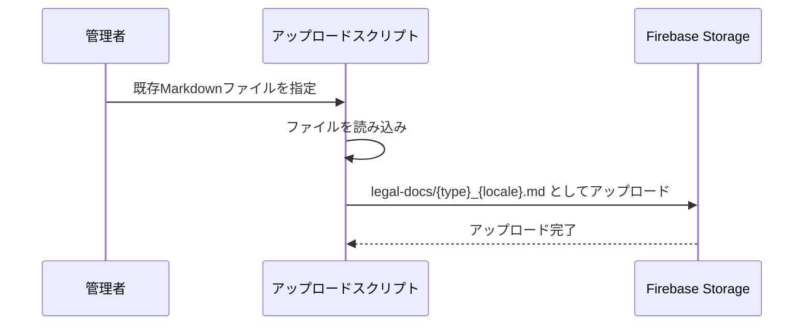
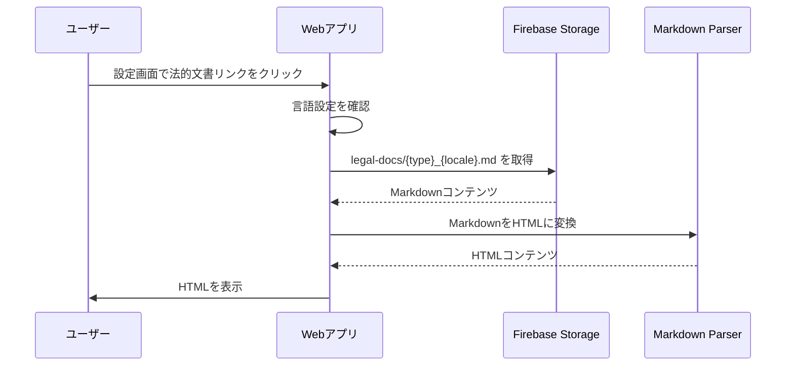
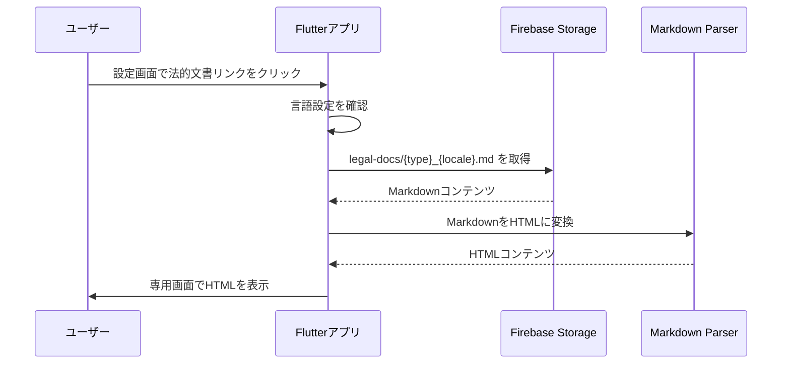

# Design Document: 20260115_legal-docs-storage-display

## Overview 

**Purpose**: この機能は、利用規約、プライバシーポリシー、特定商取引法に基づく表記、Pricing/BillingのMarkdownファイルをFirebase Storageに格納し、WebアプリとFlutterアプリでStorage上のMarkdownを取得・表示できるようにすることで、法的文書の一元管理と動的な更新を実現する。  
**Users**: 主にバックエンドエンジニアが法的文書をStorageにアップロードし、フロントエンドエンジニアとモバイルアプリ開発者がアプリ内でStorage上の文書を表示する。エンドユーザーは設定画面から法的文書を閲覧する。  
**Impact**: 既存の静的HTMLファイルへの依存を排除し、Storage上のMarkdownファイルを動的に取得・表示する方式に変更される。これにより、コード変更なしで法的文書を更新できるようになる。

### Goals
- 法的文書のMarkdownファイルをFirebase Storageに格納し、一元管理できるようにすること
- WebアプリとFlutterアプリでStorage上のMarkdownを取得・表示できるようにすること
- 既存の外部URLへの直接リンクを削除し、Storageからの取得に置き換えること
- 言語（日本語/英語）に応じて適切な文書を表示すること

### Non-Goals
- 法的文書の内容自体の変更は対象外
- 既存のMarkdownファイルのフォーマット変更は行わない
- 法的文書の編集UIの実装は対象外（Storageへの直接アップロードを想定）
- キャッシュ戦略の詳細な最適化は初期実装では対象外

## Architecture

### Existing Architecture Analysis

- 既存のWebアプリは`apps/web_app/public/`ディレクトリ内にMarkdownファイルを保持し、ビルド時に`postbuild.js`でHTMLに変換している
- Webアプリの設定画面（`SettingsView.vue`）では、外部URL（`https://cloudinbox.cloud/privacy.html`など）への直接リンクを使用している
- Flutterアプリの設定画面（`settings_screen.dart`）でも同様に外部URLへの直接リンクを使用している
- Firebase Storageは既にプロジェクトで使用されており、`mail-data/{uid}/...`のパス構造でメールデータを格納している
- Storageルールは現在`mail-data/{uid}/...`のみを許可しており、法的文書用のパスは未定義

### Architecture Pattern & Boundary Map

**Architecture Integration**:
- **Selected pattern**: 「Storage-based Content Delivery」パターン。静的ファイルをStorageに格納し、アプリから動的に取得・表示する。
- **Domain/feature boundaries**:  
  - Storage層: 法的文書のMarkdownファイルを格納（`legal-docs/`パス）
  - Webアプリ層: StorageからMarkdownを取得し、HTMLに変換して表示
  - Flutterアプリ層: StorageからMarkdownを取得し、HTMLに変換して表示
  - アップロードスクリプト: 既存のMarkdownファイルをStorageにアップロード
- **Existing patterns preserved**: 既存のFirebase Storageの使用方法、認証フロー、UIコンポーネント構造を踏襲
- **New components rationale**:  
  - Storageルールの更新により、認証ユーザーが法的文書を読み取れるようになる
  - WebアプリとFlutterアプリにMarkdown表示機能を追加することで、Storage上の最新文書を常に表示できる
  - アップロードスクリプトにより、既存のMarkdownファイルを簡単にStorageに移行できる
- **Steering compliance**: AI-DLC/Spec-Driven Developmentに従い、requirements→design→tasks→implementationの段階的アプローチを踏襲する。

### Technology Stack

| Layer | Choice / Version | Role in Feature | Notes |
|-------|------------------|-----------------|-------|
| Frontend / Web | Vue 3 + Vite | 設定画面での法的文書表示 | 既存のWebアプリフレームワーク |
| Frontend / Mobile | Flutter | 設定画面での法的文書表示 | 既存のモバイルアプリフレームワーク |
| Data / Storage | Firebase Storage | 法的文書のMarkdownファイル格納 | 既存のStorageインフラを利用 |
| Markdown Processing / Web | marked (npm) | MarkdownからHTMLへの変換 | 既存の`postbuild.js`で使用中 |
| Markdown Processing / Mobile | flutter_markdown | MarkdownからHTMLへの変換 | Flutter用のMarkdown表示パッケージ |
| Infrastructure / Runtime | Firebase Storage Rules | 法的文書へのアクセス制御 | 認証ユーザーの読み取りを許可 |

## System Flows

### Flow 1: 法的文書のアップロード（初回セットアップ）



### Flow 2: Webアプリでの法的文書表示



### Flow 3: Flutterアプリでの法的文書表示



## Requirements Traceability

| Requirement | Summary | Components | Interfaces | Flows |
|-------------|---------|------------|------------|-------|
| 1 | 法的文書のMarkdownファイルをStorageに格納 | Storageルール、アップロードスクリプト | Storage API | Flow 1 |
| 2 | WebアプリでStorage上のMarkdownを表示 | LegalDocumentViewer (Vue), Storage Service | Storage API, Markdown Parser | Flow 2 |
| 3 | FlutterアプリでStorage上のMarkdownを表示 | LegalDocumentScreen (Flutter), Storage Service | Storage API, Markdown Parser | Flow 3 |

## Components and Interfaces

### Storage Domain

#### Component: Firebase Storage (Legal Documents)

| Field | Detail |
|-------|--------|
| Intent | 法的文書のMarkdownファイルを格納するStorage領域 |
| Requirements | 1 |

**Responsibilities & Constraints**
- 法的文書のMarkdownファイルを`legal-docs/`パス配下に格納
- 認証ユーザーが読み取り可能、書き込みは管理者のみ
- ファイル名は`{document-type}_{locale}.md`形式（例: `terms_ja.md`, `privacy_en.md`）

**Dependencies**
- Inbound: アップロードスクリプト — ファイルのアップロード (P0)
- Outbound: Webアプリ、Flutterアプリ — ファイルの取得 (P0)
- External: Firebase Storage — ファイルストレージサービス (P0)

**Contracts**: Service [ ] / API [ ] / Event [ ] / Batch [ ] / State [ ]

##### Storage Path Structure
```
legal-docs/
  ├── terms_ja.md          (日本語利用規約)
  ├── terms_en.md          (英語利用規約)
  ├── privacy_ja.md        (日本語プライバシーポリシー)
  ├── privacy_en.md        (英語プライバシーポリシー)
  ├── commercial_ja.md     (特定商取引法に基づく表記・日本語のみ)
  └── pricing_en.md        (Pricing/Billing・英語のみ)
```

**Implementation Notes**
- Storageルールを更新して`legal-docs/`パスの読み取りを許可
- ファイルのメタデータ（contentType: `text/markdown`）を適切に設定
- アップロードスクリプトで既存の`apps/web_app/public/`内のMarkdownファイルを移行

### Web App Domain

#### Component: LegalDocumentViewer (Vue Component)

| Field | Detail |
|-------|--------|
| Intent | Storageから法的文書を取得し、MarkdownをHTMLに変換して表示するVueコンポーネント |
| Requirements | 2 |

**Responsibilities & Constraints**
- StorageからMarkdownファイルを取得
- MarkdownをHTMLに変換
- ローディング状態とエラー状態を管理
- 言語設定に応じて適切なファイルを取得

**Dependencies**
- Inbound: SettingsView — 法的文書リンクのクリックイベント (P0)
- Outbound: Firebase Storage — Markdownファイルの取得 (P0)
- External: marked — Markdownパーサーライブラリ (P0)

**Contracts**: Service [ ] / API [ ] / Event [ ] / Batch [ ] / State [ ]

##### Component Interface
```typescript
interface LegalDocumentViewerProps {
  documentType: 'terms' | 'privacy' | 'commercial' | 'pricing';
  locale: 'ja' | 'en';
}

interface LegalDocumentViewerState {
  content: string | null;
  loading: boolean;
  error: string | null;
}
```

**Implementation Notes**
- `SettingsView.vue`の`openLink`関数を置き換え、新しいコンポーネントを表示
- ダイアログまたは専用ページでMarkdownコンテンツを表示
- 既存のスタイル（`/css/style.css`）を適用して一貫性を保つ

#### Component: LegalDocumentService (TypeScript Service)

| Field | Detail |
|-------|--------|
| Intent | Firebase Storageから法的文書のMarkdownを取得するサービス |
| Requirements | 2 |

**Dependencies**
- Inbound: LegalDocumentViewer — Markdown取得リクエスト (P0)
- Outbound: Firebase Storage — ファイル取得 (P0)
- External: Firebase Storage SDK — Storage API (P0)

**Contracts**: Service [X] / API [ ] / Event [ ] / Batch [ ] / State [ ]

##### Service Interface
```typescript
interface LegalDocumentService {
  getDocument(documentType: string, locale: string): Promise<string>;
}

// 実装例
async function getDocument(
  documentType: 'terms' | 'privacy' | 'commercial' | 'pricing',
  locale: 'ja' | 'en'
): Promise<string> {
  const storage = getStorage(firebaseApp);
  const path = `legal-docs/${documentType}_${locale}.md`;
  const storageRef = ref(storage, path);
  const url = await getDownloadURL(storageRef);
  const response = await fetch(url);
  if (!response.ok) {
    throw new Error(`Failed to fetch document: ${response.statusText}`);
  }
  return await response.text();
}
```

**Implementation Notes**
- エラーハンドリング: ファイルが見つからない場合、ネットワークエラーなどの適切なエラーメッセージを返す
- キャッシュは初期実装では実装しない（将来的な最適化として検討可能）

### Flutter App Domain

#### Component: LegalDocumentScreen (Flutter Screen)

| Field | Detail |
|-------|--------|
| Intent | Storageから法的文書を取得し、MarkdownをHTMLに変換して表示するFlutter画面 |
| Requirements | 3 |

**Responsibilities & Constraints**
- StorageからMarkdownファイルを取得
- MarkdownをHTMLに変換して表示
- ローディング状態とエラー状態を管理
- 言語設定に応じて適切なファイルを取得

**Dependencies**
- Inbound: SettingsScreen — 法的文書リンクのタップイベント (P0)
- Outbound: Firebase Storage — Markdownファイルの取得 (P0)
- External: flutter_markdown — Markdown表示パッケージ (P0)

**Contracts**: Service [ ] / API [ ] / Event [ ] / Batch [ ] / State [ ]

##### Screen Interface
```dart
class LegalDocumentScreen extends StatefulWidget {
  final String documentType; // 'terms', 'privacy', 'commercial', 'pricing'
  final Locale locale;

  const LegalDocumentScreen({
    required this.documentType,
    required this.locale,
  });
}

class _LegalDocumentScreenState extends State<LegalDocumentScreen> {
  String? _content;
  bool _loading = true;
  String? _error;
}
```

**Implementation Notes**
- `settings_screen.dart`の`_openLink`関数を置き換え、新しい画面に遷移
- `flutter_markdown`パッケージを使用してMarkdownを表示
- AppBarに戻るボタンとタイトルを表示
- エラー時はSnackBarでエラーメッセージを表示

#### Component: LegalDocumentService (Dart Service)

| Field | Detail |
|-------|--------|
| Intent | Firebase Storageから法的文書のMarkdownを取得するサービス |
| Requirements | 3 |

**Dependencies**
- Inbound: LegalDocumentScreen — Markdown取得リクエスト (P0)
- Outbound: Firebase Storage — ファイル取得 (P0)
- External: firebase_storage — Storage SDK (P0)

**Contracts**: Service [X] / API [ ] / Event [ ] / Batch [ ] / State [ ]

##### Service Interface
```dart
class LegalDocumentService {
  Future<String> getDocument(String documentType, String locale) async {
    final storage = FirebaseStorage.instance;
    final path = 'legal-docs/${documentType}_${locale}.md';
    final ref = storage.ref(path);
    
    try {
      final data = await ref.getData();
      if (data == null) {
        throw Exception('Document not found');
      }
      return utf8.decode(data);
    } catch (e) {
      throw Exception('Failed to fetch document: $e');
    }
  }
}
```

**Implementation Notes**
- エラーハンドリング: ファイルが見つからない場合、ネットワークエラーなどの適切な例外をスロー
- UTF-8エンコーディングでMarkdownコンテンツをデコード

### Infrastructure Domain

#### Component: Upload Script

| Field | Detail |
|-------|--------|
| Intent | 既存のMarkdownファイルをFirebase Storageにアップロードするスクリプト |
| Requirements | 1 |

**Responsibilities & Constraints**
- `apps/web_app/public/`内のMarkdownファイルを読み込み
- 適切なパス名に変換してStorageにアップロード
- ファイルのメタデータ（contentType等）を設定

**Dependencies**
- Inbound: 管理者 — スクリプトの実行 (P0)
- Outbound: Firebase Storage — ファイルのアップロード (P0)
- External: Firebase Admin SDK — Storage管理API (P0)

**Contracts**: Service [ ] / API [ ] / Event [ ] / Batch [ ] / State [ ]

##### Script Interface
```typescript
// scripts/upload-legal-docs.ts
interface UploadConfig {
  sourceDir: string; // apps/web_app/public/
  storagePath: string; // legal-docs/
  fileMapping: {
    [sourceFile: string]: { type: string; locale: string };
  };
}

// ファイルマッピング例
const fileMapping = {
  'terms.md': { type: 'terms', locale: 'ja' },
  'terms_en.md': { type: 'terms', locale: 'en' },
  'privacy.md': { type: 'privacy', locale: 'ja' },
  'privacy_en.md': { type: 'privacy', locale: 'en' },
  'commercial.md': { type: 'commercial', locale: 'ja' },
  'pricing_en.md': { type: 'pricing', locale: 'en' },
};
```

**Implementation Notes**
- Firebase Admin SDKを使用してStorageにアップロード
- 既存ファイルの上書きを許可（更新時の再アップロードを想定）
- アップロード前にファイルの存在確認とバリデーションを実施

## Data Models

### Storage Path Model

**Structure Definition**:
- パス形式: `legal-docs/{document-type}_{locale}.md`
- document-type: `terms`, `privacy`, `commercial`, `pricing`
- locale: `ja`, `en`
- ファイル拡張子: `.md`（Markdown形式）

**Consistency & Integrity**:
- ファイル名は一意であること（同じdocument-typeとlocaleの組み合わせは1つのみ）
- ファイルの存在チェック: 特定商取引法は日本語のみ、Pricing/Billingは英語のみ

### Document Type Mapping

| Source File | Storage Path | Document Type | Locale | Notes |
|-------------|-------------|---------------|--------|-------|
| terms.md | legal-docs/terms_ja.md | terms | ja | 日本語利用規約 |
| terms_en.md | legal-docs/terms_en.md | terms | en | 英語利用規約 |
| privacy.md | legal-docs/privacy_ja.md | privacy | ja | 日本語プライバシーポリシー |
| privacy_en.md | legal-docs/privacy_en.md | privacy | en | 英語プライバシーポリシー |
| commercial.md | legal-docs/commercial_ja.md | commercial | ja | 特定商取引法に基づく表記（日本語のみ） |
| pricing_en.md | legal-docs/pricing_en.md | pricing | en | Pricing/Billing（英語のみ） |

## Error Handling

### Error Strategy

- **Storage取得エラー**: ファイルが見つからない場合、ネットワークエラー、認証エラーなどに対して適切なエラーメッセージを表示
- **Markdown変換エラー**: パースエラーが発生した場合、生のMarkdownテキストを表示するか、エラーメッセージを表示
- **言語不一致エラー**: 要求された言語のファイルが存在しない場合（例: 英語環境で特定商取引法を要求）、適切なフォールバックまたはエラーメッセージを表示

### Error Categories and Responses

**User Errors** (4xx):
- ファイルが見つからない（404） → 「文書が見つかりませんでした」メッセージを表示
- 認証エラー（401） → 「ログインが必要です」メッセージを表示し、ログイン画面にリダイレクト

**System Errors** (5xx):
- ネットワークエラー → 「ネットワークエラーが発生しました。しばらくしてから再度お試しください」メッセージを表示
- Storageサービスエラー → 「サービスに一時的な問題が発生しています」メッセージを表示

**Business Logic Errors**:
- 言語不一致（特定商取引法を英語環境で要求など） → 適切な言語のファイルを取得するか、エラーメッセージを表示

### Monitoring

- Storageへのアクセスログを監視（取得回数、エラー率）
- アプリ側のエラーログを記録（どの文書タイプでエラーが発生したか）
- パフォーマンスメトリクス（取得時間、表示時間）を記録

## Testing Strategy

### Unit Tests
- LegalDocumentService (Web): Storageからの取得ロジック、エラーハンドリング
- LegalDocumentService (Flutter): Storageからの取得ロジック、エラーハンドリング
- ファイル名マッピングロジック（アップロードスクリプト）

### Integration Tests
- Webアプリ: 設定画面から法的文書を表示するフロー
- Flutterアプリ: 設定画面から法的文書を表示するフロー
- Storageルール: 認証ユーザーが法的文書を読み取れることを確認

### E2E/UI Tests
- Webアプリ: 各法的文書タイプ（利用規約、プライバシーポリシー、特定商取引法/Pricing）の表示
- Flutterアプリ: 各法的文書タイプの表示
- 言語切り替え時の適切な文書表示

## Security Considerations

- **Storageルール**: 認証ユーザーのみが法的文書を読み取れるように設定。書き込みは管理者のみ（Firebase Admin SDK経由）
- **認証チェック**: アプリ側で認証状態を確認し、未認証ユーザーにはエラーメッセージを表示
- **コンテンツ検証**: アップロードされたMarkdownファイルの形式を検証（XSS対策のため、HTMLタグのサニタイズを検討）

## Performance & Scalability

- **キャッシュ戦略**: 初期実装ではキャッシュを実装しないが、将来的にはクライアント側キャッシュ（localStorage/SharedPreferences）を検討
- **ファイルサイズ**: Markdownファイルは比較的小さいため、パフォーマンス上の問題は少ないと想定
- **並行アクセス**: Storageは複数のユーザーからの同時読み取りに対応可能

## Migration Strategy

### Phase 1: Storageへの移行
1. Storageルールを更新して`legal-docs/`パスを追加
2. アップロードスクリプトを実行して既存のMarkdownファイルをStorageにアップロード
3. Storage上のファイルが正しくアップロードされたことを確認

### Phase 2: Webアプリの更新
1. `LegalDocumentService`を実装
2. `LegalDocumentViewer`コンポーネントを実装
3. `SettingsView.vue`の`openLink`関数を新しいコンポーネント表示に置き換え
4. 既存の外部URLへのリンクを削除

### Phase 3: Flutterアプリの更新
1. `flutter_markdown`パッケージを追加
2. `LegalDocumentService`を実装
3. `LegalDocumentScreen`を実装
4. `settings_screen.dart`の`_openLink`関数を新しい画面遷移に置き換え
5. 既存の外部URLへのリンクを削除

### Phase 4: 検証とクリーンアップ
1. WebアプリとFlutterアプリで各法的文書が正しく表示されることを確認
2. エラーハンドリングが適切に動作することを確認
3. 既存の`apps/web_app/public/`内のMarkdownファイルは保持（バックアップとして）または削除

