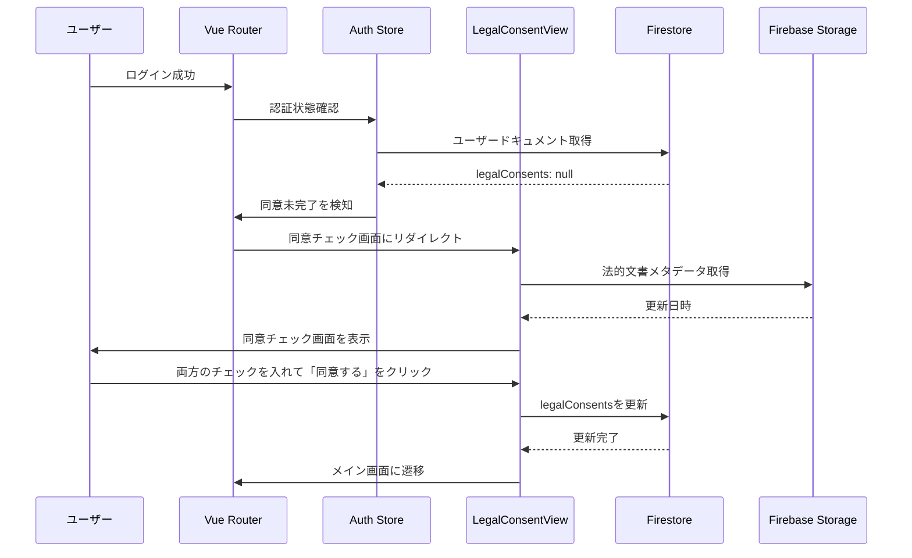
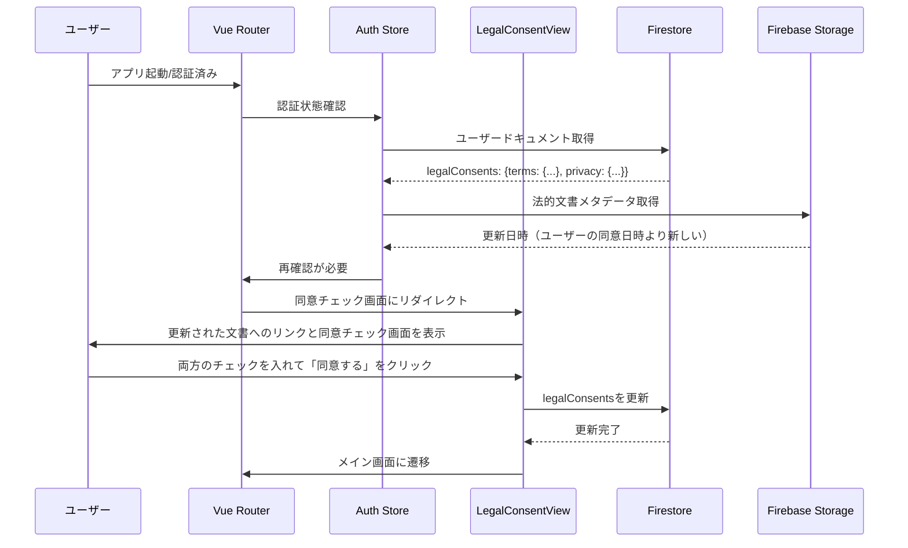
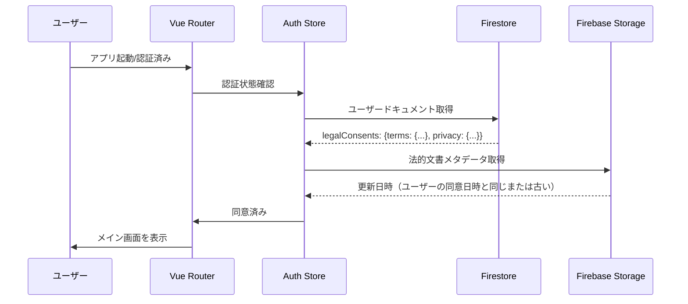
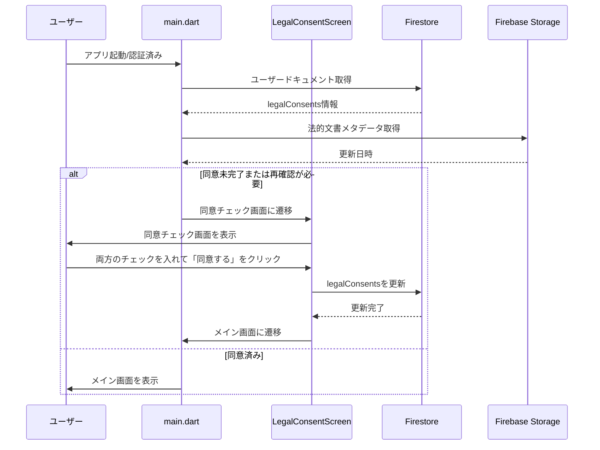

# Design Document: 20260117_legal-docs-consent-enforcement

## Overview 

**Purpose**: この機能は、利用規約とプライバシーポリシーへの同意チェックを必須化し、法的文書の更新日付を監視して、ユーザーが既に同意した日付より新しいバージョンが公開された場合に再確認を促す機能を実装する。これにより、法的文書の更新時にユーザーに最新版への同意を確実に取得できるようになる。  
**Users**: エンドユーザーがアプリを使用する前に利用規約とプライバシーポリシーに同意する必要がある。既存ユーザーも、文書が更新された場合は再確認を求められる。  
**Impact**: 認証成功後のフローに同意チェック画面が追加され、未同意または古いバージョンに同意しているユーザーはメイン機能を使用できない。Firestoreのユーザードキュメントに同意情報が保存される。

### Goals
- 利用規約とプライバシーポリシーへの同意をアプリ使用の必須条件とする
- 法的文書の更新日付を監視し、更新時には再確認を促す
- ユーザーの同意履歴をFirestoreに保存し、追跡可能にする
- WebアプリとFlutterアプリの両方で一貫した同意フローを実装する

### Non-Goals
- 法的文書の内容自体の変更は対象外
- 同意の撤回機能は初期実装では対象外
- 複数バージョンの同意履歴の詳細な管理は対象外（最新の同意のみを保持）
- 管理者向けの同意状況ダッシュボードは対象外

## Architecture

### Existing Architecture Analysis

- 既存のWebアプリはVue Routerを使用しており、`beforeEach`ガードで認証チェックを実施している
- 既存のFlutterアプリは`main.dart`で認証状態を監視し、認証済みユーザーはメイン画面に遷移する
- Firestoreの`users/{uid}`ドキュメントには`plan`、`usage`、`createdAt`、`updatedAt`フィールドが存在する
- 法的文書は既にFirebase Storageの`legal-docs/{type}_{locale}.md`パスに格納されている（`20260115_legal-docs-storage-display`仕様で実装済み）
- 既存の`LegalDocumentService`（Web/Flutter）は文書コンテンツの取得のみをサポートし、メタデータ取得は未実装

### Architecture Pattern & Boundary Map

**Architecture Integration**:
- **Selected pattern**: 「Consent Gate Pattern」。認証後のメイン機能へのアクセス前に同意チェックを必須化する。
- **Domain/feature boundaries**:  
  - Firestore層: ユーザードキュメントに`legalConsents`フィールドを追加
  - Storage層: 法的文書のメタデータ（更新日時）を取得
  - Webアプリ層: 同意チェック画面とルーターガードを実装
  - Flutterアプリ層: 同意チェック画面とナビゲーション制御を実装
- **Existing patterns preserved**: 既存の認証フロー、Firestoreデータ構造、Storageアクセスパターンを踏襲
- **New components rationale**:  
  - `legalConsents`フィールドにより、ユーザーの同意状態を追跡
  - メタデータ取得機能により、文書の更新を検知
  - 同意チェック画面により、ユーザーに明示的な同意を取得
  - ルーター/ナビゲーションガードにより、未同意ユーザーをブロック
- **Steering compliance**: AI-DLC/Spec-Driven Developmentに従い、requirements→design→tasks→implementationの段階的アプローチを踏襲する。

### Technology Stack

| Layer | Choice / Version | Role in Feature | Notes |
|-------|------------------|-----------------|-------|
| Frontend / Web | Vue 3 + Vue Router | 同意チェック画面とルーターガード | 既存のWebアプリフレームワーク |
| Frontend / Mobile | Flutter | 同意チェック画面とナビゲーション制御 | 既存のモバイルアプリフレームワーク |
| Data / Database | Firestore | ユーザーの同意情報を保存 | 既存のFirestoreインフラを利用 |
| Data / Storage | Firebase Storage | 法的文書のメタデータ取得 | 既存のStorageインフラを利用 |
| State Management / Web | Pinia | 同意状態の管理 | 既存の状態管理ライブラリ |
| UI Framework / Web | Vuetify | 同意チェック画面のUI | 既存のUIフレームワーク |
| UI Framework / Mobile | Material Design | 同意チェック画面のUI | Flutterの標準UI |

## System Flows

### Flow 1: 新規ユーザーの同意フロー（Webアプリ）



### Flow 2: 既存ユーザーの再確認フロー（Webアプリ）



### Flow 3: 同意済みユーザーの通常フロー（Webアプリ）



### Flow 4: Flutterアプリでの同意フロー



## Requirements Traceability

| Requirement | Summary | Components | Interfaces | Flows |
|-------------|---------|------------|------------|-------|
| 1 | ユーザードキュメントに同意情報を保存 | Firestore users/{uid}, Firestore Rules | Firestore API | Flow 1, 2, 4 |
| 2 | 法的文書のメタデータ取得 | LegalDocumentService (Web/Flutter) | Storage API | Flow 1, 2, 3, 4 |
| 3 | Webアプリで同意チェックを必須化 | LegalConsentView, Router Guard | Vue Router, Firestore API | Flow 1, 2, 3 |
| 4 | Flutterアプリで同意チェックを必須化 | LegalConsentScreen, Navigation Control | Firestore API | Flow 4 |

## Components and Interfaces

### Firestore Domain

#### Component: users/{uid} Document (legalConsents Field)

| Field | Detail |
|-------|--------|
| Intent | ユーザーの利用規約とプライバシーポリシーへの同意情報を保存 |
| Requirements | 1 |

**Responsibilities & Constraints**
- `legalConsents`フィールドに同意日時と文書バージョンを保存
- 既存ユーザーに対しては`legalConsents`が`null`の可能性がある（後方互換性）
- ユーザー作成時には`legalConsents`を初期化しない（明示的な同意まで未設定）

**Dependencies**
- Inbound: Webアプリ、Flutterアプリ — 同意情報の保存 (P0)
- Outbound: Webアプリ、Flutterアプリ — 同意情報の読み取り (P0)
- External: Firestore — ドキュメントストア (P0)

**Contracts**: Service [ ] / API [ ] / Event [ ] / Batch [ ] / State [X]

##### Data Structure
```typescript
interface LegalConsents {
  terms?: {
    consentedAt: Timestamp;
    documentVersion: string; // ISO 8601形式の更新日時
  };
  privacy?: {
    consentedAt: Timestamp;
    documentVersion: string; // ISO 8601形式の更新日時
  };
}

interface UserDoc {
  // 既存フィールド
  plan: {...};
  usage: {...};
  createdAt: Timestamp;
  updatedAt: Timestamp;
  // 新規フィールド
  legalConsents?: LegalConsents | null;
}
```

**Implementation Notes**
- Firestoreのセキュリティルールを更新して`legalConsents`フィールドの読み書きを許可
- `onUserCreate`関数は変更不要（`legalConsents`は初期化しない）

### Storage Domain

#### Component: Legal Document Metadata Service (Web)

| Field | Detail |
|-------|--------|
| Intent | Firebase Storageから法的文書のメタデータ（更新日時）を取得するサービス |
| Requirements | 2 |

**Dependencies**
- Inbound: LegalConsentView — メタデータ取得リクエスト (P0)
- Outbound: Firebase Storage — メタデータ取得 (P0)
- External: Firebase Storage SDK — Storage API (P0)

**Contracts**: Service [X] / API [ ] / Event [ ] / Batch [ ] / State [ ]

##### Service Interface
```typescript
/**
 * Get legal document metadata from Firebase Storage
 * @param documentType Type of document (terms, privacy)
 * @param locale Language locale (ja, en)
 * @returns Promise that resolves to the document version (ISO 8601 string)
 * @throws Error if metadata cannot be fetched
 */
export async function getDocumentMetadata(
  documentType: 'terms' | 'privacy',
  locale: Locale
): Promise<string> {
  const storage = getStorage(firebaseApp);
  const path = `legal-docs/${documentType}_${locale}.md`;
  const storageRef = ref(storage, path);

  try {
    const { getAuth } = await import('firebase/auth');
    const auth = getAuth(firebaseApp);
    if (!auth.currentUser) {
      throw new Error('User not authenticated');
    }

    // getMetadataを使用してメタデータを取得
    const metadata = await getMetadata(storageRef);
    
    // updated または timeCreated を使用（updatedが優先）
    const updatedTime = metadata.updated || metadata.timeCreated;
    if (!updatedTime) {
      throw new Error('Metadata does not contain timestamp');
    }
    
    // ISO 8601形式の文字列として返す
    return updatedTime.toISOString();
  } catch (error) {
    if (error instanceof Error) {
      const errorCode = (error as any).code;
      if (
        error.message.includes('storage/object-not-found') ||
        errorCode === 'storage/object-not-found'
      ) {
        throw new Error(`Document not found: ${path}`);
      }
      if (error.message.includes('storage/unauthorized') || errorCode === 'storage/unauthorized') {
        throw new Error(`Unauthorized: Authentication required to access ${path}`);
      }
      throw new Error(`Failed to fetch metadata: ${error.message}. Path: ${path}`);
    }
    throw new Error(`Failed to fetch metadata: ${String(error)}. Path: ${path}`);
  }
}
```

**Implementation Notes**
- `getMetadata`関数を使用してStorageファイルのメタデータを取得
- `updated`フィールドが存在する場合はそれを使用、なければ`timeCreated`を使用
- ISO 8601形式の文字列として返す（バージョン比較に使用）

#### Component: Legal Document Metadata Service (Flutter)

| Field | Detail |
|-------|--------|
| Intent | Firebase Storageから法的文書のメタデータ（更新日時）を取得するサービス |
| Requirements | 2 |

**Dependencies**
- Inbound: LegalConsentScreen — メタデータ取得リクエスト (P0)
- Outbound: Firebase Storage — メタデータ取得 (P0)
- External: firebase_storage — Storage SDK (P0)

**Contracts**: Service [X] / API [ ] / Event [ ] / Batch [ ] / State [ ]

##### Service Interface
```dart
/// Get legal document metadata from Firebase Storage
///
/// [documentType] Type of document (terms, privacy)
/// [locale] Language locale (ja, en)
/// Returns the document version (ISO 8601 string)
/// Throws [Exception] if metadata cannot be fetched
Future<String> getDocumentMetadata(String documentType, String locale) async {
  final storage = FirebaseStorage.instance;
  final path = 'legal-docs/${documentType}_${locale}.md';
  final ref = storage.ref(path);

  try {
    final metadata = await ref.getMetadata();
    
    // updated または timeCreated を使用（updatedが優先）
    final updatedTime = metadata.updated ?? metadata.timeCreated;
    if (updatedTime == null) {
      throw Exception('Metadata does not contain timestamp');
    }
    
    // ISO 8601形式の文字列として返す
    return updatedTime.toIso8601String();
  } on FirebaseException catch (e) {
    if (e.code == 'object-not-found') {
      throw Exception('Document not found: $path');
    } else if (e.code == 'unauthorized') {
      throw Exception('Unauthorized: Authentication required');
    } else {
      throw Exception('Failed to fetch metadata: ${e.message}');
    }
  } catch (e) {
    if (e is Exception) {
      rethrow;
    }
    throw Exception('Failed to fetch metadata: $e');
  }
}
```

**Implementation Notes**
- `getMetadata()`メソッドを使用してStorageファイルのメタデータを取得
- `updated`フィールドが存在する場合はそれを使用、なければ`timeCreated`を使用
- ISO 8601形式の文字列として返す（バージョン比較に使用）

### Web App Domain

#### Component: LegalConsentView (Vue Component)

| Field | Detail |
|-------|--------|
| Intent | 利用規約とプライバシーポリシーへの同意チェック画面 |
| Requirements | 3 |

**Responsibilities & Constraints**
- 利用規約とプライバシーポリシーの両方にチェックを入れる必要がある
- 両方のチェックが入っていない場合、「同意する」ボタンを無効化
- 同意時にFirestoreに同意情報を保存
- 更新された文書へのリンクを表示（再確認の場合）

**Dependencies**
- Inbound: Vue Router — 画面遷移 (P0)
- Outbound: Firestore — 同意情報の保存 (P0)
- Outbound: Firebase Storage — メタデータ取得 (P0)
- External: Vuetify — UIコンポーネント (P0)

**Contracts**: Service [ ] / API [ ] / Event [ ] / Batch [ ] / State [ ]

##### Component Interface
```typescript
interface LegalConsentViewProps {
  // プロパティなし（ルートコンポーネント）
}

interface LegalConsentViewState {
  termsChecked: boolean;
  privacyChecked: boolean;
  termsVersion: string | null;
  privacyVersion: string | null;
  loading: boolean;
  error: string | null;
  isReconsent: boolean; // 再確認かどうか
}
```

**Implementation Notes**
- Vuetifyの`v-checkbox`コンポーネントを使用
- 「同意する」ボタンは`termsChecked && privacyChecked`が`true`の時のみ有効化
- 同意時に`users/{uid}/legalConsents`を更新
- 更新された文書へのリンクは`LegalDocumentViewer`コンポーネントを使用（既存実装を再利用）
- 画面をスキップできないようにする（モーダルではなく専用ルートとして実装）

#### Component: Consent Store (Pinia Store)

| Field | Detail |
|-------|--------|
| Intent | 同意状態を管理するPiniaストア |
| Requirements | 3 |

**Dependencies**
- Inbound: LegalConsentView, Router Guard — 同意状態の確認・更新 (P0)
- Outbound: Firestore — 同意情報の読み書き (P0)
- Outbound: Firebase Storage — メタデータ取得 (P0)

**Contracts**: Service [ ] / API [ ] / Event [ ] / Batch [ ] / State [X]

##### Store Interface
```typescript
interface ConsentState {
  legalConsents: LegalConsents | null;
  isLoading: boolean;
  needsReconsent: boolean; // 再確認が必要かどうか
}

interface ConsentStore {
  // State
  legalConsents: Ref<LegalConsents | null>;
  isLoading: Ref<boolean>;
  needsReconsent: Ref<boolean>;
  
  // Actions
  checkConsentStatus(): Promise<void>; // 同意状態を確認
  saveConsent(termsVersion: string, privacyVersion: string): Promise<void>; // 同意を保存
  isConsentRequired(): Promise<boolean>; // 同意が必要かどうかを判定
}
```

**Implementation Notes**
- ユーザードキュメントから`legalConsents`を取得
- Storageから法的文書のメタデータを取得し、ユーザーの同意バージョンと比較
- 再確認が必要な場合は`needsReconsent`を`true`に設定

#### Component: Router Guard (Vue Router)

| Field | Detail |
|-------|--------|
| Intent | 認証後のルートガードで同意チェックを実施 |
| Requirements | 3 |

**Dependencies**
- Inbound: Vue Router — ルート遷移イベント (P0)
- Outbound: Consent Store — 同意状態の確認 (P0)

**Contracts**: Service [ ] / API [ ] / Event [ ] / Batch [ ] / State [ ]

##### Guard Implementation
```typescript
router.beforeEach(async (to, _from, next) => {
  const authStore = useAuthStore();
  const consentStore = useConsentStore();
  
  // ログインページはスキップ
  if (to.path === '/login') {
    if (authStore.isAuthenticated) {
      return next({ name: 'mail-list' });
    }
    return next();
  }
  
  // 認証チェック（既存ロジック）
  if (to.meta.requiresAuth && authStore.user === null) {
    await new Promise<void>(resolve => {
      const unsub = authService.onAuthStateChanged(user => {
        authStore.setUser(user);
        unsub();
        resolve();
      });
    });
  }
  
  if (to.meta.requiresAuth && !authStore.isAuthenticated) {
    next({ name: 'login' });
    return;
  }
  
  // 同意チェック（新規追加）
  if (to.meta.requiresAuth && authStore.isAuthenticated) {
    const consentRequired = await consentStore.isConsentRequired();
    if (consentRequired && to.name !== 'legal-consent') {
      next({ name: 'legal-consent' });
      return;
    }
  }
  
  next();
});
```

**Implementation Notes**
- 既存の認証チェックの後に同意チェックを追加
- 同意が必要な場合は`legal-consent`ルートにリダイレクト
- `legal-consent`ルート自体は同意チェックをスキップ（無限ループを防止）

### Flutter App Domain

#### Component: LegalConsentScreen (Flutter Screen)

| Field | Detail |
|-------|--------|
| Intent | 利用規約とプライバシーポリシーへの同意チェック画面 |
| Requirements | 4 |

**Responsibilities & Constraints**
- 利用規約とプライバシーポリシーの両方にチェックを入れる必要がある
- 両方のチェックが入っていない場合、「同意する」ボタンを無効化
- 同意時にFirestoreに同意情報を保存
- 更新された文書へのリンクを表示（再確認の場合）

**Dependencies**
- Inbound: main.dart — 画面遷移 (P0)
- Outbound: Firestore — 同意情報の保存 (P0)
- Outbound: Firebase Storage — メタデータ取得 (P0)
- External: Material Design — UIコンポーネント (P0)

**Contracts**: Service [ ] / API [ ] / Event [ ] / Batch [ ] / State [ ]

##### Screen Interface
```dart
class LegalConsentScreen extends StatefulWidget {
  final bool isReconsent; // 再確認かどうか
  
  const LegalConsentScreen({
    super.key,
    this.isReconsent = false,
  });
}

class _LegalConsentScreenState extends State<LegalConsentScreen> {
  bool _termsChecked = false;
  bool _privacyChecked = false;
  String? _termsVersion;
  String? _privacyVersion;
  bool _loading = false;
  String? _error;
}
```

**Implementation Notes**
- Material Designの`Checkbox`ウィジェットを使用
- 「同意する」ボタンは`_termsChecked && _privacyChecked`が`true`の時のみ有効化
- 同意時に`users/{uid}/legalConsents`を更新
- 更新された文書へのリンクは`LegalDocumentScreen`を使用（既存実装を再利用）
- 画面をスキップできないようにする（専用画面として実装）

#### Component: Consent Service (Dart Service)

| Field | Detail |
|-------|--------|
| Intent | 同意状態を管理するサービス |
| Requirements | 4 |

**Dependencies**
- Inbound: LegalConsentScreen, main.dart — 同意状態の確認・更新 (P0)
- Outbound: Firestore — 同意情報の読み書き (P0)
- Outbound: Firebase Storage — メタデータ取得 (P0)

**Contracts**: Service [X] / API [ ] / Event [ ] / Batch [ ] / State [ ]

##### Service Interface
```dart
class ConsentService {
  /// 同意状態を確認し、同意が必要かどうかを判定
  Future<bool> isConsentRequired() async {
    // ユーザードキュメントからlegalConsentsを取得
    // Storageから法的文書のメタデータを取得
    // 比較して同意が必要かどうかを判定
  }
  
  /// 同意を保存
  Future<void> saveConsent(String termsVersion, String privacyVersion) async {
    // Firestoreに同意情報を保存
  }
  
  /// ユーザーの同意情報を取得
  Future<LegalConsents?> getConsents() async {
    // Firestoreから同意情報を取得
  }
}
```

**Implementation Notes**
- ユーザードキュメントから`legalConsents`を取得
- Storageから法的文書のメタデータを取得し、ユーザーの同意バージョンと比較
- 再確認が必要な場合は`true`を返す

## Data Models

### Firestore Data Model

**Structure Definition**:
- エンティティ: `users/{uid}`
- 新規フィールド: `legalConsents` (optional, nullable)
- 構造:
  ```typescript
  legalConsents?: {
    terms?: {
      consentedAt: Timestamp;
      documentVersion: string; // ISO 8601形式
    };
    privacy?: {
      consentedAt: Timestamp;
      documentVersion: string; // ISO 8601形式
    };
  } | null;
  ```

**Consistency & Integrity**:
- `legalConsents`が存在しない場合は`null`として扱う（後方互換性）
- `terms`と`privacy`は独立して管理（片方のみの同意も可能だが、アプリ使用には両方の同意が必要）
- `documentVersion`はStorageファイルの`updated`または`timeCreated`メタデータのISO 8601形式

### Storage Metadata Model

**Structure Definition**:
- パス: `legal-docs/{documentType}_{locale}.md`
- メタデータフィールド:
  - `updated`: Timestamp（ファイルの最終更新日時、優先的に使用）
  - `timeCreated`: Timestamp（ファイルの作成日時、`updated`が存在しない場合に使用）

**Consistency & Integrity**:
- メタデータの`updated`フィールドが存在する場合はそれを使用
- `updated`が存在しない場合は`timeCreated`を使用
- ISO 8601形式の文字列として返す（バージョン比較に使用）

## Error Handling

### Error Strategy

- **Firestore取得エラー**: ユーザードキュメントの取得に失敗した場合、同意が必要とみなして同意チェック画面を表示
- **Storageメタデータ取得エラー**: メタデータ取得に失敗した場合、既存の同意があればそれを尊重し、なければ同意が必要とみなす
- **同意保存エラー**: 同意保存に失敗した場合、エラーメッセージを表示し、リトライを促す

### Error Categories and Responses

**User Errors** (4xx):
- Firestore権限エラー（401） → 「ログインが必要です」メッセージを表示し、ログイン画面にリダイレクト
- Storage権限エラー（401） → 「ログインが必要です」メッセージを表示

**System Errors** (5xx):
- Firestore取得エラー → 「データの取得に失敗しました。しばらくしてから再度お試しください」メッセージを表示
- Storageメタデータ取得エラー → 既存の同意があればそれを尊重し、なければ同意が必要とみなす
- ネットワークエラー → 「ネットワークエラーが発生しました。接続を確認してください」メッセージを表示

**Business Logic Errors**:
- 同意保存失敗 → 「同意の保存に失敗しました。再度お試しください」メッセージを表示し、リトライボタンを表示

### Monitoring

- Firestoreへの同意保存回数を監視
- Storageメタデータ取得のエラー率を監視
- 同意チェック画面の表示回数と完了率を監視
- 再確認が必要になったユーザー数を監視

## Testing Strategy

### Unit Tests
- `getDocumentMetadata` (Web/Flutter): メタデータ取得ロジック、エラーハンドリング
- `ConsentStore.isConsentRequired` (Web): 同意が必要かどうかの判定ロジック
- `ConsentService.isConsentRequired` (Flutter): 同意が必要かどうかの判定ロジック
- バージョン比較ロジック（ISO 8601文字列の比較）

### Integration Tests
- Webアプリ: 認証後の同意チェック画面表示フロー
- Webアプリ: 同意保存後のメイン画面遷移フロー
- Webアプリ: 再確認が必要な場合のフロー
- Flutterアプリ: 認証後の同意チェック画面表示フロー
- Flutterアプリ: 同意保存後のメイン画面遷移フロー
- Firestore: `legalConsents`フィールドの読み書き

### E2E/UI Tests
- Webアプリ: 新規ユーザーの同意フロー
- Webアプリ: 既存ユーザーの再確認フロー
- Webアプリ: 同意済みユーザーの通常フロー
- Flutterアプリ: 新規ユーザーの同意フロー
- Flutterアプリ: 既存ユーザーの再確認フロー
- Flutterアプリ: 同意済みユーザーの通常フロー

## Security Considerations

- **Firestoreルール**: 認証済みユーザーが自分の`legalConsents`フィールドを読み書きできるように設定
- **Storageルール**: 認証済みユーザーが法的文書のメタデータを読み取れるように設定（既存ルールを確認）
- **同意の改ざん防止**: クライアント側からのみ同意を保存できるが、Firestoreルールで自分のドキュメントのみ書き込み可能に制限
- **認証チェック**: メタデータ取得時と同意保存時に認証状態を確認

## Performance & Scalability

- **メタデータ取得の最適化**: アプリ起動時にメタデータを取得するが、キャッシュは初期実装では実装しない（将来的には検討可能）
- **同意状態のキャッシュ**: Piniaストア（Web）やサービス（Flutter）で同意状態をキャッシュし、不要なFirestore読み取りを削減
- **並行アクセス**: 複数のユーザーが同時に同意を保存しても問題ない（Firestoreのトランザクションを使用する必要はない）

## Migration Strategy

### Phase 1: Firestoreスキーマの更新
1. Firestoreルールを更新して`legalConsents`フィールドの読み書きを許可
2. 既存ユーザードキュメントには影響なし（`legalConsents`は`null`として扱う）

### Phase 2: メタデータ取得機能の実装
1. Webアプリの`legalDocument.ts`に`getDocumentMetadata`関数を追加
2. Flutterアプリの`LegalDocumentService`に`getDocumentMetadata`メソッドを追加
3. 既存の`getDocument`関数/メソッドは変更不要

### Phase 3: Webアプリの同意チェック実装
1. `ConsentStore`（Piniaストア）を実装
2. `LegalConsentView`コンポーネントを実装
3. ルーターに`legal-consent`ルートを追加
4. ルーターガードに同意チェックを追加
5. 既存の認証フローは変更不要

### Phase 4: Flutterアプリの同意チェック実装
1. `ConsentService`を実装
2. `LegalConsentScreen`を実装
3. `main.dart`の認証フローに同意チェックを追加
4. 既存の認証フローは変更不要

### Phase 5: 検証とクリーンアップ
1. WebアプリとFlutterアプリで新規ユーザーの同意フローを確認
2. 既存ユーザーの再確認フローを確認
3. 同意済みユーザーの通常フローを確認
4. エラーハンドリングが適切に動作することを確認

