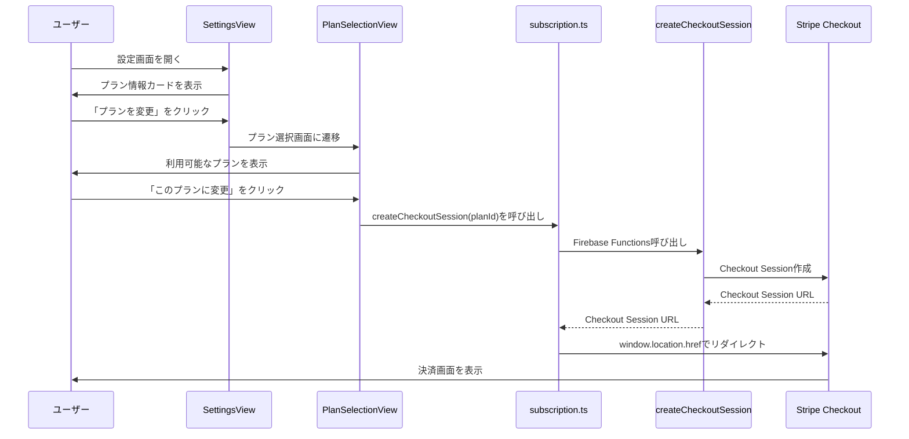
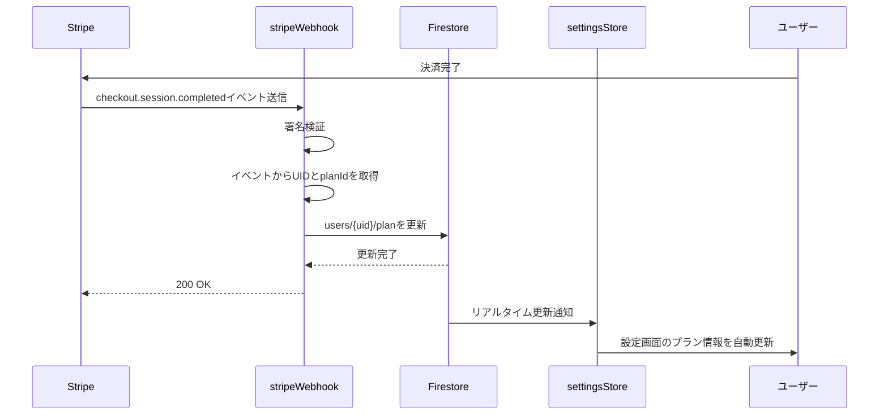
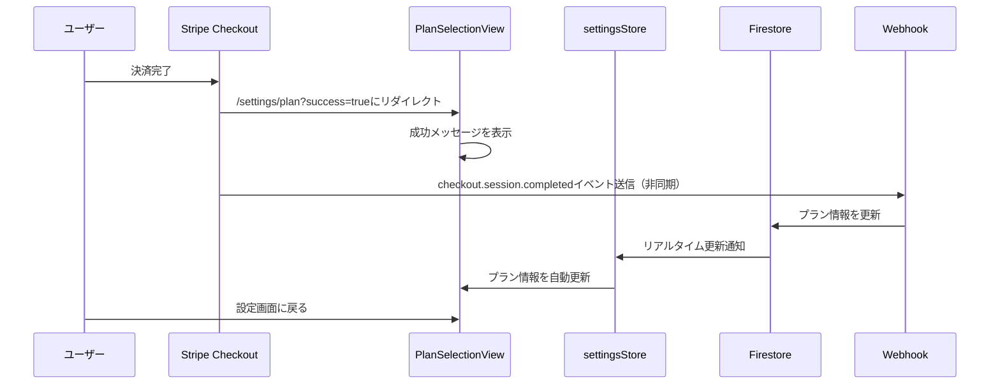
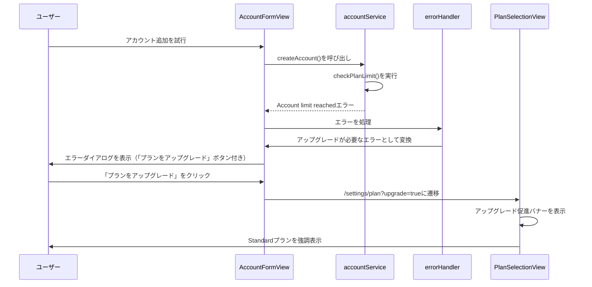

# Design Document: 20260122_web-plan-selection-stripe

## Overview 

**Purpose**: Web版でプラン選択機能を実装し、Stripeとの連携によりプラン変更を処理する。ユーザーがWebアプリからプランを選択・変更できるようにし、Stripeでの決済完了後にFirestoreのプラン情報を自動更新する。これにより、Stripeの決済結果に基づいて確実にプラン変更が反映されるようになる。  
**Users**: Webアプリユーザーがプランを選択・変更できる。Stripeでの決済完了後、自動的にFirestoreのプラン情報が更新される。  
**Impact**: 設定画面にプラン情報カードが追加され、プラン選択画面が新規作成される。Cloud FunctionsにStripe連携機能が追加され、Webhookエンドポイントが実装される。Firestoreのユーザードキュメントの`plan`フィールドがStripeの決済結果に基づいて自動更新される。

### Goals
- Webアプリでプラン選択・変更機能を提供する
- Stripe Checkoutを使用した安全な決済フローを実装する
- Stripe Webhookにより決済完了を検知し、Firestoreのプラン情報を自動更新する
- 既存の設定画面と統合し、リアルタイムでプラン情報を反映する

### Non-Goals
- モバイルアプリでのプラン選択機能は対象外（Web版のみ）
- Stripe Customer Portalの実装は対象外（Checkout Sessionのみ）
- プラン変更の履歴管理は対象外（最新のプランのみ保持）
- プラン変更の承認フローは対象外（即座に反映）

## Architecture

### Existing Architecture Analysis

- 既存のWebアプリはVue 3 + Vuetifyを使用しており、`SettingsView.vue`で設定画面を実装している
- 既存の`settingsStore`（Pinia）と`settingsService`により、Firestoreの`users/{uid}`ドキュメントからプラン情報を取得・監視している
- Firestoreの`users/{uid}`ドキュメントには`plan`フィールドが存在し、`plan.id`、`plan.label`、`plan.maxStorageBytes`、`plan.maxAccounts`が保存されている
- Cloud Functionsは`functions/src/index.ts`でエクスポートされ、`asia-northeast1`リージョンでデプロイされている
- 既存のCloud Functionsは`functions.region('asia-northeast1').https.onCall`パターンを使用している
- Vue Routerは`apps/web_app/src/router/index.ts`で設定され、認証必須ルートは`meta: { requiresAuth: true }`で指定されている

### Architecture Pattern & Boundary Map

**Architecture Integration**:
- **Selected pattern**: 「Stripe Checkout + Webhook Pattern」。フロントエンドからStripe Checkout Sessionを作成し、決済完了をWebhookで検知してFirestoreを更新する。
- **Domain/feature boundaries**:  
  - Webアプリ層: プラン選択画面とStripe Checkoutへのリダイレクト処理
  - Cloud Functions層: Stripe Checkout Session作成とWebhookエンドポイント
  - Firestore層: ユーザードキュメントの`plan`フィールドの更新
  - Stripe層: 決済処理とWebhookイベント送信
- **Existing patterns preserved**: 既存のVue Routerパターン、Cloud Functionsの`onCall`パターン、Firestoreのリアルタイム監視パターンを踏襲
- **New components rationale**:  
  - `PlanSelectionView.vue`により、ユーザーがプランを選択できる
  - `subscription.ts`サービスにより、Stripe Checkout Session作成処理をカプセル化
  - `createCheckoutSession` Cloud Functionにより、サーバーサイドでStripe Checkout Sessionを作成
  - `stripeWebhook` Cloud Functionにより、Stripeの決済完了を検知してFirestoreを更新
- **Steering compliance**: AI-DLC/Spec-Driven Developmentに従い、requirements→design→tasks→implementationの段階的アプローチを踏襲する。

### Technology Stack

| Layer | Choice / Version | Role in Feature | Notes |
|-------|------------------|-----------------|-------|
| Frontend / Web | Vue 3 + Vue Router | プラン選択画面とルーティング | 既存のWebアプリフレームワーク |
| UI Framework / Web | Vuetify | プラン選択画面のUI | 既存のUIフレームワーク |
| State Management / Web | Pinia | プラン情報の状態管理 | 既存の`settingsStore`を利用 |
| Backend / Functions | Firebase Cloud Functions | Stripe Checkout Session作成とWebhook処理 | 既存のCloud Functionsインフラ |
| Payment / Integration | Stripe | 決済処理とWebhook | 新規統合 |
| Data / Database | Firestore | ユーザープラン情報の保存 | 既存のFirestoreインフラを利用 |
| SDK / Backend | Stripe Node.js SDK | Stripe API呼び出し | `stripe`パッケージを追加 |

## System Flows

### Flow 1: プラン選択からStripe Checkoutへのリダイレクト（Webアプリ）



### Flow 2: Stripe Webhookによるプラン更新



### Flow 3: プラン変更後のリダイレクト処理（Webアプリ）



### Flow 4: アップグレードが必要な操作時の通知と遷移



## Data Models

### Firestore Schema

#### users/{uid}

既存のスキーマに変更なし。`plan`フィールドがStripe Webhookにより更新される。

```typescript
{
  plan: {
    id: 'free' | 'standard',
    label: 'Free' | 'Standard',
    maxStorageBytes: number, // Free: 2147483648 (2GB), Standard: 53687091200 (50GB)
    maxAccounts: number, // Free: 1, Standard: 複数（実装時は10など適切な値を設定）
  },
  usage: {
    storageBytes: number,
    updatedAt: Timestamp,
  },
  billing: {
    stripeCustomerId?: string, // Stripe Customer ID（ダウングレード処理時に使用）
    stripeSubscriptionId?: string, // Stripe Subscription ID（ダウングレード処理時に使用）
  },
  createdAt: Timestamp,
  updatedAt: Timestamp,
}
```

### TypeScript Interfaces

#### Web App Types

```typescript
// apps/web_app/src/types/subscription.ts
export interface Plan {
  id: 'free' | 'standard';
  label: string;
  price: number; // Standardプランのみ（Freeは0）
  priceLabel: string; // "¥500/月"（日本語）または"$5/month"（英語）
  currency: 'JPY' | 'USD'; // 通貨
  maxStorageBytes: number;
  maxAccounts: number;
  features: string[];
}

export interface CreateCheckoutSessionRequest {
  planId: 'free' | 'standard';
  locale: 'ja' | 'en';
}

export interface CreateCheckoutSessionResponse {
  url: string;
}
```

#### Cloud Functions Types

```typescript
// functions/src/subscription/types.ts
export interface CreateCheckoutSessionRequest {
  planId: 'free' | 'standard';
  locale: 'ja' | 'en';
}

export interface CreateCheckoutSessionResponse {
  url: string;
}

export interface PlanConfig {
  id: 'free' | 'standard';
  label: string;
  priceIdJpy: string; // Stripe Price ID（円用）
  priceIdUsd: string; // Stripe Price ID（ドル用）
  maxStorageBytes: number;
  maxAccounts: number;
}
```

## Component Design

### Web App Components

#### PlanSelectionView.vue

**Location**: `apps/web_app/src/views/PlanSelectionView.vue`

**Purpose**: プラン選択画面を表示し、ユーザーがプランを選択してStripe Checkoutにリダイレクトする。

**Props**: なし

**State**:
- `plans: Plan[]`: 利用可能なプランの一覧
- `currentPlanId: string`: 現在のプランID
- `isLoading: boolean`: Checkout Session作成中のローディング状態
- `error: string | null`: エラーメッセージ
- `showUpgradeBanner: boolean`: アップグレード促進バナーの表示状態（URLクエリパラメータ`?upgrade=true`から取得）

**Methods**:
- `loadPlans()`: プラン一覧を読み込む（現在のロケールに応じた価格を設定）
- `handlePlanChange(planId: string)`: プラン変更処理を開始（現在のロケールを`subscription.ts`に渡す）
- `handleBack()`: 設定画面に戻る

**UI Structure**:
- ヘッダー: 「プラン選択」タイトルと戻るボタン
- アップグレード促進バナー（`?upgrade=true`の場合）:
  - アップグレードが必要であることを示すメッセージ
  - 現在のプランと上限値、アップグレード後の上限値を表示
- プランカード一覧: 各プランの情報をカード形式で表示
  - プラン名
  - 価格
  - ストレージ容量
  - アカウント数上限
  - 機能一覧
  - 「現在のプラン」バッジ（現在のプランのみ）
  - 「このプランに変更」ボタン（Standardプランでアップグレード促進時は「今すぐアップグレード」など強調表示）
- ローディング表示: Checkout Session作成中
- エラー表示: エラー発生時

#### SettingsView.vue (更新)

**Location**: `apps/web_app/src/views/SettingsView.vue`

**Changes**: プラン情報カードを追加

**New Section**:
```vue
<v-card variant="outlined">
  <v-card-title class="d-flex align-center">
    <v-icon start color="primary">mdi-credit-card</v-icon>
    {{ t('settings.plan') }}
  </v-card-title>
  <v-card-text>
    <div class="text-body-2 mb-2">
      <strong>{{ t('settings.currentPlan') }}:</strong> {{ settingsStore.settings?.planLabel }}
    </div>
    <div class="text-body-2 mb-2">
      <strong>{{ t('settings.maxAccounts') }}:</strong> {{ planMaxAccounts }}
    </div>
  </v-card-text>
  <v-card-actions>
    <v-btn variant="text" color="primary" @click="navigateToPlanSelection">
      {{ t('settings.changePlan') }}
      <v-icon end>mdi-arrow-right</v-icon>
    </v-btn>
  </v-card-actions>
</v-card>
```

### Services

#### subscription.ts

**Location**: `apps/web_app/src/services/subscription.ts`

**Purpose**: Stripe Checkout Session作成処理をカプセル化

**Exports**:
```typescript
export async function createCheckoutSession(planId: 'free' | 'standard', locale: 'ja' | 'en'): Promise<void>
```

**Implementation**:
- Firebase Functionsの`createCheckoutSession`を呼び出し
- 返されたURLに`window.location.href`でリダイレクト
- エラーハンドリングを実装

### Cloud Functions

#### createCheckoutSession

**Location**: `functions/src/subscription/createCheckoutSession.ts`

**Type**: `functions.region('asia-northeast1').https.onCall`

**Purpose**: Stripe Checkout Sessionを作成し、URLを返す

**Request**:
```typescript
{
  planId: 'free' | 'standard',
  locale: 'ja' | 'en'
}
```

**Response**:
```typescript
{
  url: string
}
```

**Implementation Details**:
- 認証チェック: `context.auth`を確認
- 現在のプラン確認: Firestoreからユーザーの現在のプランを取得
- **プラン変更の種類に応じた処理**:
  - **アップグレード（Free → Standard）**:
    - プラン設定の取得: `planId`と`locale`からStripe Price IDを取得（`getPriceId(planId, locale)`を使用）
    - Stripe Checkout Session作成:
      - `mode: 'subscription'`
      - `success_url`: `/settings/plan?success=true`
      - `cancel_url`: `/settings/plan?canceled=true`
      - `metadata`: `{ userId: uid, planId: planId }`
  - **ダウングレード（Standard → Free）**:
    - 既存のStripe Customer IDを取得（Firestoreの`users/{uid}/billing.stripeCustomerId`から、またはStripe APIで検索）
    - 既存のサブスクリプションを取得
    - サブスクリプションを`cancel_at_period_end: true`で更新
    - Checkout Sessionは作成せず、更新完了のメッセージを返す
- エラーハンドリング: Stripe APIエラーや無効なプランIDの場合に適切なエラーを返す

**Environment Variables**:
- `STRIPE_SECRET_KEY`: Stripe APIシークレットキー

#### stripeWebhook

**Location**: `functions/src/subscription/stripeWebhook.ts`

**Type**: `functions.region('asia-northeast1').https.onRequest`

**Purpose**: Stripe Webhookイベントを受信し、Firestoreのプラン情報を更新

**Implementation Details**:
- 署名検証: Stripe Webhookの署名を検証
- イベント処理:
  - `checkout.session.completed`: チェックアウト完了時にプランを更新（アップグレード時は即座に反映）
  - `customer.subscription.updated`: サブスクリプション更新時にプランを更新
    - `cancel_at_period_end: true`かつ`status: 'active'`の場合: 請求期間終了時までStandardプランを維持（プラン更新は行わない）
    - `cancel_at_period_end: true`かつ`status: 'canceled'`の場合: 請求期間終了時にFreeプランに更新
    - その他の更新: プランIDに応じてプランを更新
  - `customer.subscription.deleted`: サブスクリプション削除時にFreeプランにダウングレード
- Firestore更新: `users/{uid}/plan`フィールドを更新
- エラーハンドリング: エラー発生時はログに記録し、Stripeに適切なステータスコードを返す

**Environment Variables**:
- `STRIPE_WEBHOOK_SECRET`: Stripe Webhookシークレット

**Webhook Events Handled**:
1. `checkout.session.completed`:
   - `session.metadata.userId`からUIDを取得
   - `session.metadata.planId`からプランIDを取得
   - **アップグレード（Free → Standard）の場合**: 即座にFirestoreの`users/{uid}/plan`をStandardプランに更新

2. `customer.subscription.updated`:
   - `subscription.customer`からCustomer IDを取得（必要に応じてUIDに変換）
   - `subscription.cancel_at_period_end`と`subscription.status`を確認:
     - `cancel_at_period_end: true`かつ`status: 'active'`の場合: 請求期間終了時までStandardプランを維持（プラン更新は行わない）
     - `cancel_at_period_end: true`かつ`status: 'canceled'`の場合: 請求期間終了時にFreeプランに更新（`current_period_end`が現在時刻を過ぎている場合）
     - その他の場合: `subscription.items.data[0].price.id`からPrice IDを取得し、プランIDに変換してFirestoreの`users/{uid}/plan`を更新

3. `customer.subscription.deleted`:
   - `subscription.customer`からCustomer IDを取得（必要に応じてUIDに変換）
   - Firestoreの`users/{uid}/plan`をFreeプランに更新

## Configuration

### Stripe Configuration

#### Plan Configuration

```typescript
// functions/src/subscription/planConfig.ts
export const PLAN_CONFIGS: Record<'free' | 'standard', PlanConfig> = {
  free: {
    id: 'free',
    label: 'Free',
    priceIdJpy: '', // FreeプランはCheckout不要
    priceIdUsd: '', // FreeプランはCheckout不要
    maxStorageBytes: 2147483648, // 2GB
    maxAccounts: 1,
  },
  standard: {
    id: 'standard',
    label: 'Standard',
    priceIdJpy: process.env.STRIPE_STANDARD_PRICE_ID_JPY || '', // 環境変数から取得（円用）
    priceIdUsd: process.env.STRIPE_STANDARD_PRICE_ID_USD || '', // 環境変数から取得（ドル用）
    maxStorageBytes: 53687091200, // 50GB
    maxAccounts: 10, // 適切な値を設定
  },
};

/**
 * ロケールに応じたPrice IDを取得する
 * @param planId プランID
 * @param locale ロケール（'ja'または'en'）
 * @returns Stripe Price ID
 */
export function getPriceId(planId: 'free' | 'standard', locale: 'ja' | 'en'): string {
  const config = PLAN_CONFIGS[planId];
  return locale === 'ja' ? config.priceIdJpy : config.priceIdUsd;
}
```

#### Environment Variables

**Cloud Functions**:
- `STRIPE_SECRET_KEY`: Stripe APIシークレットキー
- `STRIPE_WEBHOOK_SECRET`: Stripe Webhookシークレット
- `STRIPE_STANDARD_PRICE_ID`: StandardプランのStripe Price ID（オプション、planConfigで直接指定も可能）

**設定方法**:
```bash
firebase functions:config:set stripe.secret_key="sk_..."
firebase functions:config:set stripe.webhook_secret="whsec_..."
firebase functions:config:set stripe.standard_price_id_jpy="price_..."
firebase functions:config:set stripe.standard_price_id_usd="price_..."
```

### Router Configuration

**Location**: `apps/web_app/src/router/index.ts`

**New Route**:
```typescript
{
  path: '/settings/plan',
  name: 'plan-selection',
  component: () => import('@/views/PlanSelectionView.vue'),
  meta: { requiresAuth: true },
}
```

## Security Considerations

### Authentication & Authorization

- すべてのCloud Functionsは認証必須（`context.auth`チェック）
- プラン選択画面は認証必須ルート（`meta: { requiresAuth: true }`）
- Stripe Webhookは署名検証により、Stripeからのリクエストのみを受け付ける

### Data Validation

- `planId`の検証: 'free'または'standard'のみ許可
- Stripe Checkout SessionのメタデータにUIDを含めることで、Webhook処理時にユーザーを特定
- Firestore更新時のトランザクション処理（必要に応じて）

### Error Handling

- Cloud Functionsのエラーハンドリング: `functions.https.HttpsError`を使用
- Webアプリのエラーハンドリング: スナックバーでエラーメッセージを表示
- Stripe Webhookのエラーハンドリング: エラー発生時はログに記録し、Stripeに適切なステータスコードを返す

## Testing Strategy

### Unit Tests

- `createCheckoutSession` Cloud Function: Stripe API呼び出しのモック
- `stripeWebhook` Cloud Function: Webhookイベントの処理ロジック
- `subscription.ts`サービス: Firebase Functions呼び出しのモック

### Integration Tests

- プラン選択フロー: SettingsView → PlanSelectionView → Stripe Checkout
- Webhook処理フロー: Stripe Webhook → Firestore更新 → SettingsView更新

### Manual Testing

- Stripe Checkout Session作成の確認
- Stripe Webhookの動作確認（Stripe CLIを使用）
- プラン変更後のUI更新確認

## Deployment Considerations

### Cloud Functions Deployment

```bash
cd functions
npm install  # stripeパッケージを追加
npm run build
firebase deploy --only functions:createCheckoutSession,functions:stripeWebhook
```

### Environment Variables Setup

```bash
firebase functions:config:set stripe.secret_key="sk_..."
firebase functions:config:set stripe.webhook_secret="whsec_..."
firebase functions:config:set stripe.standard_price_id="price_..."
```

### Stripe Webhook Configuration

- Stripe DashboardでWebhookエンドポイントを設定
- エンドポイントURL: `https://asia-northeast1-{project-id}.cloudfunctions.net/stripeWebhook`
- イベント: `checkout.session.completed`, `customer.subscription.updated`, `customer.subscription.deleted`

## Dependencies

### New Dependencies

**functions/package.json**:
```json
{
  "dependencies": {
    "stripe": "^14.0.0"
  }
}
```

### Existing Dependencies

- `firebase-functions`: Cloud Functions実装
- `firebase-admin`: Firestore操作
- `vue`, `vue-router`, `vuetify`: WebアプリUI
- `pinia`: 状態管理

## Migration & Rollout

### Migration Steps

1. Stripe SDKを`functions/package.json`に追加
2. Cloud Functionsに環境変数を設定
3. `createCheckoutSession`と`stripeWebhook`をデプロイ
4. Stripe DashboardでWebhookエンドポイントを設定
5. Webアプリにプラン選択画面を追加
6. 設定画面にプラン情報カードを追加

### Rollout Plan

1. **Phase 1**: Cloud Functionsのデプロイとテスト
2. **Phase 2**: WebアプリのUI実装とテスト
3. **Phase 3**: 統合テストとStripe Webhookの動作確認
4. **Phase 4**: 本番環境へのデプロイ

### Rollback Plan

- Cloud Functionsのロールバック: 前のバージョンにデプロイ
- Webアプリのロールバック: 前のバージョンにデプロイ
- Stripe Webhookの無効化: Stripe DashboardでWebhookエンドポイントを無効化

## Open Questions & Future Considerations

### Open Questions

1. Standardプランの`maxAccounts`の適切な値は？（要件では「複数」と記載）
2. FreeプランからStandardプランへの変更時に、既存のアカウント数が上限を超えている場合の処理は？
3. Stripe Customer IDとFirebase UIDのマッピング方法は？（Webhook処理時に必要）
   - 解決策: `checkout.session.completed`イベントで`session.metadata.userId`からUIDを取得し、`users/{uid}/billing.stripeCustomerId`に保存する。または、Stripe CustomerのメタデータにUIDを保存する。

### Future Considerations

- モバイルアプリでのプラン選択機能
- Stripe Customer Portalの実装
- プラン変更履歴の管理
- プラン変更の承認フロー

